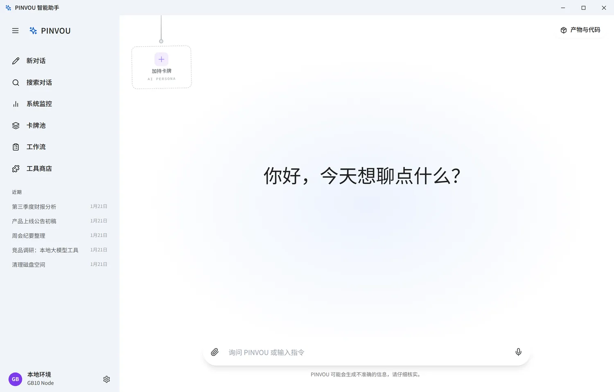
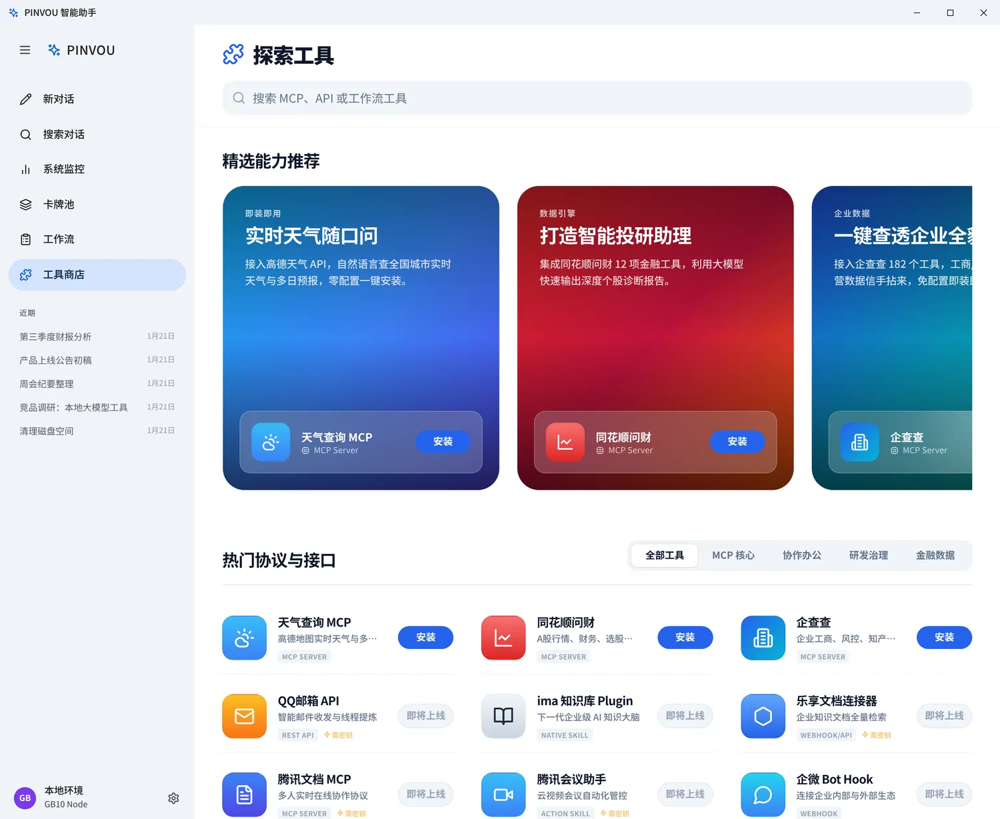
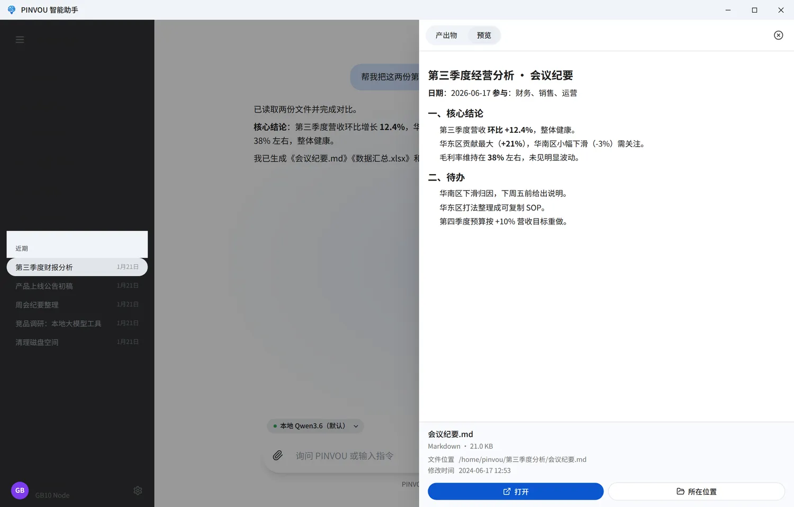

# PINVOU

**能调用工具、操作文件、沉淀知识并交付产物的桌面 AI 工作台。**

PINVOU 不只是一个聊天界面。它把模型、工具、个人知识、专家角色和工作流放进同一个桌面应用，让 AI 从“回答问题”进一步走到“完成任务”。模型既可以运行在本地，也可以接入 OpenAI-compatible 服务；工具与连接器按需启用。



## 能做什么

### 从对话到可交付产物

- 多会话管理与会话标题搜索，历史消息、工具调用和产物随会话持久化
- 支持 PDF、Office 文档、图片和文本附件，可拖拽或粘贴导入
- 自动收集 AI 创建或修改的文件，在产物面板中预览、定位和打开
- Markdown 产物可直接编辑，也可选中内容继续让 AI 修改
- Plan / YOLO 双模式：复杂任务先确认方案，明确任务可直接执行

### 让 AI 使用你的知识和方法

- 本地知识库支持文件管理、全文检索与向量检索
- 记忆中心沉淀长期偏好和上下文，并提供候选确认与管理
- 专家卡牌池可创建、保存和加持不同领域角色
- Skills、Commands 与工作流把可复用的方法固化为稳定能力

### 连接真实业务工具

- 工具商店统一管理本地 MCP、远程 MCP、CLI 和 API 连接器
- 支持 OAuth / SSO 等免手填密钥的授权方式
- 可按需连接飞书、钉钉、企业微信、Obsidian、企业知识库、法律与企业数据等能力
- 移动端扫码后可远程查看和控制当前工作区

### 面向实际运行

- 本地语音输入，语音模型按需下载
- GPU、内存、磁盘、模型服务与上下文使用情况集中监控
- Linux 应用内更新，Windows OTA 链路适配
- 会话、设置、知识和运行时扩展统一保存在 `~/.pinvou3/`

> [!NOTE]
> 数据是否离开本机取决于你选择的模型服务和工具。使用本地模型与本地工具时可保持本地闭环；启用云模型、远程 MCP 或第三方连接器时，相关请求会发送给对应服务。

<table>
  <tr>
    <td width="50%"></td>
    <td width="50%"></td>
  </tr>
  <tr>
    <td align="center">工具与连接器按需扩展</td>
    <td align="center">产物集中预览与交付</td>
  </tr>
</table>

## 模型接入

PINVOU 支持本地 vLLM 和 OpenAI-compatible API。应用内可保存多个模型配置，并在不同会话间快速切换；当前提供本地 vLLM、DeepSeek、Kimi、通义千问、豆包、MiniMax、智谱、MiMo 等配置模板，也可以填写自定义兼容端点。

本地 vLLM 示例：

```bash
export DEEPSEEK_BASE_URL="http://127.0.0.1:8000/v1"
export DEEPSEEK_API_KEY="local-no-auth"
export DEEPSEEK_MODEL="qwen36_35b_256k"
```

模型地址、模型名和密钥也可以直接在应用设置中管理。对于非本机的明文 HTTP 端点，开发环境还需显式设置 `DEEPSEEK_ALLOW_INSECURE_HTTP=1`。

## 架构

```text
React + Vite UI
       ↕ Tauri commands / events
pinvou3-app（桌面编排层）
       ↕ EngineHandle / AgentHarness
DeepSeek-TUI（Agent 底座 submodule）
       ├─ OpenAI-compatible 模型服务
       ├─ MCP servers / CLI connectors
       └─ Skills / Commands / Hooks / Compaction
```

模型调用、流式输出、工具循环、Session、MCP client、Skills、Hooks 和 Compaction 由 [DeepSeek-TUI](https://github.com/h3c-hexin/DeepSeek-TUI) 底座提供。`pinvou3-app/` 负责桌面 UI、运行时配置、业务编排和系统集成，不重复实现底座能力。

扩展能力时按以下边界落位：

| 需求 | 扩展位置 |
|---|---|
| 增加领域 Agent 或工具组合 | `SKILL.md` |
| 接入外部 API | 独立 MCP server 或连接器 |
| 调整模型行为 | bundle 中的 `instructions.md` |
| 桌面 UI、系统能力或 Engine 配置 | `pinvou3-app/` |
| 修复底座通用问题 | DeepSeek-TUI fork，并按 fork policy 维护 |

## 开发启动

### 前置条件

- Git（支持 submodule）
- Node.js 与 npm
- Rust toolchain
- Tauri 2.0 对应的系统依赖
- 一个可访问的 OpenAI-compatible 模型端点

### 启动应用

```bash
git clone --recursive git@github.com:Pinvou/pinvou3.git
cd pinvou3/pinvou3-app
npm ci
cd ..
./pinvou3-app/run-dev.sh
```

如果仓库已经克隆但 submodule 尚未拉取：

```bash
git submodule update --init --recursive
```

### 常用验证

```bash
# 以下命令均从仓库根目录执行
(cd pinvou3-app && npm run lint:ui)
(cd pinvou3-app && npm run build:ui)
(cd pinvou3-app && npm test)

(cd pinvou3-app/src-tauri && cargo test --lib -- --test-threads=1)

./scripts/fork-guard.sh --fast
```

完整的提交规范、CI 门控和 fork 修改规则见 [CONTRIBUTING.md](CONTRIBUTING.md)。

## 仓库结构

```text
pinvou3-app/          Tauri 2.0 + React/Vite 桌面应用
DeepSeek-TUI/         Agent 底座 submodule
pinvou3-app/resources/mcp-servers/
                      独立 MCP 服务
workflows/            可复用工作流
scripts/              测试、守卫、构建与发布脚本
docs/                 架构设计、验证报告与维护文档
资料包/               面向终端用户的指南与界面素材
```

## 进一步阅读

- [贡献指南](CONTRIBUTING.md)
- [DeepSeek-TUI fork 策略](docs/fork-policy.md)
- [当前 fork 修改清单](docs/fork-modifications.md)
- [工具市场设计](docs/工具市场.md)
- [应用内升级设计](docs/应用内升级-设计.md)
- [终端用户资料包](资料包/README.md)

---

PINVOU 正在持续迭代中。功能状态以 `main` 分支和当前发布版本为准。
