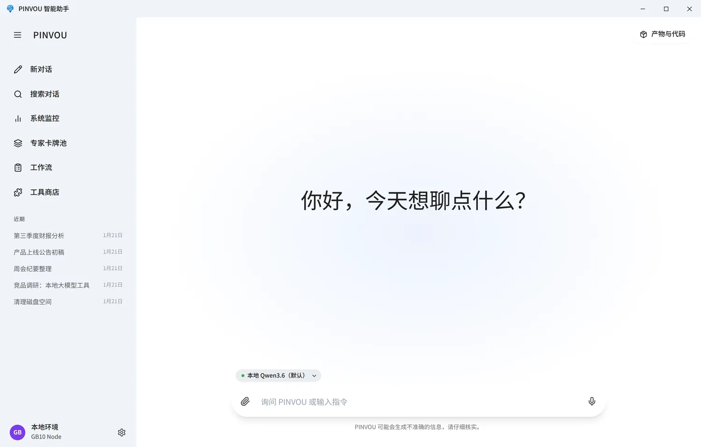
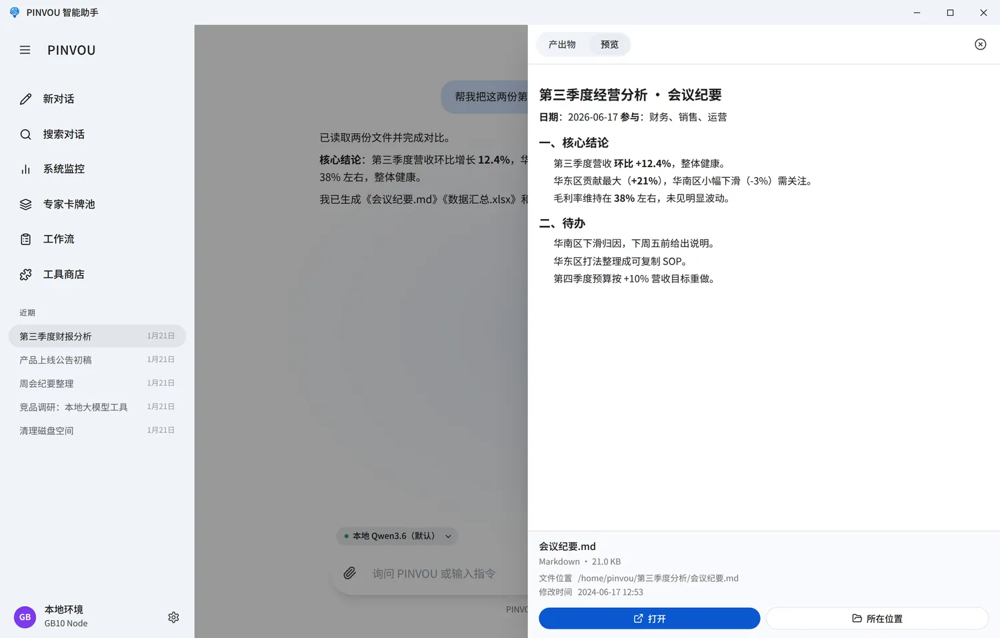

<div align="center">


# Pinvou Agent

**能调用工具、操作文件、沉淀知识并交付产物的开源桌面 AI Agent 工作台。**

[English](README.md) · [简体中文](README.zh-CN.md)

[](https://github.com/Pinvou/pinvou-agent/actions/workflows/pr-check.yml)
[](LICENSE)
[](pinvou3-app/package.json)
[](#-快速开始)
[](https://github.com/Pinvou/pinvou-agent/stargazers)

[官网](https://pinvou.com/) · [CodeWhale 底座](https://github.com/Pinvou/CodeWhale) · [问题反馈](https://github.com/Pinvou/pinvou-agent/issues) · [讨论区](https://github.com/Pinvou/pinvou-agent/discussions) · [安全政策](SECURITY.md)

<p align="center">
  <a href="https://pinvou.com/assets/videos/pinvou-agent-feature-update-2026-07.mp4">
    
  </a>
</p>
<p align="center">
  <a href="https://pinvou.com/assets/videos/pinvou-agent-feature-update-2026-07.mp4"><strong>▶ 观看 90 秒功能演示：7 月 17—23 日功能更新</strong></a>
</p>

</div>

Pinvou Agent 不只是一个聊天界面。它把模型、工具、个人知识、专家角色和工作流放进同一个桌面应用，让 AI 从“回答问题”进一步走到“**完成任务**”。模型既可以运行在本地，也可以接入任意 OpenAI-compatible 服务；工具与连接器按需启用。

## ✨ 功能特性

### 🎯 从对话到可交付产物

- **多会话管理**与会话标题搜索，历史消息、工具调用和产物随会话持久化
- 支持 **PDF、Office 文档、图片和文本附件**，可拖拽或粘贴导入
- **产物面板**自动收集 AI 创建或修改的文件，集中预览、定位和打开
- **Markdown 产物可直接编辑**，也可选中内容继续让 AI 修改
- **Plan / YOLO 双模式**：复杂任务先确认方案，明确任务可直接执行
- **ACP 代码会话**（如 Codex）：在同一工作台中驱动代码 Agent 完成编码任务

### 🧠 知识与记忆

- **本地知识库**支持文件管理、全文检索与向量检索
- **记忆中心**沉淀长期偏好和上下文，并提供候选确认与管理
- **专家卡牌池**可创建、保存和加持不同领域角色
- **Skills、Commands 与工作流**把可复用的方法固化为稳定能力

### 🔌 连接真实业务工具

- **工具商店**统一管理本地 MCP、远程 MCP、CLI 和 API 连接器
- 支持 **OAuth / SSO** 等免手填密钥的授权方式
- 可按需连接**飞书、钉钉、企业微信、腾讯会议、腾讯 ima、Obsidian**、企业知识库、法律与企业数据等能力
- **移动端扫码**后可远程查看和控制当前工作区

### 🖥️ 面向实际运行

- **本地语音输入**，语音模型按需下载
- GPU、内存、磁盘、模型服务与上下文使用情况**集中监控**
- Linux 应用内更新，macOS / Windows OTA 链路适配
- 会话、设置、知识和运行时扩展统一保存在 `~/.pinvou3/`

> [!NOTE]
> 数据是否离开本机取决于你选择的模型服务和工具。使用本地模型与本地工具时可保持本地闭环；启用云模型、远程 MCP 或第三方连接器时，相关请求会发送给对应服务。

## 📸 界面预览

<table>
  <tr>
    <td width="50%"></td>
    <td width="50%"></td>
  </tr>
  <tr>
    <td align="center">工具与连接器按需扩展</td>
    <td align="center">产物集中预览与交付</td>
  </tr>
</table>

## 🤖 模型接入

Pinvou Agent 支持**本地 vLLM** 和任意 **OpenAI-compatible API**。应用内可保存多个模型配置，并在不同会话间快速切换；当前提供本地 vLLM、DeepSeek、Kimi、通义千问、豆包、MiniMax、智谱、MiMo 等配置模板，也可以填写自定义兼容端点。

本地 vLLM 示例：

```bash
export DEEPSEEK_BASE_URL="http://127.0.0.1:8000/v1"
export DEEPSEEK_API_KEY="local-no-auth"
export DEEPSEEK_MODEL="qwen36_35b_256k"
```

模型地址、模型名和密钥也可以直接在应用设置中管理。对于非本机的明文 HTTP 端点，开发环境还需显式设置 `DEEPSEEK_ALLOW_INSECURE_HTTP=1`。

## 🚀 快速开始

### 前置条件

- Git（支持 submodule）
- Node.js 与 npm
- Rust toolchain
- [Tauri 2 系统依赖](https://v2.tauri.app/start/prerequisites/)
- 一个可访问的 OpenAI-compatible 模型端点

源码树支持 **Linux、Windows 和 macOS**；macOS 当前目标为 Apple Silicon (arm64) + macOS 11.0+。语音识别引擎可按构建配置打包；文件解析（PDF / Office / OCR / 压缩包等）依赖可选外部工具，可通过 Homebrew 或各工具官网安装。

### 启动应用

```bash
git clone --recursive https://github.com/Pinvou/pinvou-agent.git
cd pinvou-agent/pinvou3-app
npm ci
cd ..
./pinvou3-app/run-dev.sh
```

如果仓库已经克隆但 submodule 尚未拉取：

```bash
git submodule update --init --recursive
```

## 🏗️ 架构

[](https://v2.tauri.app/)
[](https://react.dev/)
[](https://vite.dev/)
[](https://www.rust-lang.org/)

```text
React + Vite UI
       ↕ Tauri commands / events
pinvou3-app（桌面编排层）
       ↕ EngineHandle / AgentHarness
CodeWhale（Agent 底座 submodule）
       ├─ OpenAI-compatible 模型服务
       ├─ MCP servers / CLI connectors
       └─ Skills / Commands / Hooks / Compaction
```

模型调用、流式输出、工具循环、Session、MCP client、Skills、Hooks 和 Compaction 由 [CodeWhale](https://github.com/Pinvou/CodeWhale) 底座提供。`pinvou3-app/` 负责桌面 UI、运行时配置、业务编排和系统集成，不重复实现底座能力。

扩展能力时按以下边界落位：

| 需求 | 扩展位置 |
|---|---|
| 增加领域 Agent 或工具组合 | `SKILL.md` |
| 接入外部 API | 独立 MCP server 或连接器 |
| 调整模型行为 | bundle 中的 `instructions.md` |
| 桌面 UI、系统能力或 Engine 配置 | `pinvou3-app/` |
| 修复底座通用问题 | CodeWhale fork，并按 [fork policy](docs/fork-policy.md) 维护 |

## 📁 仓库结构

```text
pinvou3-app/          Tauri 2 + React/Vite 桌面应用
CodeWhale/            Agent 底座 submodule
pinvou3-app/resources/mcp-servers/
                      独立 MCP 服务
workflows/            可复用工作流
scripts/              测试、守卫、构建与发布脚本
docs/                 架构设计、验证报告与维护文档
```

## 🧪 常用验证

```bash
# 以下命令均从仓库根目录执行
(cd pinvou3-app && npm run lint:ui)
(cd pinvou3-app && npm run build:ui)
(cd pinvou3-app && npm test)

(cd pinvou3-app/src-tauri && cargo test --lib -- --test-threads=1)

./scripts/fork-guard.sh --fast
```

## 🤝 参与贡献

欢迎贡献！提交前请阅读 [贡献指南](CONTRIBUTING.zh-CN.md) 了解流程与 CI 门控；涉及 CodeWhale 底座的改动请遵循 [fork 策略](docs/fork-policy.md) 与 [当前 fork 修改清单](docs/fork-modifications.md)。参与本项目即表示同意遵守 [社区行为准则](CODE_OF_CONDUCT.md)。

## 💬 社区与安全

- 🐛 [GitHub Issues](https://github.com/Pinvou/pinvou-agent/issues) — 可复现的 bug 与聚焦的功能建议
- 💡 [GitHub Discussions](https://github.com/Pinvou/pinvou-agent/discussions) — 问题与想法交流（社区支持为尽力而为，见 [SUPPORT.md](SUPPORT.md)）
- 🔒 **请勿在公开 Issue 中报告安全漏洞** — 请使用 [SECURITY.md](SECURITY.md) 中的私有渠道，或发送邮件至 `security@pinvou.com`

## 📖 进一步阅读

- [第三方许可声明](THIRD_PARTY_NOTICES.md)
- [商标使用规则](TRADEMARKS.md)
- [SBOM 说明](docs/sbom.md)
- [工具市场设计](docs/工具市场.md)

## 🔗 友情链接

- [LINUX DO](https://linux.do/)

## ⭐ Star History

<a href="https://www.star-history.com/?repos=pinvou%2Fpinvou-agent&type=date">
 <picture>
   <source media="(prefers-color-scheme: dark)" srcset="https://api.star-history.com/chart?repos=pinvou%2Fpinvou-agent&type=date&theme=dark&sealed_token=k7dkorBV3gOYRbA3ai0hCjYhzSjr1TFHk6Z9Lxdr5i_rhBGio7qlD80ERUfWzofzxF8394-zl1QwsZJEhzGPELvh9_Fm4xXR5Jm4xdEAfAENh8uizuoqey8O1_1aY5b-IZZsqiZjk3VyNn3v8sAgDQmveN9oz2jtOlYmwOYMYZYOhJp8mTouzJQyRCAB" />
   <source media="(prefers-color-scheme: light)" srcset="https://api.star-history.com/chart?repos=pinvou%2Fpinvou-agent&type=date&sealed_token=k7dkorBV3gOYRbA3ai0hCjYhzSjr1TFHk6Z9Lxdr5i_rhBGio7qlD80ERUfWzofzxF8394-zl1QwsZJEhzGPELvh9_Fm4xXR5Jm4xdEAfAENh8uizuoqey8O1_1aY5b-IZZsqiZjk3VyNn3v8sAgDQmveN9oz2jtOlYmwOYMYZYOhJp8mTouzJQyRCAB" />
   
 </picture>
</a>

---

<div align="center">

Pinvou Agent 正在持续迭代中，功能状态以 `main` 分支和当前发布版本为准。

**[MIT License](LICENSE)** · 由 Pinvou 团队与社区贡献者用 ❤️ 打造

</div>
