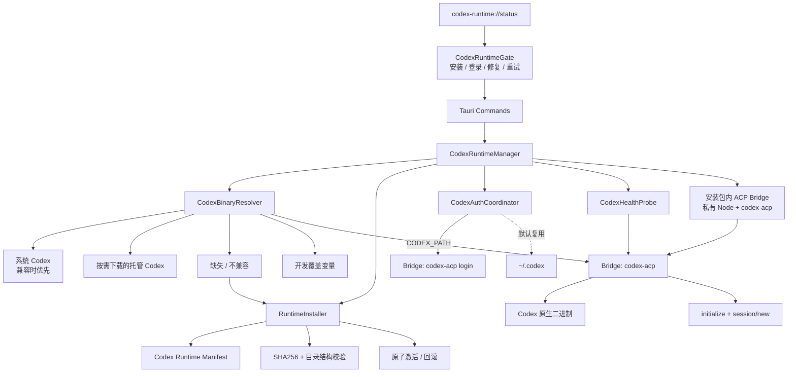
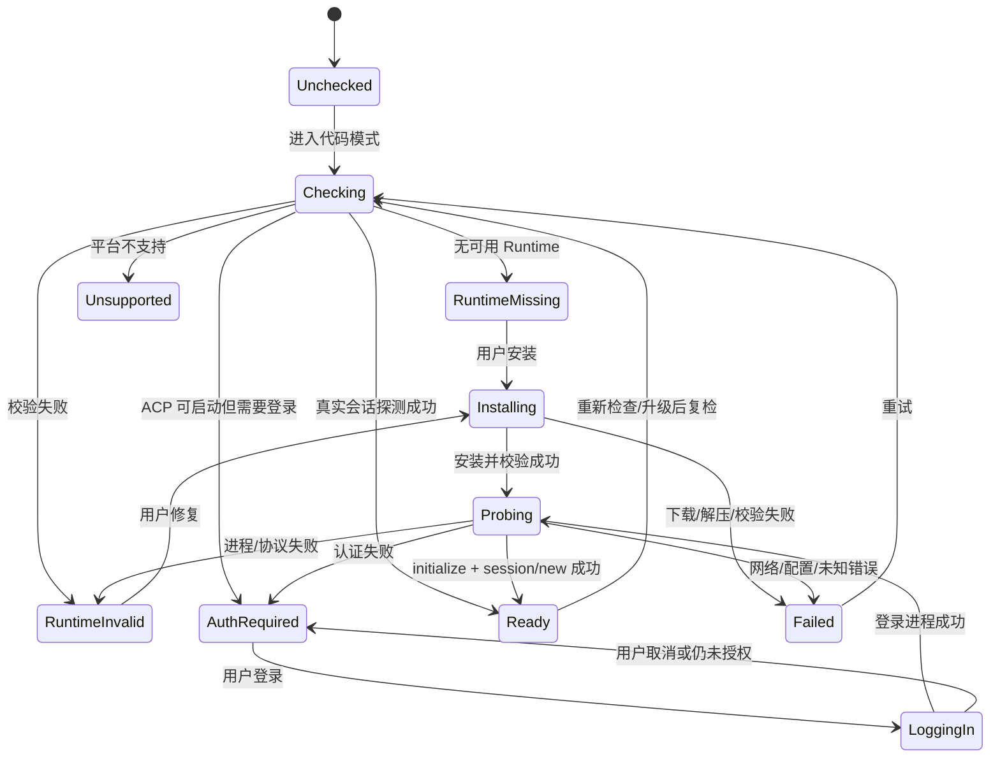

# Codex ACP 运行环境与首次使用设计

> 文档状态：待评审
>
> 记录日期：2026-07-23
>
> 对应分支：`feat/codex-acp`
>
> 上位决策：[`Codex-ACP-整体架构决策.md`](./Codex-ACP-整体架构决策.md)

## 1. 一句话决策

正式版 Pinvou 不要求用户预先安装 Node、npm、Codex CLI 或 `codex-acp`，但会优先检测
并复用设备上已经安装且兼容的 Codex。设备没有 Codex，或系统版本与当前
`codex-acp` 不兼容时，Pinvou 再按需下载固定版本的托管 Codex。

Pinvou 安装包只携带体积较小的 **ACP Bridge Runtime**（私有 Node +
`codex-acp`，不携带大体积 Codex 平台二进制），从而保证 ACP Host 自身不依赖系统
Node/npm。用户只负责完成 ChatGPT 登录或显式提供 API Key。

运行组件和用户配置采用以下边界：

```text
Pinvou 安装包管理
└── <app-resources>/codex-bridge/
    ├── 私有 Node
    └── codex-acp

系统已有，兼容时优先使用
└── <resolved-from-PATH>/codex

Pinvou 按需下载，仅在系统 Codex 缺失或不兼容时存在
└── ~/.pinvou3/runtimes/codex/<runtime-release>/
    └── 对应平台的 Codex 原生二进制

用户管理，Pinvou 默认只读复用
└── ~/.codex/
    ├── auth.json
    ├── config.toml
    ├── skills
    ├── rules
    └── MCP 配置
```

Pinvou 不全局安装 npm 包、不修改系统 `PATH`、不使用 `sudo`，也不静默改写
`~/.codex`。下载组件损坏时只修复 `~/.pinvou3/runtimes/codex/`；Bridge 损坏时提示
修复或重新安装 Pinvou。两者都不得删除用户的 Codex 登录、配置、skill、MCP 或会话
数据。

## 2. 背景和当前问题

当前 Codex ACP MVP 已经可以：

- 在 `~/.pinvou3/runtimes/codex-acp-1.1.5/` 安装固定版本
  `@agentclientprotocol/codex-acp`。
- 通过该包的依赖获得 `@openai/codex` 和当前平台的 Codex 原生二进制，因此不强制要求
  用户全局安装 Codex CLI。
- 优先使用环境变量指定、应用内置、Pinvou 私有目录中的 adapter，最后才回退到系统
  `PATH`。
- 调用 `codex-acp login` 发起登录。
- 复用用户默认 `HOME` 下的 `~/.codex`，因此已登录用户可以继续使用自己的 Codex
  配置、skills 和 MCP。

但当前实现仍有四个产品化缺口：

1. **仍依赖系统 Node/npm**
   adapter 和内置 npm 依赖树已经属于 Pinvou，但启动和首次安装仍要求系统存在
   Node.js 20+ 与 npm。
2. **认证判断不可靠**
   当前只检查 `OPENAI_API_KEY` 或 `~/.codex/auth.json` 是否存在。文件存在不代表凭证
   有效，也不能证明模型、网络和 ACP 会话可用。
3. **安装方式不适合正式终端**
   首次使用直接执行 npm 安装，依赖 npm registry、代理和现场网络；也没有 Pinvou
   自己的产物 manifest、完整性校验、原子切换和回滚。
4. **状态过于粗糙**
   UI 只能区分 Node 缺失、adapter 缺失、未登录和普通错误，不能准确区分下载失败、
   组件损坏、登录过期、Codex 配置错误、网络错误和平台不支持。

## 3. 目标与非目标

### 3.1 目标

- 系统已有兼容 Codex 时直接复用，不重复下载大体积 Codex 平台二进制。
- 全新 Linux 设备没有 Node、npm、Codex CLI 时，用户仍可从 Pinvou 内完成首次启用。
- 已经使用过 Codex 的用户默认复用原来的 `~/.codex`，无需重复登录或搬迁配置。
- 未登录用户可从 Pinvou 发起 ChatGPT 登录，成功后自动复检并进入会话。
- Pinvou 必须通过真实 ACP `initialize + session/new` 判断 Codex 是否可用。
- 下载、安装、登录、检查、修复均有明确状态、进度和可恢复操作。
- Bridge 和托管 Codex 版本固定、可审计、可校验、可回滚，不依赖终端现场执行 npm
  安装。
- Codex Runtime 的安装或故障不能阻塞 Pinvou 启动，也不能影响 DeepSeek-TUI 原有功能。
- 首期完成 Linux x64 / arm64；架构保留 Windows x64 / arm64 与 macOS x64 / arm64
  扩展能力。

### 3.2 非目标

- 不在 Pinvou 中实现 OpenAI 账号体系或自行处理 ChatGPT OAuth token。
- 不复制、迁移或解析 `auth.json` 中的凭证内容。
- 不接管 Codex system prompt、tools、tool loop、skills、MCP 和上下文管理。
- 不要求应用启动时就安装 Codex Runtime；只有进入“代码”模式或用户显式启用时才检查。
- 不将托管 Codex 的更新与 Pinvou 主程序 OTA 强制绑定；Bridge 与 Pinvou 主程序一起
  发布。
- 不在本阶段建设通用 ACP Agent Runtime 市场。

## 4. 参考 AionUI 后的取舍

AionUI 的成熟点是：

- 管理私有 Node Runtime 和固定版本 ACP Tool。
- 按操作系统和 CPU 架构准备独立产物。
- 校验 `codex-acp` 包中对应平台的 Codex 原生二进制。
- 使用 manifest、SHA256 和分类错误处理安装失败。
- 用真实 `initialize + session/new` 区分 `online`、`missing`、`offline` 和
  `auth_required`。

AionUI 当前登录体验的不足是：检测到 `auth_required` 后，主要提示用户去 CLI 登录或
配置环境变量。Pinvou 已经有应用内“登录”入口，应保留并完善这一点。

Pinvou 采用以下组合方案：

| 能力 | 采用方案 |
|---|---|
| 私有 Node / ACP Tool | 随 Pinvou 内置小型 Bridge Runtime |
| Codex 原生二进制 | 系统兼容版本优先；缺失或不兼容时按需下载 |
| 认证和配置目录 | 复用 Codex 默认 `~/.codex` |
| ChatGPT 登录 | Pinvou 内发起，授权页面仍由官方 Codex 流程处理 |
| API Key | 高级备选，不作为默认首次使用路径 |
| 健康检查 | 真实 ACP 握手，不以文件存在为结论 |
| 后端实现 | 保持 Tauri/Rust 直连，不引入 AionCore 或额外 HTTP 服务层 |

## 5. 总体架构



### 5.1 组件职责

#### `CodexRuntimeManager`

- Codex Runtime 的唯一后端入口。
- 串行化安装、修复、登录和健康检查，避免重复任务。
- 将底层错误转换为稳定的产品状态。
- 发出安装进度与状态变更事件。
- 不负责正常会话 timeline；Runtime 就绪后仍由现有 `AcpPool` 托管会话。

#### `CodexBinaryResolver`

Bridge Runtime 始终使用 Pinvou 固定版本，不从系统查找 Node 或 `codex-acp`。Bridge
通过 `CODEX_PATH` 选择实际 Codex 二进制，按以下优先级解析：

1. 开发覆盖 `PINVOU3_CODEX_PATH`。
2. 系统 `PATH` 中已安装、版本兼容且健康检查可启动的 Codex。
3. 当前已激活的 Pinvou 托管 Codex。
4. 无可用版本，进入按需下载状态。

系统 Codex 的绝对路径、版本和来源要写入状态对象并在诊断界面可见。不能只根据命令名称
判断兼容；必须执行 `codex --version`，再用固定 Bridge 完成真实 ACP 探测。

系统 Codex 已安装但只是未登录时，不应错误下载托管 Codex，因为两者默认共享同一
`~/.codex`，下载并不能解决认证问题。只有缺失、版本不兼容或二进制无法启动时才进入
下载流程。

#### `RuntimeInstaller`

- Linux MVP 从 OpenAI 官方 npm registry 取得对应平台的固定 Codex 归档；官方源不可达
  时可尝试镜像，但两者必须通过同一个内置 SHA-512。后续可迁到 Pinvou CDN，不得改变
  同一版本的校验值。
- 解压到同一文件系统下的 staging 目录。
- 校验代码内置的 URL、SHA-512、版本、平台、架构和 Codex 文件结构。
- 使用内置 Bridge 执行 Codex 版本、自检和 ACP 启动检查。
- 校验成功后用目录 rename 原子激活。
- 激活失败时保留上一个可用版本。

#### `CodexAuthCoordinator`

- 启动私有 Runtime 中的 `codex-acp login`。
- 允许 adapter 调用系统浏览器完成官方授权。
- 登录进程结束后不直接宣告成功，而是触发 `CodexHealthProbe`。
- 不读取、不展示、不记录 OAuth token。
- 用户取消登录时回到 `auth_required`，不归类为 Runtime 故障。

#### `CodexHealthProbe`

分三层检查：

1. **结构检查**：文件、版本、权限、平台和 SHA256。
2. **进程检查**：私有 Node 能启动 adapter，ACP `initialize` 成功。
3. **会话检查**：在 Pinvou 临时探测目录执行 `session/new`，能获得 Agent capability、
   模型/模式等会话信息。

只有第 3 层成功才返回 `ready`。探测会话不得出现在用户会话列表中，完成后立即关闭
子进程并清理临时目录。

## 6. Runtime 产物设计

### 6.1 版本与平台

Bridge Release 随 Pinvou 主程序发布，托管 Codex Runtime Release 与 Pinvou 主程序
版本解耦，例如：

```text
bridge release:  codex-bridge-2026.07.1
node:            22.x LTS（构建时固定精确版本）
codex-acp:       1.1.5

runtime release: codex-runtime-0.x.y
codex:           0.x.y
platform:        linux-x64 / linux-arm64
```

Bridge 不能只固定顶层 `codex-acp` 而允许每次构建重新解析不同的传递依赖，必须使用
锁文件。构建 Bridge 时不携带 `@openai/codex-*` 平台二进制，并验证设置
`CODEX_PATH` 后 adapter 不会尝试解析内置 Codex。

兼容矩阵由 Bridge Release 明确记录，例如某个 `codex-acp` 版本验证过哪些 Codex
版本。系统 Codex 超出已验证范围时默认下载托管版本，但允许用户在高级设置中强制试用
系统版本。

### 6.2 目录布局

```text
<app-resources>/codex-bridge/
├── manifest.json
├── node/bin/node
└── acp/node_modules/@agentclientprotocol/codex-acp/

~/.pinvou3/runtimes/codex/
├── active.json
├── codex-runtime-0.x.y-linux-x64/
│   ├── manifest.json
│   └── bin/codex
├── codex-runtime-previous/
└── .staging/
```

Rust 侧直接使用私有 Node 执行 adapter JS 入口，不依赖 `#!/usr/bin/env node`，也不修改
应用或系统的 `PATH`：

```text
<app-resources>/codex-bridge/node/bin/node
<app-resources>/codex-bridge/acp/node_modules/@agentclientprotocol/codex-acp/dist/index.js
CODEX_PATH=<system-codex-or-managed-codex>
```

启动子进程时只补充必要环境变量，并继承用户原有 `HOME`，从而自然复用 `~/.codex`。

### 6.3 Manifest

最小 manifest 字段：

```json
{
  "schema_version": 1,
  "runtime_release": "codex-runtime-0.x.y",
  "platform": "linux",
  "arch": "x64",
  "codex_version": "0.x.y",
  "codex": "bin/codex",
  "files": [
    {
      "path": "node/bin/node",
      "sha256": "..."
    }
  ]
}
```

下载模式下，可信根必须随 Pinvou 应用发布，不能接受下载服务器临时返回的任意 checksum
作为唯一依据。Linux MVP 在 Rust 代码中固定 OpenAI 官方归档的版本、URL 和 SHA-512；
后续迁到 Pinvou CDN 时再升级为签名的 Runtime Release Index。

### 6.4 安装策略

采用“**系统 Codex 优先 + 托管 Codex 按需下载**”：

- Linux 正式安装包只内置固定 Bridge Runtime，不内置大体积 Codex 平台二进制。
- 进入“代码”模式时先检测系统 Codex 路径、版本并执行真实 ACP 探测。
- 系统版本兼容时直接使用，不下载托管 Codex。
- 系统缺失或不兼容时，用户点击一次即可下载托管 Codex。
- Linux MVP 直接获取 OpenAI 官方 npm registry 的固定平台归档，不调用 npm；官方源
  不可达时可使用镜像，但所需版本、URL 和 SHA-512 已编译进 Pinvou。后续可无缝切换
  到 Pinvou CDN。
- 托管 Codex 更新不覆盖旧目录；新版本校验和探测成功后才切换 `active.json`。
- 每个平台最多保留当前和上一个托管版本，清理动作不得触碰 `~/.codex`。

按本机现有产物估算，Bridge 安装包压缩增量约 45～60 MB，安装后约 130～160 MB；
系统缺少 Codex 时再下载约 110～130 MB，解压后约 330～360 MB。最终数字以独立 Bridge
产物构建后实测为准。

## 7. 用户配置与认证边界

### 7.1 默认复用 `~/.codex`

Pinvou 默认不设置独立 `CODEX_HOME`，继续继承用户 `HOME`：

- 已登录用户无需重复登录。
- Codex 自身配置、原生 skills、MCP 和记忆行为保持一致。
- 用户在 Codex CLI、Codex 桌面端和 Pinvou 之间不需要复制配置。

Pinvou 不应：

- 自动创建或改写 `~/.codex/config.toml`。
- 复制、迁移、解析或上传 `auth.json`。
- 因 Runtime 修复而删除 `~/.codex`。
- 把 Pinvou 的 system prompt、skill 或 MCP 默认写入 Codex 用户目录。

后续如需企业隔离，可增加“独立 Codex Profile”高级选项，但不能作为默认行为。

### 7.2 ChatGPT 登录

首次未登录时：

1. 用户点击“使用 ChatGPT 登录”。
2. Pinvou 启动私有 Runtime 的 `codex-acp login`。
3. 官方流程打开浏览器，用户完成授权。
4. Pinvou 显示“等待浏览器授权”，支持取消和重新打开。
5. 登录命令结束后自动执行真实 ACP 健康检查。
6. 探测成功才进入 `ready`；仍是认证错误则继续显示“重新登录”。

登录过程中不得在普通日志、timeline 或前端事件中传递凭证。

### 7.3 API Key

API Key 是高级备选，不是默认首次使用路径：

- 优先允许用户自己通过系统环境提供 `OPENAI_API_KEY`。
- 如果后续增加应用内录入，必须使用操作系统凭据存储；不得明文写入
  `settings.json`、session sidecar 或 timeline。
- API Key 只注入 Codex 子进程，不注入 DeepSeek-TUI 或其他 connector。
- UI 只显示“已配置”，不提供读取原值能力。

Linux 若目标发行版没有可用的 Secret Service，则第一阶段宁可只支持用户环境变量，也
不应退化成明文保存。

## 8. Runtime 状态机

### 8.1 稳定状态

```rust
enum CodexRuntimePhase {
    Unchecked,
    Checking,
    RuntimeMissing,
    Installing,
    RuntimeInvalid,
    AuthRequired,
    LoggingIn,
    Probing,
    Ready,
    Failed,
    Unsupported,
}
```

状态对象至少包含：

```rust
struct CodexRuntimeStatus {
    phase: CodexRuntimePhase,
    runtime_release: Option<String>,
    codex_acp_version: Option<String>,
    codex_version: Option<String>,
    source: Option<RuntimeSource>,
    progress: Option<RuntimeProgress>,
    failure_kind: Option<RuntimeFailureKind>,
    message: Option<String>,
    can_retry: bool,
    can_repair: bool,
}
```

前端不能再用多个布尔值自行推导主状态，避免出现“已安装但未登录”“正在安装但按钮仍可
发送”之类的组合错误。

### 8.2 主要状态转换



## 9. 错误分类

`RuntimeFailureKind` 至少覆盖：

| 类型 | 含义 | UI 操作 |
|---|---|---|
| `unsupported_platform` | 当前 OS/架构没有产物 | 查看支持范围 |
| `bundled_resource_missing` | 安装包缺少应内置的 Runtime | 重新安装 Pinvou |
| `download_failed` | CDN/代理/网络下载失败 | 重试、查看诊断 |
| `checksum_mismatch` | 文件完整性校验失败 | 删除 staging 后重新下载 |
| `archive_invalid` | 解压或目录结构错误 | 修复 |
| `runtime_validation_failed` | Bridge 或托管 Codex 自检失败 | 修复/重新下载 |
| `acp_init_failed` | 进程启动但 ACP initialize 失败 | 修复、查看诊断 |
| `auth_required` | Agent 可连接但需要登录 | 登录 |
| `auth_expired` | 已有凭证但授权失效 | 重新登录 |
| `codex_config_invalid` | Codex 配置无法解析或冲突 | 打开配置位置、重试 |
| `network_unavailable` | OpenAI 服务不可达 | 检查网络、重试 |
| `session_probe_failed` | initialize 成功但 session/new 失败 | 查看诊断、重试 |
| `unknown` | 未分类错误 | 查看诊断、反馈 |

后端应保存可诊断的原始错误，但前端普通提示使用稳定分类和中文说明。日志必须脱敏，不能
包含 API Key、Authorization header、OAuth token 或 `auth.json` 内容。

## 10. 首次使用 UI

Codex Runtime Gate 位于主页“代码”模式。Runtime 未就绪时，不跳转到设置页，也不把
错误塞进对话 timeline，而是在内容区显示 `CodexRuntimeGate`；左侧统一会话列表仍可
查看已有 Codex 会话摘要。

### 10.1 组件缺失

```text
开始使用 Codex

没有检测到兼容的系统 Codex。
Pinvou 可以下载经过验证的托管 Codex，不会修改系统 Node 或全局 Codex。

Codex 0.x.y
约 120 MB · Linux x64

[下载托管 Codex]
```

### 10.2 安装中

```text
正在下载托管 Codex

下载运行组件        68%
校验文件            等待中
启动检查            等待中

[取消]
```

取消只删除 staging，不删除已经激活的 Runtime。

### 10.3 需要登录

```text
登录后使用 Codex

使用你的 ChatGPT 账号完成官方授权。
Pinvou 不会读取或保存你的登录密码。

[使用 ChatGPT 登录]
[高级：使用 API Key]
```

### 10.4 等待授权

```text
请在浏览器中完成登录

授权完成后 Pinvou 会自动检查连接。

[重新打开浏览器] [取消]
```

### 10.5 组件损坏

```text
Codex 组件需要修复

托管 Codex 校验失败，不会影响系统 Codex，也不会影响你的登录、配置、skills 和 MCP。

[重新下载] [查看诊断]
```

### 10.6 已就绪

Runtime Gate 消失，恢复正常会话列表、项目选择和输入框。页脚只保留简洁的
“Codex 已连接”；详细版本、来源和诊断放在 Codex 设置或状态弹层中，例如：

```text
Codex 已连接
来源：系统 Codex
版本：0.x.y
路径：/usr/local/bin/codex
配置：~/.codex
```

历史会话始终可见。Runtime 未就绪时允许查看已有 timeline，但禁止发送、改模型、改模式
和回复权限，并明确说明当前原因。

## 11. Tauri 接口

建议新增或调整为以下命令：

```text
get_codex_runtime_status
ensure_codex_runtime
cancel_codex_runtime_operation
start_codex_login
cancel_codex_login
probe_codex_runtime
repair_codex_runtime
get_codex_runtime_diagnostics
```

状态变化统一通过：

```text
codex-runtime://status
```

安装、登录和探测在后端维持单任务锁。重复点击返回同一进行中状态，而不是启动第二个 npm、
登录或 ACP 子进程。

现有 `prepare_codex_acp`、`login_codex_acp` 可在迁移期作为兼容入口调用新的
`CodexRuntimeManager`，前端切换完成后再删除旧命令。

## 12. 与现有功能的隔离

### 12.1 不影响 DeepSeek-TUI

- Runtime 检查只在进入“代码”模式或设置中显式检查时触发。
- Pinvou 应用启动不等待 Runtime 下载、登录或 ACP 探测。
- 不修改全局 `PATH`、`HOME`、Node 环境或 DeepSeek-TUI Engine 配置。
- Codex 子进程的环境变量仅作用于该子进程。
- Codex Runtime 失败不发布 `chat:*` 事件，也不进入 DeepSeek 会话状态。
- Runtime 文件只位于 `~/.pinvou3/runtimes/codex/`。

### 12.2 不破坏用户 Codex

- 默认复用但不写入 `~/.codex`。
- “重新下载/删除托管 Codex”只处理 `~/.pinvou3/runtimes/codex/`；Bridge 损坏通过
  修复或重新安装 Pinvou 处理。
- 用户全局安装的 Codex CLI 不被升级、删除或覆盖。
- 开发覆盖变量只影响当前 Pinvou 进程。

### 12.3 会话兼容

现有 `session-agents.json`、`acp-state.json` 和 `acp-timeline.jsonl` 不因 Runtime
版本改变而迁移。Runtime Release 是进程实现版本，不是 Pinvou 会话 schema 版本。

## 13. 发布与供应链

### 13.1 构建流水线

每个平台独立执行：

1. 下载并校验固定版本 Node 官方产物。
2. 使用锁定依赖安装 `@agentclientprotocol/codex-acp`。
3. 构建不携带 Codex 平台二进制的 Bridge Runtime。
4. 使用多个受支持 Codex 版本和 `CODEX_PATH` 验证 Bridge 兼容矩阵。
5. 将 Bridge Runtime 放入对应 Tauri 安装包。
6. 分别构建 Linux x64 / arm64 托管 Codex 下载产物。
7. 生成包含文件哈希、版本、平台和兼容范围的 manifest。
8. 上传托管 Codex 产物到 Pinvou 可信下载源。
9. 保存 SBOM、许可证清单和构建日志。

不得在 Linux x64 构建机上把本机原生包直接复用到 arm64 产物。

### 13.2 更新策略

- Bridge 内置系统 Codex 的已验证版本范围和推荐托管版本。
- 系统 Codex 更新后仍兼容时继续使用，不触发托管下载。
- 系统 Codex 超出兼容范围时提示切换托管版本，不静默执行大文件下载。
- 托管版本更新失败不阻塞继续使用当前可用版本。
- 必须升级时先下载、校验、探测，再切换。
- 新托管版本连续启动失败时自动回退上一个已验证版本。
- 回滚只切换托管 Codex，不回滚或修改用户 `~/.codex`。

## 14. 分阶段实施

### 阶段 A：状态模型与真实健康检查

- 引入单一 `CodexRuntimeStatus` 和错误分类。
- 用 `initialize + session/new` 替换 `auth.json` 文件存在判断。
- 前端增加 `CodexRuntimeGate`，区分缺失、未登录、配置错误和连接错误。
- 暂时继续使用系统 Node，降低一次改动范围。

验收：

- 删除/过期 `auth.json`、无效 API Key、错误 `config.toml` 能得到不同的准确提示。
- `auth.json` 存在但无法建会话时不能显示“Codex 已连接”。
- DeepSeek 页面和会话不受影响。

### 阶段 B：私有 Bridge 与系统 Codex 优先

- 构建 Linux x64 / arm64 Bridge Runtime。
- 使用私有 Node 启动 adapter，并通过 `CODEX_PATH` 使用系统 Codex。
- 检测系统 Codex 的绝对路径、版本和兼容性。
- 状态和诊断中明确展示当前使用系统还是托管 Codex。
- 正式包不再依赖系统 Node/npm。

验收：

- 已安装兼容 Codex 的设备不下载托管 Codex即可进入登录或会话阶段。
- 没有系统 Node/npm，但存在原生 Codex 时仍可正常运行 ACP。
- 系统 Codex 未登录时提示登录，不误触发托管下载。

### 阶段 C：托管 Codex 按需下载

- 构建 Linux x64 / arm64 托管 Codex 下载产物。
- 增加固定产物信息、SHA-512、staging 和原子激活；签名索引及上一版本自动回滚后续补齐。
- 系统 Codex 缺失或不兼容时显示一次性下载入口。

验收：

- 干净设备没有 `node`、`npm`、`codex`、`codex-acp` 时，下载托管 Codex 后可进入
  登录阶段。
- 下载过程不调用 npm；Linux MVP 从 OpenAI 官方 npm registry 读取固定平台归档。
- 下载失败不影响 Pinvou 和 DeepSeek-TUI。
- 托管 Codex 损坏可以重新下载，且系统 Codex 与 `~/.codex` 完全不变。

### 阶段 D：应用内登录闭环

- 登录状态、浏览器等待、取消、重新打开和登录后自动探测完整接入。
- API Key 只保留高级入口；具备安全存储前不在 UI 中明文落盘。

验收：

- 新用户从“安装”到“ChatGPT 登录”再到首个会话，无需打开终端。
- 已登录用户直接进入 `ready`，不会重复要求授权。
- 用户取消登录后可以重试，不残留错误进程。

### 阶段 E：更新、诊断与恢复

- Runtime 在线更新、失败回滚、诊断导出和日志脱敏。
- 支持代理、超时、下载续试及安装完整性错误分类。

### 阶段 F：Windows/macOS

- 按相同 manifest 和状态机扩展目标平台。
- 平台差异只进入 Runtime 构建和进程启动层，不分叉上层 UI 与会话逻辑。

## 15. 测试与验收矩阵

| 场景 | 预期结果 |
|---|---|
| 干净 Linux，无 Node/npm/Codex | 提示下载托管 Codex，成功后进入登录页 |
| 已安装兼容系统 Codex | 使用系统 Codex，不下载托管版本 |
| 已安装不兼容系统 Codex | 解释版本问题并提供托管版本下载 |
| 系统 Codex 存在但未登录 | 提示登录，不下载托管版本 |
| 已存在有效 `~/.codex` | 探测成功后直接进入会话 |
| `auth.json` 存在但过期 | 显示重新登录，不显示已连接 |
| 设置有效 `OPENAI_API_KEY` | 探测成功后进入会话 |
| API Key 无效 | 显示认证失败，不记录 key |
| `config.toml` 语法错误 | 显示配置错误及配置路径 |
| Bridge 文件被篡改 | 提示修复/重新安装 Pinvou |
| 托管 Codex 文件被篡改 | 完整性失败，可重新下载 |
| staging 下载中断 | 当前 Runtime 不受影响，可重试 |
| 新托管版本探测失败 | 保留或回退上一版本 |
| OpenAI 网络不可达 | 显示网络错误，不误报未安装 |
| 用户取消浏览器登录 | 回到需要登录，可再次发起 |
| 代码模式未就绪 | 历史可查看，发送和配置修改禁用 |
| Codex 安装/登录失败 | DeepSeek 会话仍可正常创建和使用 |
| 删除托管 Codex | 不删除系统 Codex 和 `~/.codex` |

自动测试至少覆盖：

- Runtime 状态转换和重复操作锁。
- 系统 Codex 路径解析、版本兼容矩阵和 `CODEX_PATH` 注入。
- manifest 路径穿越、哈希错误和平台错误。
- staging 原子激活与回滚。
- 登录取消、超时和进程回收。
- ACP probe 成功、`auth_required`、配置错误和网络错误分类。
- 日志脱敏。
- Codex Runtime 事件不会进入 DeepSeek reducer。

## 16. 建议代码落点

后端按主线架构放在独立 feature：

```text
pinvou3-app/src-tauri/src/features/codex_acp/
├── mod.rs
├── runtime.rs
├── events.rs
├── store.rs
└── ...
```

前端建议新增：

```text
pinvou3-app/src/features/codex/
├── CodexAcpView.jsx
├── CodexRuntimeGate.jsx
├── codex-runtime-state.js
└── components/
    ├── RuntimeInstallCard.jsx
    ├── RuntimeLoginCard.jsx
    └── RuntimeRepairCard.jsx
```

构建脚本建议替换当前仅 npm 安装的脚本：

```text
pinvou3-app/scripts/codex-runtime/
├── build-runtime.sh
├── validate-runtime.sh
├── generate-manifest.mjs
└── targets/
```

具体文件可以在实施时根据代码体量合并；分层职责不应退回到一个同时负责安装、登录、
进程、会话和 UI 状态推导的大文件。

## 17. 需要本次评审确认的决策

本文当前收敛为以下四项：

1. **系统 Codex 优先**：检测路径和版本，兼容时直接使用，不重复下载大体积二进制。
2. **缺失或不兼容时下载**：Pinvou 提供固定托管版本的一键下载，不要求用户安装
   Node/npm。
3. **默认共享用户 `~/.codex`**：Pinvou 不创建隔离配置目录，也不静默修改用户配置。
4. **ChatGPT 登录为默认路径**：API Key 是高级备选；没有安全凭据存储前不在 Pinvou
   配置文件中保存 Key。

实施顺序为阶段 A → B → C → D：先改善判断和 UI，再接私有 Bridge 和系统 Codex
检测，然后完成托管 Codex 按需下载，最后完成不打开终端的首次登录闭环。
