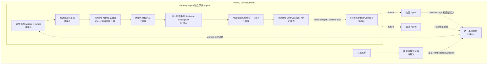
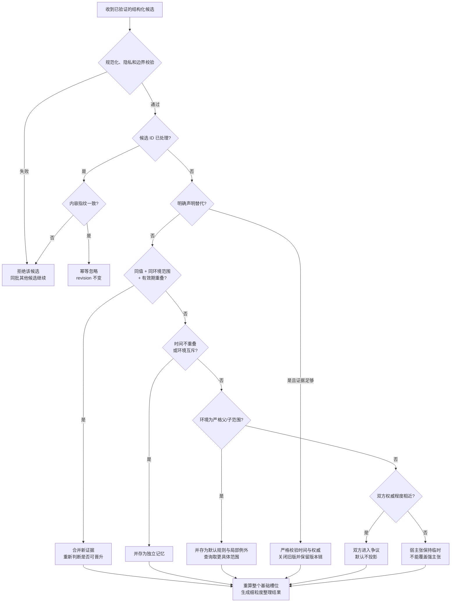

# PinvouOS：无 Session 的 Memory Agent 整理内核

## 状态

整理内核已接入 PinvouOS Runtime 核心：记忆决策和检查点写入同一统一事件账本，
启动时可由检查点和后续决策精确重放；写入受进程内单写锁与账本持久头 CAS 保护，
失败后隔离当前记忆引擎，不暴露未落盘状态。Runtime 同时已接结构化 Claim 的精确语义
绑定、可重建结构热索引与有界 Top-K 投影，并完成旧全量 snapshot 的一次性迁移。

这还不是完整的后台记忆服务。Front / Orchestrator 到记忆的异步 worker、消费游标、
候选提取和反思尚未接入；完整 `UserMessage` / `VerifiedTaskOutcome` 事件、周期检查点、
压缩、冷归档、SQLite、Front Context Compiler、token budget、`context_plan_hash` 和
Obsidian 也仍是后续工作。

本决策延续 ADR-0007 的单一连续身份，并明确替代旧 `features/memory/` 中按 Session
捕获对话、调用模型复盘、再生成 Session prompt 文件的做法。旧模块在迁移期间保持
兼容，但不能成为 PinvouOS 记忆真相源。新的 `MemoryOrganizer` 是唯一的
记忆语义核心；现有 `MemoryAgent` API 只保留迁移期兼容入口，内部也已转向新引擎。

## 第一性事实

1. 对话、工具调用、用户纠正和任务结果都是事件；事件本身不是长期记忆。
2. 长期记忆是从事件证据派生出的、可撤回和可重建的投影。
3. “模型认为很可能”与“用户明确说过”不是同一种证据，不能只用一个置信度数字
   把它们抹平。
4. 用户偏好和环境事实会随时间变化。覆盖旧值会破坏因果，永久保留所有值又会污染
   当前上下文，因此必须有有效时间、替代关系和当前状态。
5. 多个任务可以同时存在。任务的承诺、进度和下一步属于任务系统；任务完成后形成的
   经历和教训才属于 Memory Agent。
6. 资源目标是：写入不复制整份记忆库，查询依赖可重建的结构热索引和有界 Top-K，
   也不为每条消息常驻一个大模型。Runtime 核心已满足这两个热路径约束；
   长期归档和语义检索仍待设计与基准测试。

## 顶层位置



Memory Agent 位于 `features/pinvou_os/memory_agent/`，与交互 Agent、编排 Agent
并列。它不放进前端、不放进任务系统，也不把 Obsidian 当数据库。
`memory decision stream` 只是统一事件账本中的一条逻辑流，不是第二份真相源。
当前内存热索引已可从 decision / checkpoint 重建；未来 SQLite 或向量索引也只能是
可丢弃的派生层。

## 本次实现边界

```text
memory_agent.rs                 新内核出口与迁移兼容 capability
memory_agent/domain.rs          候选、证据、时间/环境、状态与投影协议
memory_agent/organizer.rs       确定性整理状态机和槽位索引
memory_agent/decision.rs        细粒度决策、哈希链、检查点与精确重放
memory_agent/retrieval.rs       可重建结构热索引
memory_agent/runtime_adapter.rs Runtime 可信证据边界与旧 snapshot 迁移
runtime.rs / model.rs           同账本持久化、重放、单写与事件协议
memory_agent/*tests.rs          整理、决策、迁移和 Runtime 回归测试
```

`MemoryOrganizer` 和决策引擎仍是可序列化状态之上的确定性 Rust 核心：

- 不启动后台线程；
- 不调用语言模型；
- 整理器自身不访问网络或数据库；持久化只由 Runtime 适配层完成；
- 不依赖旧 Session 记忆模块；
- 不修改任务、交互或编排状态；
- 单批最多处理 128 个候选，单条记忆最多保留 128 个证据引用；
- 对同一基础槽位的活动记忆数和单条记忆的冲突边数设置硬上限；
- 单条值最多 16 KiB，候选身份只保留计数和 16 个固定长度指纹样本；
- 状态恢复时重建非序列化槽位索引、证据元数据指纹索引和检索 posting。

这已同时验证“记忆怎样成立”与“决策怎样持久和恢复”，但尚未回答
“哪些原始事件由后台工作器何时整理”。

## 记忆不是一个文本桶

领域内核支持五类记忆：

- **情境事实**：在某段时间和环境下成立的事实；
- **偏好**：用户明确表达，或得到足够行为证据支持的选择倾向；
- **习惯**：至少三个不同事件支持的稳定行为模式；
- **行动经历**：Pinvou 一次行动及其结果，每次经历都是独立 episode；
- **教训**：由至少两个独立行动结果支持，或由用户明确指定的可复用规律。

每条记忆同时保存：

- 身份空间；
- 环境条件；
- 生效和失效时间；
- 事情发生时间与 Pinvou 获知时间；
- 支持证据与反向证据；
- 证据来源类型和可靠度；
- 内容重要性与当前置信度；
- 临时、确认、争议、被替代或撤回状态；过期由查询时间派生；
- 新旧版本链和冲突关系。

Mission 和 Run 只出现在证据出处中。领域协议里没有 Session。

## 证据来源不能被一个分数抹平

证据来源按语义分为：

1. 用户明确陈述；
2. 行为观察；
3. Agent 或工具执行结果；
4. 任务系统终态回执或独立结果验证；
5. 外部资料；
6. 模型推断。

置信度只参与候选质量判断和检索排序，不赋予事实权威。即使模型推断的置信度写成
`1.0`，单凭模型自身也只能进入临时状态。用户明确偏好可以一次确认；观察到的习惯
需要三个不同事件；行动经历必须有终态验证回执；普通教训需要至少两个不同 Run 的
已验证结果。Agent 自报“成功”不能确认经历或教训。

`MemoryEvidence` 的 Rust 结构体可序列化，不等于任意调用方都是可信来源。当前 Runtime
只接受能与同账本结构化 `ClaimAsserted` / `ClaimRetracted` 做精确
`subject + predicate + value` 绑定的情境事实候选。调用方只能提交候选和事件引用；
`origin`、来源行为者、观察/记录时间、可靠度和证据极性由 Runtime 覆盖。调用方也不能
借一条真实但无关的事件确认自己的文本。

这个边界目前是刻意窄的：用户偏好、习惯、行动经历、教训、环境/有效时间语义和争议裁决
还没有对应的受信事件适配器。特别是失败尝试：内核已支持将终态失败保存为“行动经历”，
并在多个独立 Run 的已验证结果达到门槛后形成“教训”；但在 `VerifiedTaskOutcome` 未接入前，
它不会自动采集或误把 Agent 自报失败当作已验证经验。

## 整理流程



关键规则：

- 同槽同值只合并不同事件证据，不重复建条目；
- 同一个事件或候选回放不会重复计数；
- 同一证据被换一个候选编号重复提交时，不会提高重要性、置信度或扩大有效时间；
- 同一候选编号换了内容会被拒绝，不能伪装成幂等回放；
- 不同身份空间或互斥环境的值可以并存；
- 严格的环境父/子范围是“默认规则 + 局部例外”，查询时优先更具体的范围；
- 可同时成立但互不包含的环境范围，如有相反值，必须进入争议；
- 有效时间重叠且权威相近的相反主张进入争议，不能静默覆盖；
- 争议不是粘死状态；每次相关写入都会重算整个槽位，并可用一份权威纠正一次性关闭所有冲突方；
- 冲突边只表示当前未解决争议；替代、撤回或裁决后双向释放，历史关系由未来决策流审计；
- 明确替代保留旧记录、有效期和双向版本链；
- 替代的生效时间必须严格晚于旧版起点，避免产生零长度时间段；
- 撤回保留审计记录；过期由查询时间派生，不破坏性改写历史状态；
- 撤回新版本不会自动复活旧版本；
- 原始密码、令牌和密钥不得入库，只允许保存 Keyring 引用；
- `mission:* / run:* / task:* / work:*` 的实时状态、进度和下一步直接拒绝。

## 任务系统与记忆系统的边界

| 内容 | 所有者 | Memory Agent 的处理 |
|---|---|---|
| 任务当前状态、进度、阻塞、下一步 | 任务系统 | 拒绝作为长期记忆 |
| 某次任务使用了什么方法、结果如何 | Memory Agent | 保存为行动经历 |
| 用户对结果的明确评价 | Memory Agent | 作为经历或偏好的证据 |
| 多次成功/失败后形成的方法规律 | Memory Agent | 满足门槛后形成教训 |
| 原始对话、工具调用、回执 | 统一事件账本 | 只保留证据引用 |

因此“没有 Session”不等于“没有任务边界”：任务仍以 Mission / Run 并发存在，
Memory Agent 只是跨任务积累可复用认知，不接管任务状态机。
一次行动经历是独立 episode，不会因为主体和谓词相同就互相覆盖或争议。

## 上下文选择输出

整理内核可以按身份空间、环境、有效时间、类型、主题和当前关注词生成有界投影。
它先用 space / kind / subject / predicate 的可重建 posting 取最小候选集，再在这个
结构候选集内执行时间、环境、状态和关注词检查，查询临时内存只保留 Top-K。
排序综合：

- 记忆重要性；
- 证据置信度；
- 当前关注词的轻量匹配；
- 新近程度；
- 来源权威；
- 当前状态。

输出的 `selection_weight` 是入选记忆之间归一化后的建议占比，供未来 Front Context
管理器排序和截断。它**不是 Transformer 内部 attention 权重**，本阶段不修改推理
引擎，也不承诺按该值改变模型内部注意力。

当前只做确定性的结构过滤和轻量关注词匹配。向量检索可以以后作为可卸载索引加入，
不能成为 Memory Agent 常驻工作的硬依赖。
这个内存结构索引已是 Runtime 热路径的实现，但不等于长期 SQLite 或冷归档已完成。
更重要的是，Front 尚未消费该投影；token budget、序列化顺序、滞回稳定和
`context_plan_hash` 不属于当前 Memory Runtime API。

`current_at_ms` 只表示“现在该应用哪些记忆”，不是“Pinvou 在历史某时刻已经知道
什么”的双时间查询。历史知识快照必须由统一账本中的记忆 decision stream 按目标位置回放，
不能用当前投影伪装。当前 Runtime 启动恢复已使用该流，但对外的历史位置查询 API 尚未实现。

## Obsidian 的定位

Obsidian 中的 Pinvou 历史记忆存在重复副本、旧结论和新结论并存、来源粒度不一、
缺少有效时间与反向证据等问题。它适合作为未来一次性导入和冲突测试集，不适合作为
运行时真相源。

导入时必须：

1. 先按内容和来源事件去重；
2. 把历史 `originSessionId` 仅保留为导入来源，不作为分区；
3. 将旧结论标记为临时候选；
4. 通过时间、来源和用户新决定建立替代或争议关系；
5. 不直接放大重复笔记的“票数”。

## 已完成的 Runtime 持久化边界

- 每次有效状态变更写入 `OrganizedMemoryDecisionRecorded`，幂等重试不追加空决策；
- 决策带序列、前驱哈希、命令指纹和精确 delta，重放时不重新运行整理策略；
- Runtime 启动时由最新可验检查点与后续决策恢复；缺口、乱序、篡改和非法混合失败关闭；
- 记忆操作在同一写锁内完成“生成决策 → 追加/刷新/同步账本”；持久失败后引擎进入隔离态；
- 账本追加在文件锁内验证 durable head CAS，检测到外部写入就 fail-stop；
- 启动时发现旧 `MemoryProjectionUpdated` 时，仅做一次确定性迁移并落一个带来源标记的检查点；
  Working、失活或不安全记录不冒充长期记忆，导入的耐久事实也先保持临时态；
- 旧兼容入口已转调新引擎，正常写路径不再生成全量 `MemoryProjectionUpdated`。

因此 N次写入累计制造 N² 全量 snapshot 的路径已停止。当前仅有“旧数据导入检查点”，
还没有周期检查点调度、压缩和冷归档。

## 后续接入顺序

1. 定义并接入完整 `UserMessage` 和 `VerifiedTaskOutcome` 等受信原始事件；
2. 从统一事件账本按耐久游标异步消费，支持停机续跑、有界队列和背压；
3. 用规则或按需模型生成候选与反思；语言模型只能提议，不能签发证据或直接确认事实；
4. 扩展 Runtime 可信适配器，覆盖偏好、习惯、终态行动结果、教训、时间/环境和争议裁决；
5. 加入周期检查点、决策流压缩、幂等 sidecar 剪枝和冷归档；
6. 将 SQLite 或其他磁盘结构索引作为可重建派生层，向量索引保持可选；
7. 实现 Front Context Compiler，消费稳定只读投影，负责 token budget、稳定排序与 `context_plan_hash`；
8. 最后再接 Obsidian 的人工浏览/纠错投影，严禁将它变成运行时真相源。

撤回与隐私删除不是同一个操作：撤回要保留决策与证据链；“忘掉我的这条信息”必须通过未来独立的
隐私清除流程去载荷、删除派生索引并保留最小化的合规墓碑。

`subject` 和 `predicate` 当前仍是字符串。扩展候选提取前必须定义稳定命名空间和受控谓词，
否则“喜欢的称呼 / 称呼偏好 / preferred_name”会裂成三个无法冲突检测的槽位。

## 进入生产接入前的门禁

当前 Runtime 核心可用不等于端到端记忆系统已闭环。这些门禁仍未完成：

- Front / Orchestrator 异步 worker、耐久消费游标、候选提取、反思、有界队列和背压尚未接入；
- Runtime 可信边界目前只完整支持结构化 Claim 的情境事实断言/撤回；完整 `UserMessage`、
  `VerifiedTaskOutcome`、隐私分类、偏好/习惯和裁决语义尚未接入；
- 当前全局 10,000 条记录是内存安全上限，不是长期存储策略；达到前必须能归档非活动记忆；
- 候选和争议裁决的幂等表有硬上限，现在不会自动淘汰；只有持久检查点确认不会再回放后才可剪枝；
- 周期检查点、决策压缩、冷归档、SQLite 和策略/schema 演进流程尚未接入；
- 结构热索引和有界 Top-K 已实现，但在长期工作集上的资源基准、语义检索和磁盘层仍缺失；
- Front Context Compiler、token budget、稳定序列化和 `context_plan_hash` 未接，因此不能宣称
  当前交互路径已使用新记忆投影；
- Obsidian 仍是未来人工治理投影，尚未接入。

## 已验证的行为

记忆模块、原子 Agent 集成与 Runtime 持久化回归均有独立用例；不在 ADR 锁定会随并行开发
变化的测试数字。当前回归覆盖：

- 用户明确偏好与模型推断的晋升差异；
- 同值证据合并和候选回放幂等；
- 新旧偏好替代和版本链；
- 推断不能替代用户确认事实；
- 同权威冲突进入争议；
- 不同环境并存、局部例外覆盖与部分重叠范围争议；
- 争议解除、解除回放和三方冲突顺序无关；
- 习惯和教训的多证据门槛；
- 行动经历互不覆盖；
- Agent 自报结果不能确认行动经历；
- 时间、环境、状态过滤与重要性排序；
- 过期、撤回和撤回回放；
- 撤回/裁决不得早于记忆或证据，裁决必须真正得到已确认胜者；
- 状态序列化恢复和索引重建；
- 结构 posting 候选缩小与有界 Top-K 等价性；
- 决策序列、哈希链、checkpoint + tail 重放与损坏失败关闭；
- Runtime 证据权威覆盖、Claim 精确语义绑定和内部记忆事件对 Renderer 隐藏；
- 单写并发顺序、账本追加失败隔离与重启无 tentative 泄漏；
- 旧 snapshot 一次性迁移、检查点后续跑与新旧双真相拒绝；
- 凭据引用与任务状态边界；
- 批量硬上限；
- 单个坏候选不阻断同批正常候选；
- 同一候选编号异内容拒绝、证据元数据不可伪改和损坏状态恢复失败；
- 时间不重叠的历史记忆不占用当前槽位并发上限；
- 原协议不含 Session 分区。
