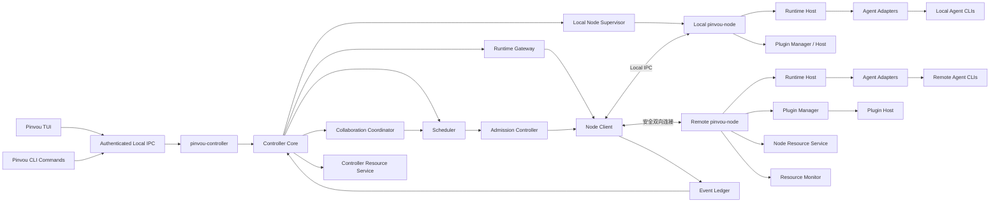
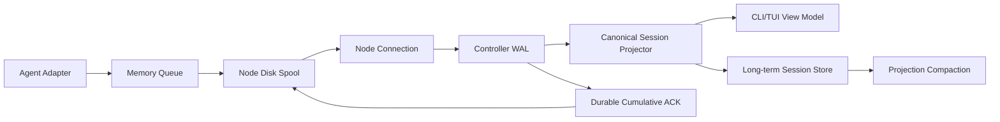
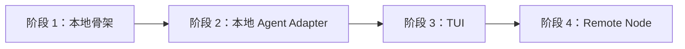

# Pinvou 分布式 Node、Agent Runtime 与插件调度架构设计

> 状态：Long-term Architecture Blueprint Draft，等待评审
> 日期：2026-08-18
> 范围：Pinvou CLI、Pinvou Node、Pinvou TUI、Agent CLI 适配、插件任务、资源与事件数据面
> 本文是长期架构蓝图与演进约束，不等同于单次迭代实施计划。近期实现采用四个纵向阶段：本地骨架、本地 Agent CLI Adapter、TUI、Remote Node；先证明本地 Runtime 和产品交互，再把同一执行合同扩展到远程设备。

## 0. 配套实施文档（2026-08-19）

本蓝图评审产生的配套文档集，落地工作以这些文档为直接输入：

| 文档 | 内容 | 状态 |
|---|---|---|
| `2026-08-19-stage1-decision-freeze.md` | 阶段 1 阻塞决策（§26 提级定稿）：平台顺序、数据根、IPC（16MB 帧上限）、存储选型（共享 seglog）、fsync/合并窗口、Codex 接口、daemon 生命周期、时钟、退出码、依赖基线 | **已冻结**（2026-08-19 评审后） |
| `2026-08-19-stage1-latency-spike.md` | 延迟 spike：t0 定义修正、fsync 实测数据（双屏障 p95≈2.7ms）、预算分解表、S2/S3 门禁与决策树 | S1 已完成；首次 S2 运行无效，待重跑 |
| `2026-08-19-runtime-event-schema-v1.md` | 事件 schema v1：kind 分类法、序号与合并规则、版本演进规则 | 草案 |
| `2026-08-19-codex-adapter-contract.md` | Codex Adapter 合同：基于 codex-cli 0.139.0 第一方 JSON Schema 的方法/事件/审批/错误映射与兼容策略 | 草案 |
| `2026-08-19-stage1-implementation-spec.md` | 阶段 1 实施规格：crate 落位、任务分解（~34 人日）、PR 切分、里程碑出口 | 草案 |
| `2026-08-19-stage1-ci-test-strategy.md` | CI 分层测试：真实 codex smoke 的认证/flaky/成本方案、性能基准环境合同 | 草案 |
| `2026-08-19-threat-model.md` | 威胁模型：资产/攻击者/威胁矩阵、Controller 私钥失窃与多管理机两个显式决策、阶段 1 IPC 硬化清单 | 草案 |
| `2026-08-19-existing-assets-inventory.md` | 既有资产盘点：CodeWhale（DeepSeek 系 fork，其 app-server ≠ codex app-server）、codex_acp 经验复用、AGENTS.md 修约提案 | 草案 |
| `2026-08-19-codewhale-cli-adapter-boundary.md` | CodeWhale 作为外部 CLI 的 Adapter 解耦合同：禁止编译依赖和主工程改动、机器接口选择、黑盒测试与阶段边界 | **设计冻结** |
| `2026-08-19-store-schema-migration.md` | 存储迁移与降级：三层版本模型、回滚兼容矩阵、合同测试清单 | 草案 |

关键修正与澄清（详见各文档）：t0 定义改为合并前原始输出时刻（§13.4.1）；文本合并窗口默认 50ms（§10.4/§26）；CodeWhale 的 app-server 与 OpenAI codex 的 app-server 是两套无关协议（§10.3 引用时不得混淆）。2026-08-19 合同一致性修约进一步确认：首次 S2 因额度错误与 fail-open 判定而无效；raw spool 序号与传输序号分离；fence 必须 drain 旧 Runtime；ResourceRef 不携带裸远端路径；同用户恶意进程视为用户会话已失陷，而不是由 DACL/instance_id 完整防御。

## 1. 背景

Pinvou 需要在现有 Pinvou CLI 基础上增加局域网分布式能力：常驻 `pinvou-controller` 能发现其他设备，在获得独占控制权后，既可以在单个远端 Node 打开交互式 Agent 会话，也可以委派独立 AgentTask，或编排多个 Node 进行 CollaborativeRun，并向 Pinvou TUI 实时投影运行过程。

远端只需安装同一套 Pinvou CLI，并启动 `pinvou node`。Node 应能发现当前运行环境中已经安装和登录的 Agent CLI，例如 Claude Code、Codex、Gemini、CodeBuddy、Pi 等。用户选择“设备 + Agent Runtime + 工作目录”后即可开始工作，无需在主控重复配置第三方 Agent 的账号。

Pinvou Node 还需要托管可扩展插件。插件能力可以被主控直接调用，不要求先经过 Agent Runtime。例如下载、数据处理或设备专属工具都可以作为插件能力被发现和调度。通用调度层只理解任务、依赖、约束、资源和产物，不理解某个具体云盘、下载站点或业务协议。

## 2. 目标

1. 局域网自动发现 Pinvou Node，同时提供不依赖广播的手动连接能力。
2. 一个 Node 只能永久绑定一个主控；断网、主控退出或崩溃均不自动释放。
3. 主控能够选择远端已有的 Agent CLI，进行实时交互式聊天。
4. 本地和远端复用同一套 Node Runtime Host 与 Agent Adapter；Pinvou TUI 只通过 Controller IPC 使用 Runtime。
5. 主控保存逻辑会话的权威历史；Runtime 可以跨设备、跨 Agent 类型切换。
6. 工作目录与逻辑会话解耦；Runtime 切换后由用户重新选择工作目录。
7. Node 可托管不依赖 Agent Runtime 的工具插件，并由通用调度器编排。
8. Node 上报 CPU、内存、GPU、磁盘、网络、压力和 Capacity Envelope；TUI 槽位数只是按具体 Workload Profile 派生的展示。
9. 高频聊天事件可实时显示、可靠重放并高效本地持久化。
10. 远端资源能在主控中预览、流式读取或下载，不暴露不可用的裸远端路径。
11. 原生系统、WSL 和 Docker 使用相同业务协议，只替换发现、传输和宿主适配。
12. 现有 Desktop/CodeWhale 功能保持稳定；新的分布式能力不修改 `pinvou3-app/` 或 `CodeWhale/`，也不把它们作为新 CLI/TUI 的编译或运行前提。
13. 独立建设新 CLI 插件系统；本路线不迁移 Desktop 插件，也不要求 Desktop 共用 Plugin Host。
14. Controller daemon 与 Node daemon 分别成为其 Store 的唯一写者，客户端和 Worker 不直接写权威数据。
15. 事件在容量、断线、磁盘故障和进程崩溃下具有明确的 ACK、背压、溢出和缺口语义。
16. Attachment 与插件副作用都能通过持久 intent/journal、幂等键和保守重试完成可证明恢复。
17. 远程聊天、单任务委派和多 Node 协作开发具有独立领域模型、状态机与 TUI 入口，但共享 Controller/Node 基础设施。

## 3. 非目标与第一版限制

本节“第一版”指长期蓝图中对应能力首次进入社区产品的版本。近期阶段使用第 3.1 与第 23 节更严格的范围。

- 第一版不实现分布式文件系统或远程磁盘挂载。
- 第一版不自动执行 Git clone、pull、merge、冲突处理或工作目录恢复。
- 第一版仓库同步由用户自行操作；未来可以增加 `WorkspaceSyncProvider`。
- 第一版不保证跨 Agent 恢复其不可见的内部推理状态、缓存或厂商私有 Session 状态。
- 第一版不通过主控下发 Claude、Codex、Gemini 等第三方 Agent CLI 的账号或 Provider 配置。
- 第一版不要求 Docker/WSL 的 mDNS 一定可达，必须保证手动端点连接可用。
- 通用调度器不感知云盘、模型仓库、分块下载等具体业务协议。
- 大型二进制资源不进入聊天事件流或会话数据库。
- 第一版不迁移、导入或改写现有 Desktop 插件及其存储。
- 第一版不让新 CLI 与 Desktop 双写 `installed.json`、`mcp.json`、凭据或运行状态。
- 第一版不迁移现有 Desktop ACP，也不修改其嵌入式 CodeWhale 路径；CodeWhale 在新 Runtime 中与 Codex、Claude Code 等地位相同，只能作为外部 Agent CLI 通过 Adapter 接入。

### 3.1 近期四阶段明确暂缓范围

阶段 1–4 只建立本地 Runtime、首批 Agent Adapter、TUI 和 Remote Node 的纵向产品闭环，不包含：

- mDNS 自动发现、跨 Node 自动选择和完整设备资源仪表盘。
- Runtime/Node 自动切换、自动恢复和自动跨 Node 重分配。
- CollaborativeRun、通用 Work DAG 和多 Agent 自动协作编排。
- 插件包、Plugin Host、市场迁移和工具调度。
- 自适应 Workload Profile、动态 fan-out、GPU/thermal/network 综合调度。
- WSL/Docker、托管 Relay 的规模化运营、跨 Node WorkspaceSyncProvider 和 Bare Git 自动化。
- 自动 clone、pull、merge、冲突解决或跨 Node 工作目录恢复。

暂缓表示不在近期四阶段实现，不表示从长期蓝图删除。阶段 4 只加入手动选择 Remote Node 的 Interactive Session 和单个 AgentTask，不提前引入通用 Scheduler 或 CollaborativeRun。

### 3.2 外部证据成熟度

本文引用按三类使用，不能把新论文中的条件性结果写成生产保证：

- **mature invariant**：由经典分布式系统、开放标准或多年生产系统支持，可冻结为可靠性/安全硬合同；
- **market convergence**：多个独立产品采用，可作为默认产品与隔离基线，但仍需 Pinvou 验收；
- **research hypothesis**：近期论文在特定假设、数据集或成本模型下观察到，只能提出实验开关和评测项，未通过本项目基线前不得默认启用。

Event log、durable ACK、有界背压、隔离 workspace、snapshot+cursor 恢复属于前两类；TIPEX、ALIGN、History Matters、AiFlow、LATTE、LAMaS 所支撑的 replica parallelism、历史评分、动态图和关键路径策略属于 `research hypothesis`。完整外部证据与限制见 `docs/research/2026-08-19-distributed-agent-runtime-market-and-paper-validation.md`。

## 4. 核心术语

| 术语 | 定义 |
|---|---|
| Controller | 拥有 Node 独占权的主控身份；第一版由 `pinvou-controller` 持有并持续运行。 |
| Controller daemon | 内部常驻进程 `pinvou-controller`，是 Controller 数据唯一写者并托管 Controller Core。 |
| Controller Core | 无界面控制核心，负责身份、Node 连接、Runtime Gateway、调度、会话、事件与资源状态。 |
| Node | 运行 `pinvou-node` 的一个运行环境实例，不等同于物理设备。 |
| Node Environment | 原生 OS、WSL 实例或容器等具体运行环境。 |
| Logical Session | 由主控保存的长期逻辑会话，独立于设备、Agent 和工作目录。 |
| Runtime Attachment | Logical Session 在某个 Node 上连接某个 Agent Runtime 的一次运行段。 |
| Workspace Binding | Runtime Attachment 绑定的 Node 本地工作目录。 |
| Agent Runtime Adapter | 将 ACP、app-server、stream-json 等不同 Agent 接口映射为统一 Runtime 接口的 Adapter。 |
| Interactive Session | 面向实时聊天、审批、打断和持续流式输出的运行模式。 |
| Delegated Agent Task | 用户、主 Agent 或协作协调器委派给某个 Agent Runtime 的有界后台任务。 |
| Collaborative Run | 围绕父 Session/目标编排多个 Delegated Agent Task 的多 Node 协作运行。 |
| Job | 可调度、可重试、有明确状态与产物的后台任务。 |
| DAG | 描述 AgentTask/PluginJob 等 Work Item 依赖关系的有向无环图；无依赖节点可以并行运行。 |
| Capability | Node、Agent Runtime 或插件声明的可用能力。 |
| Admission Controller | 根据 Controller/Node 实时容量、预约和优先级决定工作进入、排队或拒绝的模块。 |
| Workload Profile | 对某类 Runtime、插件或任务 CPU、内存、GPU、I/O、事件速率等需求的保守画像。 |
| ResourceRef | 对远端文件、目录或任务产物的稳定引用。 |
| Event Ledger | 主控保存的规范化运行事件账本。 |
| Walking Skeleton | 阶段 1 的最小本地纵向链路，使用一个真实 Codex Adapter 验证进程拓扑、IPC、Event Spool、WAL 和事件投影，不包含 TUI 或远程网络。 |
| Local Agent Runtime MVP | 阶段 2 的本地真实 Agent CLI 闭环，首批支持 Codex、Claude Code 与 CodeBuddy。 |
| Remote Node MVP | 阶段 4 将已由 CLI/TUI 验证的 Runtime 合同扩展到远程 Node，支持远程会话和手动 AgentTask。 |

## 5. 总体架构



架构选择为“Pinvou 控制面 + 多种 Agent 传输 Adapter”的混合方案：

- Pinvou 自己定义设备、会话、事件、资源、插件、调度与安全语义。
- Agent CLI 使用其最成熟的官方接口，不强制统一成 ACP。
- ACP 只是一类 Agent Adapter 的内部传输方式，不承担局域网通信、资源传输或任务调度。
- 插件与 Agent Runtime 并列，主控可以直接调用插件而不消耗模型。
- Collaboration Coordinator 只能通过 Controller Scheduler 委派 AgentTask/PluginJob，不能让主 Agent 直接控制 Node。

## 6. 产品与进程形态

用户只安装一个 Pinvou CLI，并使用一个公共命令入口：

```text
pinvou                         # 在交互终端中默认打开 TUI
pinvou benchmark ...
pinvou node start
pinvou node status
pinvou node release
pinvou runtime detect
pinvou runtime auth list
pinvou runtime auth login <runtime>
pinvou plugin list
```

安装包内部包含独立的 `pinvou-controller` 与 `pinvou-node` 常驻程序。三者关系是：

- 用户体验和安装包合并。
- 进程生命周期与代码模块分离。
- `pinvou` 是唯一面向用户的产品入口和短生命周期客户端，负责 TUI、命令解析与本地 IPC 调用，不直接写权威数据库。
- `pinvou-controller` 是主控常驻进程，唯一持有 Controller Identity、Node 连接、Session/Event/Job 权威状态和 Controller Store 写权限。
- `pinvou-node` 负责常驻监听、Runtime、插件、事件和资源。
- 两个 daemon 均不依赖 Tauri、React 或 Desktop 产品后端。

Walking Skeleton 不按长期架构名词逐一拆 crate。阶段 1 只保留真实进程、跨进程协议和 Runtime seam：

```text
pinvou-cli/crates/
  cli                       # 现有 pinvou 入口；增加本地 controller/runtime 骨架命令
  controller                # lib + pinvou-controller binary
  node                      # lib + pinvou-node binary
  protocol                  # 本地 IPC 与未来 Node Protocol 共用的最小领域类型
  seglog                    # spool/WAL 共用的追加日志原语；边界以冻结决策 D-04 为准
  runtime-api               # 长生命周期交互 Runtime seam
  agent-adapter-codex       # 阶段 1 唯一真实 Adapter
```

阶段 1 使用真实 Codex Adapter 验证 Runtime 和高频事件链路。确定性事件发生器只能用于对同一 Spool/WAL 路径施压，不能替代真实 Codex 端到端验收。阶段 2 在保留 Codex 的基础上再接入 Claude Code 与 CodeBuddy：

```text
  agent-adapter-claude-code
  agent-adapter-codebuddy
```

三者必须实现同一个 `runtime-api`，但可以分别使用各 Agent CLI 最合适的官方接口；“支持任意 Agent CLI”定义为用户可以选择任一“Pinvou 已实现 Adapter 且当前设备探测为可用”的 CLI，不承诺无需 Adapter 支持未知 CLI。Gemini、Pi 等进入后续 Adapter 批次。

第一轮内部深模块：

```text
controller/src/
  ipc
  store
  event_ledger
  session
  node_client

node/src/
  store
  event_spool
  runtime_host
  resource
```

暂不创建 `scheduler-core`、`event-ledger`、`resource-service`、`admission`、`collaboration`、`plugin-*` 等 crate。它们先作为 Controller/Node 内部实现，只有出现第二个真实调用方、需要独立版本兼容或进程部署时才提升为 crate。`tui` 在阶段 3 出现真实界面后再创建，不建立空壳；远程 transport、pairing 和 discovery 在阶段 4 再进入 Node，不污染阶段 1–3 的本地执行路径。

现有 `agent-backend-api` 与 benchmark crates 保持原路径，不与 `runtime-api` 合并。前者适合一次性 benchmark；后者只服务长生命周期交互 Runtime。阶段 1–2 不重构现有 benchmark。

### 6.1 命令路由合同

下表是最终产品合同。阶段 1–2 尚无 TUI，`pinvou` 无参数只输出可用命令和帮助，不提供占位界面；阶段 3 完成后才切换为默认进入 TUI。

TUI 与 CLI 不通过不同程序区分，而通过 `pinvou` 是否收到子命令区分：

| 调用方式 | 行为 |
|---|---|
| `pinvou` | stdin/stdout 均为交互终端时启动 TUI。 |
| `pinvou <subcommand>` | 执行 CLI 子命令，完成后退出，绝不隐式进入 TUI。 |
| `pinvou --help` / `pinvou --version` | 输出信息后退出。 |
| `pinvou --output json` | 因缺少子命令返回稳定的 usage 错误，不启动 TUI。 |

无参数运行在 CI、管道、重定向输出或后台任务中时，不启动全屏界面，也不等待用户输入；应返回非零状态和明确提示，例如“当前不是交互终端，请使用具体子命令”。未知子命令同样返回 usage 错误，不能回退到 TUI。

CLI 子命令继续提供适合脚本的稳定退出码和结构化输出；TUI 只是 Controller Core 的交互前端，不改变底层命令与服务合同。

只有 TUI、remote/session/task 等主控命令按需启动 `pinvou-controller`。`pinvou node start/status/pairing/release` 属于 Node 本机管理路径，通过受当前用户保护的 admin socket/Supervisor 工作，不启动 Controller daemon。这样纯远端 Node 机器可以只运行 `pinvou-node`，不会意外创建主控身份或 Store。

### 6.2 TUI 定位

Pinvou TUI 是新 `pinvou-cli` 的交互前端，不是现有 Desktop 或 CodeWhale TUI 的兼容层：

- TUI 只依赖 `controller-ipc` 客户端、只读 ViewModel 和命令 Interface，不链接 `controller-core`，也不直接依赖 Store、Agent Adapter、Node daemon 或 Tauri。
- CLI 命令与 TUI 通过本地 IPC 共享 `pinvou-controller` 内的 Controller Identity、会话存储、Node Client、Runtime Gateway、Scheduler 和 Plugin Client。
- TUI 退出不等于 Controller 放弃 Node Owner，也不自动终止远端任务。
- 现有 Desktop 是否接入新 Runtime 只能在本路线之外单独立项；CodeWhale 在新 Runtime 中仅通过外部 CLI Adapter 接入。
- 可以借鉴现有终端交互经验，但不复制 CodeWhale 中与其 Engine 状态强耦合的整套 TUI。

### 6.3 TUI 技术选型与事件循环

Pinvou TUI 使用 Rust 原生技术栈：

```text
Ratatui     # 布局、组件与终端差量渲染
Crossterm   # Windows、macOS、Linux 的输入和终端控制
Tokio       # Node、Runtime、插件、资源与后台任务的异步运行时
tracing     # 结构化日志，写入文件而不是破坏全屏终端
```

不采用 Python Textual、Go Bubble Tea 或独立 WebView，避免引入第二套运行时、发布链路和类型系统。也不在 Ratatui 之上再套重型 TUI Framework；Pinvou 自己维护薄的单向数据流：

```text
TerminalEvent -------+
ControllerEvent -----+--> Action --> update(Model) --> View --> Ratatui
Timer/ResizeEvent ----+
```

模块边界：

```text
tui/
  app                 # 主事件循环与页面路由
  model               # 纯界面状态
  action              # 用户动作与后台事件
  update              # 确定性的状态转换
  view                # Ratatui 渲染
  terminal            # Crossterm 初始化、能力检测与恢复
  screens             # chat/nodes/sessions/tasks/collaboration/jobs/plugins/resources/settings
  widgets             # 可复用终端组件
```

规则：

- 终端线程不执行网络、文件传输、Agent 或插件工作，只消费 Controller ViewModel 并提交命令。
- 使用事件驱动重绘；高频 Runtime 增量先由 Event Ledger 合并，TUI 再按最大帧率节流，空闲时不持续刷新。
- 只允许一个任务读取 Crossterm 事件，避免键盘、Resize 和终端查询发生竞争。
- panic、Ctrl+C、正常退出和初始化失败都必须经过 Terminal Guard 恢复备用屏幕、Raw Mode、光标和输入模式。
- `Cargo.lock` 锁定经过测试的 Ratatui/Crossterm/Tokio 组合，升级时执行跨平台终端合同测试。

### 6.4 CLI Skeleton 与 TUI 产品入口

阶段 1 先通过脚本化 `pinvou` CLI 和真实 Codex Adapter 验证本地进程、Event Spool、WAL、事件投影和性能假设；阶段 2 再扩展到 Claude Code 与 CodeBuddy，证明 Runtime seam 没有为 Codex 过拟合；阶段 3 才让 Pinvou TUI 成为第一个产品化交互入口；阶段 4 在不改变 TUI/Runtime 合同的前提下加入 Remote Node。整个路线不以 Desktop 接入作为验收条件。长期 TUI 的 Nodes 页面处理两类动作：

```text
本机 Node：启动、停止、重启、启用/关闭局域网发现
远端 Node：发现、手动添加、配对、连接、打开设备工作台
```

TUI 不能拼接 Shell 命令管理进程，而是调用 Controller Core 的稳定接口：

```text
Ratatui TUI
    |
Authenticated Local IPC
    |
pinvou-controller / Controller Core
    +-- LocalNodeSupervisor --> 管理本机 pinvou-node
    +-- Node Client ---------> 连接远端 pinvou-node
```

首次执行需要主控能力的 `pinvou` 命令时按需启动并注册私有的 `pinvou-controller` 用户级后台进程；它不监听局域网、不广播设备。Controller 从阶段 1 起可以按需监督仅接受本机连接的私有 Node，以保证本地和远端 Runtime 使用唯一执行拓扑。局域网监听、发现和远端配对默认关闭，阶段 4 必须由用户明确启用。TUI 退出不停止 Controller 或已启用 Node；关闭公开监听和释放 Owner 是不同操作。

远端 Node 必须已经运行。TUI 的“打开远端 Node”表示进入其设备工作台，而不是远程启动进程。设备工作台显示资源、Agent Runtime、插件、会话、任务、工作目录、延迟、协议版本和最近错误，并提供开始聊天、继续会话、指派 AgentTask、加入 CollaborativeRun、调用插件和打开资源等入口。

### 6.5 与主工程的依赖隔离

新的分布式依赖子图必须可以脱离 Desktop/CodeWhale 独立编译、测试和运行：

```text
controller / node / protocol / runtime-api / agent-adapter-*
  MUST NOT depend on:
  - pinvou3-app
  - pinvou3-app/src-tauri
  - Tauri
  - CodeWhale
  - Desktop SessionStore / ACP Pool / marketplace state
```

`cli` 是组合入口。现有 `product-backend` feature 及 `pinvou-product-backend -> pinvou3-app` 依赖是既有 benchmark 的 legacy 路径，不属于分布式产品架构。新增 distributed 命令和正式分发的 CLI/Controller/Node binary 必须在不启用 `product-backend` 的构建中完整工作，不能把主工程类型泄漏到 Controller/Node Interface。阶段 1 只允许在 `pinvou-cli/` 内调整 feature/入口组织以建立这个构建边界，不以修改 `pinvou3-app/` 消除 legacy 依赖。

CodeWhale 虽然同时提供可嵌入 Rust crate，但在新架构中必须按**外部 Agent CLI**处理：

```text
pinvou-node / Runtime Host
        |
AgentRuntimeAdapter interface
        |
agent-adapter-codewhale
        |
spawn/monitor CodeWhale CLI + versioned machine protocol
```

`agent-adapter-codewhale` 不得链接 `codewhale-*` crate、不得读取 CodeWhale 内部数据库或直接调用 Engine 类型，也不得要求修改 CodeWhale fork 才能完成 Pinvou 阶段验收。它只能依据 CodeWhale 已公开的 CLI 参数与版本化机器接口启动子进程、协商能力并归一化事件；接口暂不具备的能力显式报告 `unsupported`。未来如果 CodeWhale 新增通用机器接口，应在 CodeWhale 自身独立发布后由 Adapter 适配，不能形成父仓与 submodule 的编译期回边。

CI 增加 Cargo metadata 依赖图守卫和独立构建门禁：

```text
cargo check/test: controller, node, protocol, runtime-api, first adapter
pinvou distributed/release profile: no product-backend / no Tauri / no codewhale-* crate / no pinvou3-app
```

依赖图守卫既检查直接依赖，也检查完整传递闭包和 binary feature resolution。仅仅把 CodeWhale 隐藏在可选 feature、build script、FFI 或动态库后面仍视为违反边界；允许的唯一关系是运行时启动用户机器上独立安装、独立升级的 `codewhale` 可执行文件。

主工程零影响是阶段 1–10 的硬门禁：本路线不得修改 `pinvou3-app/`、`CodeWhale/`、现有 Desktop 配置/数据、打包清单或默认启动路径；不得改变现有 Desktop binary 的 feature resolution、Cargo.lock 解析结果、资源释放内容或运行时行为。共享仓库根脚本若必须识别新 CLI，只能增加不被现有主工程命令调用的独立入口。任何必须改动主工程才能继续的需求均视为超出本路线范围，暂停并单独立项，不能以“兼容修复”混入 CLI PR。

新的 Controller/Node 数据根、身份、Session、WAL 和 spool 不读取或双写 Desktop 的 `~/.pinvou3` Session/marketplace 状态。未来复用通过版本化协议或迁移工具完成，不通过共享数据库文件。只有出现第二个真实消费者后，才考虑把中立算法提取为共享 crate。

## 7. 设备身份、发现与永久独占

### 7.1 Node 身份

Node 首次启动生成长期身份：

```text
NodeIdentity
- node_id
- public_key
- private_key        # 只保存在 Node
- display_name
- protocol_version
```

Node 身份与 IP、端口和主机名无关。网络地址变化不改变设备身份。

### 7.2 局域网发现

原生系统使用 mDNS/DNS-SD 广播 `_pinvou-node._tcp.local`，只公开最少信息：

```text
- node_id
- display_name
- protocol_version
- pairing_state: unclaimed | claimed
- connection_port
```

CPU、内存、Agent、插件和目录信息只能在认证后获取。发现设备不等于获得控制权。

发现必须是可替换的 Adapter：

```text
DiscoveryProvider
- MdnsDiscovery
- StaticEndpointDiscovery
- HostBrokerDiscovery       # 后期
- RelayDiscovery            # 阶段 4 冻结合同；托管发现/全球路由后期交付
```

### 7.3 首次配对

阶段 4 的 Remote Node MVP 先支持手动 endpoint，不依赖 mDNS：

1. Controller 手动添加未绑定 Node endpoint，并提交带 Controller 公钥/显示名的 pairing request。
2. Node 生成短期 `request_id` 和一次性验证码，在 Node 本机显示 Controller fingerprint、来源 endpoint 和申请时间。
3. 用户必须在 Node 本机执行交互确认或 `pinvou node pairing approve <request-id>`；仅知道验证码不足以远程绑定。
4. 用户在 Controller CLI 输入验证码，双方完成相互持有私钥的证明并展示一致 fingerprint。
5. Node 在一个持久化事务中写入 OwnerBinding 和 pairing audit，再返回成功。

本机管理入口：

```text
pinvou node pairing list
pinvou node pairing approve <request-id>
pinvou node pairing deny <request-id>
```

安全合同：

- pairing request 使用短 TTL、尝试次数上限、速率限制和指数退避；具体默认值在实施前冻结。
- Node 已有 Owner 时在进入验证码流程前拒绝其他 Controller。
- 未认证请求不能读取 Agent、插件、Workspace、资源状态或 Owner 公钥之外的敏感信息。
- 多个待处理请求逐一显示 Controller fingerprint，用户批准精确 request，不提供“全部允许”。
- 验证码、私钥和完整认证材料不进入日志；审计只保存 request、fingerprint、结果、时间和本地确认主体。
- OwnerBinding 落盘失败视为配对失败，不能只在内存中宣称已绑定。
- Node 无交互终端时，用户仍须通过本机管理 socket/CLI 明确批准；Controller 不能替代本机确认。

### 7.4 永久独占

```text
OwnerBinding
- owner_id
- owner_authority_key       # 稳定授权身份，不直接充当长期传输会话凭据
- display_name
- bound_at
```

规则：

- 一个 Node 只能有一个 Owner。
- 主控退出、崩溃、断网或长期离线不释放绑定。
- Owner 授权不依靠 IP 或设备名称。实际重连使用由 Owner 授权、可撤销和可轮换的 device/transport credential；泄露旧传输凭据不等于改变 OwnerBinding。
- 其他 Controller 只能看到“已被其他主控绑定”。
- 不设置自动过期 Lease。
- Owner 授权根丢失时只能在 Node 本机执行释放；单个传输凭据丢失时，已认证 Owner 可以吊销旧 generation 并轮换，不需要释放 OwnerBinding。

释放入口：

```text
pinvou node release                 # Node 本机
pinvou node unbind <node-id>        # 当前 Owner
```

`release` 只删除 Owner；`reset-identity` 重新生成 Node 身份；`factory-reset` 清理身份与配置。后两者必须是高风险本机操作。

## 8. 连接与传输

业务协议不区分原生、WSL 或 Docker。连接层提供统一双向 `NodeConnection`：

```text
NodeConnection
- DirectTlsTransport
- PortForwardTransport
- LocalIpcTransport
- RelayTransport            # 阶段 4 必须通过合同/loopback；托管规模化后期
```

第一版建议：

- TLS 1.3 加密，配对后固定双方公钥。
- HTTP 接口承载查询、命令和资源元数据。
- 长连接承载 Agent 事件、任务进度、审批和设备状态。
- HTTP Range 承载资源预览与下载。
- 所有结构消息包含协议版本、请求 ID、Session ID 和事件序号。
- 建立连接后保持双向，不要求每个 Node 事件重新发起连接。
- Direct TLS 只作为 LAN、VPN、显式端口转发和自托管路径；面向 WAN 的正常路径是 Node/Controller 主动出站连接可替换 Relay，不把监听 `0.0.0.0` 或公网暴露 Node 端口作为推荐配置。
- Relay 只负责 rendezvous/盲转发；Controller/Node 端到端完成身份验证、内容加密、应用层 durable ACK 和重放。Relay 传输确认不得冒充 Controller WAL durable ACK。

发现结果返回候选端点而不是单一 IP：

```text
NodeEndpoint
- node_id
- transport
- address
- priority
- network_scope: local | host_forwarded | relay
- expires_at
```

Node 支持实际监听地址与对外地址分离：

```text
pinvou node start --listen 0.0.0.0:9847 --advertise 192.168.1.20:19847
```

## 9. WSL 与 Docker

Node 定义为运行环境实例。同一物理机上的 Windows、WSL 和多个容器可以分别成为 Node。

```text
NodeEnvironment
- kind: native | wsl | container
- os
- architecture
- hostname
- container_runtime
- resource_scope: host | vm | cgroup
- parent_host_id       # 可选资源归组
- persistent_identity
```

约束：

- WSL/Docker 使用与原生 Node 相同的业务协议。
- WSL/Docker 自动发现只做尽力支持，手动端点连接必须可用。
- Docker 通过端口映射暴露 Node。
- Node 只发现当前环境内的 Agent CLI，不跨环境借用可执行文件或登录信息。
- Docker 身份、Owner、配置和登录目录必须使用持久卷。
- 没有持久化 Node Home 时必须明确警告容器重建会产生新设备。
- Docker 工作目录必须由用户显式挂载，Node allowed roots 再限制可访问范围。
- 默认禁止挂载或访问 Docker Socket。

资源监控必须报告实际可调度配额：容器读取 cgroup 限制，WSL 报告环境可用资源，而不是简单上报物理宿主总量。多个环境共享同一物理宿主时，可以通过 `parent_host_id` 归组，避免调度器重复计算容量。

## 10. 统一 Agent Runtime

### 10.1 统一 seam

Pinvou CLI/TUI 不直接依赖 ACP、Codex app-server、某个 CLI 的 JSON 格式或权威数据库，而只依赖 `pinvou-controller` 的本地 IPC Interface。Controller 内部的 `RuntimeGateway` 对本机和远端只提供一条执行拓扑：

```text
Pinvou CLI / TUI
      |
Authenticated Local IPC
      |
pinvou-controller / Controller Core
      |
Runtime Gateway
      |
Node Client
      +-- Local IPC  --> Local pinvou-node  --> Runtime Host
      +-- TLS        --> Remote pinvou-node --> Runtime Host
```

本地和远端 Runtime Host 使用同一套 Agent Adapter。差异只存在于 NodeConnection 的传输 Adapter。Logical Session、Job 与插件不存在绕过 `pinvou-node` 的 Local Runtime Host 或由 TUI 直接启动进程的路径。现有 `agent-backend-api` 仍可服务隔离的 benchmark 流程，但它不能创建 Runtime Attachment、写 Session/Event Ledger 或伪装成 Node 执行。

本机 Node 可以在“私有执行模式”下运行：允许 Controller 通过本地 IPC 使用 Runtime 和插件，但保持局域网发现与网络监听关闭。用户首次选择本机 Agent 时，TUI 必须提示并获得确认后启动该模式。`pinvou runtime detect` 在本机 Node 未运行时返回 `local_node_not_running` 或引导启用，不能临时创建第二套探测/执行进程。

### 10.2 Agent Runtime Adapter 接口

概念接口：

```text
AgentRuntimeAdapter
- probe()
- capabilities()
- auth_status()
- start_auth()
- create()
- resume()
- import_context()
- send()
- approve()
- respond_input()
- steer()
- interrupt()
- subscribe_events()
- close()
```

Adapter 能力必须通过协商获得，不能按 Agent 名称硬编码：

```text
RuntimeCapabilities
- interactive_chat
- native_resume
- history_import
- tool_approval
- elicitation
- steering
- image_input
- file_reference
- session_modes
- config_options
- auth_flows
```

不支持的操作显式返回 `unsupported`，不得静默模拟为成功。

### 10.3 Agent 传输策略

按 Agent 官方接口选择最成熟的方式：

- ACP：使用成熟且能力完整的官方 ACP Agent。
- Codex：可优先使用更完整的 app-server 接口。
- Claude/CodeBuddy：可使用稳定的 stream-json Adapter。
- Pi 等：使用其 JSON/进程模式和 Session 文件能力。
- CodeWhale：作为独立安装和独立升级的外部 CLI，通过 `agent-adapter-codewhale` 使用其公开、版本化机器接口；不得链接 CodeWhale crate 或访问其内部 Store。CodeWhale 不再拥有“Pinvou 内置 Runtime”特权。
- 未来 Pinvou 自研 Agent：同样以独立 CLI/进程协议接入；不在 Pinvou CLI 进程内嵌入 CodeWhale Engine。

不为了微小序列化开销强制自研二进制 Agent 协议。性能重点是长驻进程、异步读取、事件合并、批量持久化和背压。

### 10.4 ACP 性能原则

- 每个活跃 Runtime Attachment 维持一个长生命周期 Agent 进程。
- 不为每次消息重新启动 CLI。
- 文本事件默认按 50ms 合并，而不是每个 token 单独跨网络与写入 Controller WAL。Node 必须先把合并输入形成可恢复的 spool 记录；合并窗口不得成为静默丢失窗口。
- 控制、审批和结束事件不得丢弃。
- 大型文件走 Resource Service，不使用 base64 塞入 ACP 或事件流。
- 有界队列分别处理文本、工具日志和控制事件，控制事件拥有最高优先级。
- 当文本 delta、审批、取消响应和终态复用同一 stdout/JSON-RPC 通道时，Adapter reader 必须持续 drain；不得通过停止读取进程管道给 R1 背压，否则会同时阻塞 R0 并可能死锁。R1 应写入 disk spool 或合并，R2/R3 按声明策略截断；达到 hard pressure 时停止新 admission，并请求 interrupt/terminate Runtime，以 R0 记录明确终态或 gap。

### 10.5 A2A/MCP 互操作边界

A2A Task/Artifact/stream 和 MCP Tasks/Resources 只作为 Runtime/Plugin seam 上的可选 Adapter，不替代 Pinvou 内部 AgentTask、Attachment、WorkspaceWriteGrant、execution journal、ResourceRef 或 Controller WAL。映射是有损且必须能力协商：外部协议的 completed/ACK 不等于 Pinvou WAL durable，外部 URI/Artifact 必须先拉取、校验 checksum/version 和策略后才能登记为 ResourceRef；不支持 task、stream、push、resume/cancel 时显式返回 `unsupported`。MCP Tasks 仍处于快速演进扩展面，阶段计划不得假定所有 Host 已实现。

## 11. Agent CLI 检测与认证

Node 检测当前用户环境中的 Agent CLI，并上报：

```text
RuntimeDescriptor
- runtime_id
- agent_kind
- executable_path
- version
- transport_kind
- capabilities
- auth_status
- availability
```

Node 必须运行在实际安装和登录 Agent CLI 的普通用户账户下。第一版使用用户级后台进程，而不是 Windows SYSTEM、Linux root 或 macOS LaunchDaemon。

认证由 Agent CLI 自己完成，Pinvou 只统一状态与引导：

```text
AuthFlow
- ExistingCredential
- DeviceCode
- BrowserUrl
- LocalInteractive
- Unsupported
```

第三方 Agent 凭据规则：

- 凭据仅保存在 Node 本机和该 CLI 的官方存储中。
- 主控不读取、同步、备份或保存 Token。
- 主控只接收脱敏认证状态、授权 URL 和短期设备码。
- 只能本地交互登录的 Agent，CLI/TUI 显示需要在 Node 执行的命令。
- Runtime 认证失效时进入 `blocked_auth`，不丢失 Logical Session。

本路线不向任何外部 Agent CLI（包括 CodeWhale）下发 Provider 密钥或改写其配置；认证和 Provider 配置由对应 CLI 在 Node 本机管理。未来若存在 Pinvou 自研独立 CLI，其安全配置下发必须另立协议与威胁模型，不能作为 CodeWhale Adapter 的隐含能力。

## 12. Logical Session、Runtime Attachment 与工作目录

### 12.1 三者解耦

```text
LogicalSession
  +-- RuntimeAttachment #1: Node A + Codex + Workspace A
  +-- RuntimeAttachment #2: Node B + Claude + Workspace B
  +-- RuntimeAttachment #3: Local + CodeWhale CLI + Workspace C
```

Logical Session 由主控保存，包含规范化消息、工具调用、审批、资源引用、Runtime 切换记录和展示状态。

Runtime Attachment 表示一段实际运行：

```text
RuntimeAttachment
- attachment_id
- logical_session_id
- attachment_epoch         # Logical Session 单写者版本
- node_id
- runtime_id
- agent_kind
- native_session_id       # 可选优化，不是权威历史
- workspace_binding_id
- started_at
- ended_at
- end_reason
- capabilities_snapshot
```

### 12.2 Runtime 切换

允许在同一个 Logical Session 中跨设备、跨 Agent 类型切换：

1. 主控结束或中断原 Runtime Attachment。
2. 用户选择新的 Node 与 Agent Runtime。
3. 主控依据新 Runtime 能力选择 native resume、history import 或规范化上下文注入。
4. 创建新的 Runtime Attachment。
5. UI 明确显示“已从 Node A/Codex 切换到 Node B/Claude”。

跨 Runtime 接续只保证可见会话历史连续，不承诺恢复厂商隐藏状态。

### 12.3 工作目录切换

Workspace Binding 独立于会话历史：

```text
WorkspaceBinding
- binding_id
- node_id
- path
- kind: default | project | temporary
- availability
- repository_hint
```

切换 Runtime 后必须提醒用户重新选择新 Node 上的工作目录。第一版 Git 更新、仓库同步和冲突处理由用户自行完成。

未来可以增加 `WorkspaceSyncProvider`，其中 Bare Git 只是一个实现选项，不进入第一版核心协议。

### 12.4 TUI 挂接交互

“把 Session 挂载到 Node”在协议中称为创建 Runtime Attachment，不表示挂载远端文件系统。聊天页顶部始终显示：

```text
Logical Session | Node | Agent Runtime | Workspace | Attachment State
```

未挂接的历史 Session 仍可完整查看。用户执行“挂接并继续”后进入统一向导：

1. 选择 Node：显示在线状态、Owner、延迟、CPU、内存、GPU、磁盘和可用槽位。
2. 选择 Agent Runtime：只显示目标 Node 实际探测到的 Runtime，并显示版本、认证和恢复能力。
3. 选择 Workspace：提供默认目录、最近目录和受 allowed roots 约束的远程目录浏览。
4. 确认恢复计划：明确显示 native resume、history import 或规范化上下文注入及其限制。

Sessions 页面可以从 Session 选择 Node；Nodes 页面也可以从 Node 选择已有或新建 Session。两条入口最终必须调用同一个 Controller Command，不能各自实现挂接逻辑。

### 12.5 两阶段挂接与跨 Node 切换

挂接使用两阶段协议：

```text
PrepareAttachment
- 验证 Owner、连接、协议、Runtime、认证、能力、Workspace 和资源约束
- 返回可展示的 AttachmentPlan
- 不启动 Agent、不结束旧 Attachment、不修改活动会话

CommitAttachment
- 携带 plan_id、idempotency_key 和 attachment_epoch
- 创建实际 Runtime Attachment
- 重复提交返回同一结果
```

跨 Node 或跨 Agent 切换流程：

1. 在新 Node 上完成 `PrepareAttachment`，旧 Attachment 继续可用。
2. TUI 展示目标 Node、Runtime、Workspace、恢复方式和风险，等待用户确认。
3. Controller 持久化 `SwitchIntent` 并暂时冻结新的聊天输入。
4. 若旧 Runtime 正在生成，用户选择“等待当前回合结束”“立即中断并切换”或“取消”。
5. Controller 结束旧 Attachment，确认历史已进入 Event Ledger，然后提升 `attachment_epoch`。
6. 对新 Node 执行 `CommitAttachment`，成功后持久化 `SwitchCompleted` 并恢复输入。
7. 启动失败时 Session 保持 `unattached/degraded`，保留 SwitchIntent 和明确恢复入口，不伪装成仍在旧 Node 运行。

单写者状态：

```text
SessionAttachmentState
- logical_session_id
- active_attachment_id
- attachment_epoch
- state: unattached | preparing | switching | attached | degraded
```

所有会改变 Session 的命令和事件都携带 `attachment_epoch`。旧 epoch 的迟到事件保存在旧 Attachment 记录中，可查看但不投影到新活动回合；同一 Logical Session 同一时间只有一个 Attachment 可以接收用户输入。

Controller 在 epoch 提升后立即向旧 Node 发送 `fence_attachment(attachment_id, old_epoch)` 指令。Node 收到后先禁止旧 Runtime 接收新输入并请求 interrupt/stop，但继续 drain 其 stdout/stream-json，直到收到终态、进程退出或达到强杀期限；drain 期间的 R0/R1 仍写入旧 Attachment spool，R2/R3 可按策略截断并记录显式 gap。Node 回传最终 spool 游标后才关闭读取端。这样既隔离旧 epoch 的投影，也不会因提前关闭 pipe 丢失终态、阻塞子进程或违背 R0/R1 审计合同。未收到 fence 确认时不影响新 epoch 的活动，但旧 Attachment 保持 `fenced` 状态直到 reconcile。

如果旧 Node 离线且 Runtime 可能仍在执行，默认禁止普通切换。用户可以显式“强制切换”，但 TUI 必须提示旧设备上的 Agent 可能继续修改旧工作目录。Controller 只能隔离会话历史双写，不能隔离离线设备的文件副作用；旧 Node 重连后应立即终止失效 epoch 对应的 Runtime。

### 12.6 Attachment 完整状态机

Attachment 生命周期与 Runtime 活动状态分开建模，避免把审批、认证和切换组合成不可控的状态爆炸：

```text
AttachmentLifecycle
  preparing -> prepared -> starting -> active -> stopping -> completed
       |           |          |          |          |
       +-----------+----------+----------+----------+-> failed
                                         +------------> fenced
                                         +------------> orphaned
                                                          |
                                           +--------------+------------+
                                           v              v            v
                                         active         fenced       failed

RuntimeActivity（仅 lifecycle=active）
  idle | running | waiting_approval | waiting_input | blocked_auth | interrupting

SwitchLifecycle（Logical Session 协调状态）
  none -> preparing_target -> quiescing_source -> committing_target -> completed
                    |                 |                    |
                    +-----------------+--------------------+-> recovery_required
```

状态语义：

- `prepared`：目标检查通过但尚未产生 Agent 副作用，带有效期的 AttachmentPlan 已持久化。
- `starting`：Commit 已持久化并发送，必须用 idempotency key 查询或重试，不能再次创建新 Runtime。
- `active`：Node 已确认 Runtime 实例，只有当前 epoch 可以接收输入和投影事件。
- `stopping`：不再接受新输入，等待 Runtime 结束、最终事件和资源封口。
- `completed`/`failed`：已知终态，分别表示正常或错误结束。
- `fenced`：epoch 已失效；事件只进入旧 Attachment 记录，Node 应终止 Runtime。
- `orphaned`：Controller 暂时无法判断 Runtime 是否仍有文件或外部副作用；reconcile 后只能回到同 epoch 的 `active`，或进入 `fenced/failed`。
- `recovery_required`：切换 intent 已产生但无法自动证明安全完成；Session 暂停新输入并向用户展示恢复选择。

每次状态转换必须先写 Controller Store 的 intent，再执行外部动作，收到 Node 事实后写 result。Node 以 `(attachment_id, operation_id)` 保存 execution journal，所有 start/stop/interrupt 都可查询和幂等重放。非法转换显式返回 `invalid_attachment_transition`。

### 12.7 崩溃与恢复表

| 故障点 | 恢复行为 |
|---|---|
| TUI/CLI 崩溃 | Controller 和 Node 不受影响；新客户端从 ViewModel cursor 恢复。 |
| Controller 在 Prepare 前崩溃 | 没有持久化 intent，无副作用。 |
| Controller 在 `prepared` 后崩溃 | 重启后恢复计划；过期则无副作用地废弃。 |
| Controller 已写 Commit、未收到 start ACK | 按 operation/idempotency key 查询 Node；禁止盲目创建第二 Runtime。 |
| Node 已启动 Runtime、start ACK 丢失 | Node journal 返回同一 Runtime 实例和 attachment epoch。 |
| Controller 已写 SwitchIntent、尚未提升 epoch | 恢复后继续确认旧 Attachment 状态，允许安全取消。 |
| epoch 已提升、旧 Runtime 尚未确认停止 | 旧 Attachment 已 fenced；重复 stop，迟到事件隔离，文件副作用标记风险。 |
| 旧 Runtime 已停止、目标启动失败 | Logical Session 进入 `unattached/degraded`，提供重试目标或重新挂接旧 Runtime，不回滚历史。 |
| Node 在 Runtime active 时重启 | 根据 execution journal 与进程事实恢复、native resume 或报告 failed；不得猜测为 active。 |
| Controller 与 Node 网络分区 | Node 依据离线策略继续或暂停并写 spool；普通切换受限，强制切换产生 fenced/orphaned 风险记录。 |
| Controller WAL/Store 持久化失败 | 停止 ACK、拒绝新输入与切换，保持 Node spool，进入可见故障状态。 |
| Node spool 损坏或不可读 | Attachment 标记 `orphaned/failed`，报告明确事件缺口，不伪造完整历史。 |

Controller 重启时先恢复 WAL 和所有未完成 intent，再开放客户端写操作；reconcile 完成前 TUI 可以只读显示，但不能发起可能重复的副作用。

## 13. Controller 单写、数据权威与事件可靠性

### 13.1 Controller daemon 与多进程单写

`pinvou-controller` 是 Controller 数据的唯一写者。TUI、CLI、未来 Desktop、Agent Adapter 和插件 Worker 均不得直接打开 Controller Store：

```text
pinvou clients --Local IPC--> pinvou-controller --Store Interface--> Controller Store
Agent/Plugin --> pinvou-node --Node Store Interface--> Node Store / Event Spool
```

外部 seam 保持窄而稳定：

```text
ControllerIpc
- execute(CommandEnvelope) -> CommandReceipt
- query(Query) -> ViewModel
- subscribe(cursor, filter) -> EventStream
- health() -> ControllerHealth
```

事务、WAL、锁、reconcile、Scheduler 和 Node Client 全部隐藏在该 Interface 后面；客户端不能选择事务顺序、ACK 时点或直接传 SQL/文件路径。

单写规则：

- Controller daemon 启动时取得 Controller Profile 的 OS 级独占锁，并生成 `controller_instance_id`；第二实例必须连接既有实例或失败，不能并行打开 Store。
- Node daemon 对自己的 Node Home 使用相同的独占实例锁；同一 Node Identity 不允许两个进程同时执行。
- Unix 使用权限受限的 Unix Domain Socket，Windows 使用限制为当前用户的 Named Pipe；IPC 再进行实例挑战与协议版本协商。
- 所有变更命令携带 `request_id` 和幂等键；客户端断线重试不能重复创建 Session、Attachment、Job 或安装操作。
- 客户端只订阅带 cursor 的 ViewModel/事件投影；慢客户端不阻塞 Store 提交、Node ACK 或其他客户端。
- Agent Adapter 和插件 Worker 只能向 Node daemon 返回事件、结果和 ResourceRef，不能写核心数据库。
- Controller Store 无法持久化时停止 ACK Node 事件、拒绝新工作并进入只读/故障状态，不能以 UI 已显示作为成功依据。

Controller Store 采用 single-writer-multi-reader 并发模型。写操作经过 WAL 后产生新版本快照，读操作（query、subscribe）基于游标指向的版本快照执行，不阻塞写操作也不被写操作阻塞。慢客户端只延迟自己消费的快照版本，不影响 WAL 提交、Node ACK 或其他客户端的读取。这与"客户端只订阅带 cursor 的 ViewModel/事件投影"的设计一致：cursor 是一致快照的句柄，不是实时指针。

cursor 不是无限保留承诺。历史压缩、schema/filter 不兼容或游标未知时，`subscribe` 必须返回结构化 `cursor_expired {latest_snapshot_ref, snapshot_version}`，客户端原子加载对应快照、丢弃旧局部投影，再从 `snapshot_version` 之后重新订阅。快照取得与后续订阅之间不得存在丢事件窗口；合同测试覆盖 cursor 仍有效、已压缩、伪造/未知、属于其他 filter/schema 四种情况。

Controller daemon 首次由 `pinvou` 按需启动并注册为当前用户级后台进程。TUI 退出或崩溃只断开一个客户端，不改变 Controller Identity、Node Owner、连接、任务与持久化职责。

### 13.2 数据权威与持久化矩阵

“权威”表示冲突时以哪一侧为准，不等于该数据只有一份副本：

| 数据 | 权威所有者 | 权威持久化位置 | 其他副本及恢复规则 |
|---|---|---|---|
| Controller Identity、Node 信任记录 | Controller | Controller Store/系统安全存储 | 客户端无副本；丢失私钥不能靠 Node 反推。 |
| Node Identity、OwnerBinding、本地硬策略 | Node | Node Store/系统安全存储 | Controller 只缓存公开信息；冲突以 Node 为准。 |
| Logical Session、规范化消息、切换记录 | Controller | Session Store + Event Ledger | Node 仅保留执行所需上下文和有限 spool。 |
| Attachment 协调状态、epoch、SwitchIntent | Controller | Controller Store | Node 保存执行 journal；重连后按 epoch 对账。 |
| Runtime 进程与实际执行状态 | Node | Node execution journal + 进程事实 | Controller 保存观察状态；不一致时执行 reconcile。 |
| 厂商 native session | 对应 Agent CLI/Node | Agent 官方存储 | 只是恢复优化，不能覆盖 Logical Session。 |
| Workspace 文件 | Node 所在文件系统 | Workspace | Controller 仅保存 WorkspaceBinding/ResourceRef。 |
| 未 ACK Runtime 事件 | Node | Node disk spool | 内存队列只是加速；Node 必须可重放。 |
| 已 ACK Runtime 事件与会话投影 | Controller | Controller WAL + Session Store | ACK 后 Node 可回收相应 spool。 |
| Job DAG、调度决定、Attempt 账本 | Controller | Job Ledger | Node 保存当前 Attempt journal，重连后对账。 |
| CollaborativeRun、AgentTask、ContextPackage、TaskResult | Controller | Collaboration/Job Ledger + Session Store | Node 只保存当前执行所需副本、Child Runtime journal 和未 ACK 事件。 |
| WorkspaceWriteGrant | Controller 协调、Node 强制执行 | Controller Ledger + Node grant journal | 不按时间自动失效；epoch 只保护账本 holder/迟到事件，普通文件系统写入不具备可执行 fencing。 |
| 插件安装包、实际配置、权限授权 | 执行 Node | Node Plugin Store/安全存储 | Controller 只缓存 capability 和期望操作结果。 |
| 第三方 Agent 凭据 | Agent CLI/Node | Agent 官方凭据存储 | Controller 永不保存 Token，只缓存脱敏状态。 |
| 外部 Agent Provider 配置 | 对应 Agent CLI/Node | Agent 官方配置/安全存储 | Controller 不保存或下发；未来自研独立 CLI 的配置协议须另立设计。 |
| Artifact 原始字节 | 产出 Node | Node Resource Store/Workspace | Controller 缓存经 checksum 标识的副本；ResourceRef 元数据进入 Session。 |
| Node 资源快照与能力 | Node 观测 | Node 短期状态 | Controller 保存最近一小时缓存和任务分配快照。 |
| Admission 队列、优先级与 Controller 预约 | Controller | Admission/Job Ledger | TUI 只消费队列 ViewModel。 |
| Node reservation token 与实际资源占用 | Node | Node reservation journal | Controller 保存 token/Attempt 映射；重连后双方 reconcile。 |
| Workload Profile 观测值 | Node/Controller 各自观测 | 各自状态库 | 签名声明与保守默认不可被一次观测覆盖。 |

删除、迁移、恢复和备份实现必须服从该矩阵，不能让缓存通过“最后写入时间”升级为权威。

### 13.3 事件信封

```text
RuntimeEventEnvelope
- protocol_version
- node_id
- logical_session_id
- attachment_id
- work_id               # AgentTask/PluginJob 时可选
- collaborative_run_id  # 协作运行时可选
- turn_id
- stream_id
- seq                    # 合并/降级后分配的连续传输序号
- source_span            # 可选；映射到 Node spool 原始记录区间
- timestamp
- kind
- payload
- vendor_extension       # 可选
```

阶段 1 即定义两个逻辑传输流：`control` 只承载 R0，`main` 承载 R1–R3。每个流的 `seq`、累计 ACK、重放游标和 `source_span` 映射相互独立，防止已有 R1 序号缺口阻塞后到 R0。`seq` 在所属流中严格单调连续，并且只在合并、截断和 latest-wins 决策完成后分配。`source_span` 只用于 Node 把该流的传输 ACK 映射回可回收的原始 spool 区间。重连时主控分别提交每个流最后连续 ACK，Node 从各流下一传输序号重放。未知控制/安全事件不得降级为可丢弃事件；完整规则以 `2026-08-19-runtime-event-schema-v1.md` 为准。

### 13.4 数据路径与 ACK



规则：

- Node 必须先按 rate class 将事件路由到 `control`/`main`，再为 R0/R1 原始事件分配该流 spool `source_seq` 并追加到 disk spool；R2/R3 可在分配 `source_seq` 前执行截断/latest-wins，R2 丢弃必须形成显式诊断 gap。达到 durable barrier 的记录才可进入合并/传输阶段。仅存在于内存的 R0/R1 尾部不算可重放；若 Node 在 barrier 前崩溃，恢复时必须依据 active Turn/Attachment journal 产生 R0 `stream.gap(reason="uncommitted_tail")`，不得把不完整历史宣称为完整。
- Spool-send 流水线：原始记录达到 durable barrier 后即可由合并器生成传输事件并分配连续 `seq`，同时后续原始记录继续追加。Node 为每个 stream 维护 raw durable、transport sent、transport ACK 及 `seq -> source_span` 映射游标。ACK 推进后才能回收对应原始 spool 区间。
- Controller 先批量写入 WAL 并达到配置的 durable barrier，再分别返回 `control`/`main` 的连续累计 ACK。物理上可以合并为一个 `BatchAck` 消息，但逻辑水位不能合并。
- R0 group commit：控制事件（审批、取消、错误、结束）不合并内容，但可以在一个极短窗口（默认 5ms，可配置）内收集同批次到达的 R0 事件，用一次 fsync 落盘。窗口到期或达到批次上限（默认 16 事件）立即 fsync，不等 50–100ms 文本窗口。这使得 R0 事件无需每次独立 fsync，同时保持"不合并、不丢弃"的语义。
- BatchAck：Controller 在一个 ACK 周期（与 WAL batch 对齐）内，将所有已完成 durable barrier 的 stream 的累计 ACK 合并为单个 `BatchAck` 消息回传 Node。Node 收到后批量回收对应 spool 区间，减少高频场景下的 ACK 回传网络往返。
- ACK 表示 Controller 已承担恢复责任，不表示 UI 已渲染或 Session projector 已完成。
- 传输采用 at-least-once；Controller 以 `(node_id, attachment_id, stream_id, seq)` 去重，实现一次投影。
- 文本和思考增量在同一个默认 50ms raw batch 窗口内收集并追加 spool；该批达到 durable barrier 后立即合并、分配传输序号，再传输并写入 Controller WAL。不得在 durable barrier 后重新启动第二个 50ms 等待窗口。
- UI 可以进一步按帧节流，但不能改变最终文本内容。
- 审批、输入请求、取消、失败、结束等控制事件不合并、不丢弃。
- 工具日志和文本使用独立有界队列及背压策略，不能阻塞控制事件。
- R1 已达到 high-water、存在传输缺口或重放积压时，`control` 仍必须独立发送和推进 ACK；G3 必须覆盖该最坏场景，而不是只测空闲链路。
- 回合完成后将增量合并为结构化消息、工具、审批和状态。
- WAL 在规范化数据事务提交后可以回收；长期存储保留完整合并文本和结构化语义，不永久保存每个 token 帧。
- Controller daemon 崩溃后先从 WAL 恢复，再根据 ACK 向 Node 补拉缺失事件。

#### 13.4.1 阶段 1 性能假设与测量合同

阶段 1 必须先证伪“单机 Node + Event Spool + Controller WAL 仍能满足实时聊天”的核心假设，不能只验证功能路径可运行。真实 Codex 用于取得实际事件形态、峰值速率和端到端延迟；确定性事件发生器复用完全相同的 Spool、IPC、WAL 和 projector 路径，只负责可重复的吞吐与突发压力测试。

每个测量事件使用稳定 `event_id`，并记录以下阶段：

```text
t0  raw_cli_output_arrived   # Adapter 从 Codex stdout 读到原始输出
t0a raw_event_normalized     # 解析为未合并的原始 RuntimeEvent
t1  raw_spool_durable        # Node 原始 spool batch 达到 durable barrier
t1' transport_event_ready    # 对已 durable source span 完成合并并分配传输 seq
t2  controller_ingested      # Controller 接收并完成去重检查
t3a wal_durable              # Controller WAL 达到 durable barrier
t3b viewmodel_projected      # Canonical projector 将事件投影为 ViewModel 更新
t4  terminal_flushed         # CLI 成功 write + flush
```

t3a 到 t3b（projector）允许异步推进：WAL durable 后 Controller 即可返回 ACK，projector 在后续批次中异步将规范化事件投影为 ViewModel 更新。t3b 不阻塞 t3a 的 ACK 路径。如果 projector backlog 超过阈值，Controller 优先处理 R0 控制事件的投影，R1 文本投影可延迟到下一批次。`event-to-screen` 的规范定义仍是 `t4 - t0`，但分段报告必须区分 `t0->t0a`（原始解析）、`t0a->t1`（raw group-commit/可靠性入口）、`t1->t1'`（合并与传输序号）、`t1'->t3a`（传输与 Controller WAL）和 `t3a->t4`（投影与渲染）。

阶段 1 尚无 TUI，因此 `event-to-screen` 的规范定义是 `t4 - t0`：Adapter 读到 Codex 原始输出，到 CLI 成功写入并 flush 终端的时间，包含合并窗口。它不声称测量终端模拟器或物理显示器真正绘制像素的时间。所有阶段位于同一宿主机，诊断模式通过平台 `HostMonotonicClock` 取得跨进程可比较的单调时间；该时间只用于同次运行的延迟计算，不作为业务时间持久化，也不跨重启比较。重放事件单独计算 replay throughput/积压年龄，不能混入实时 `event-to-screen` 分位数。

必须覆盖四类负载：

1. 真实 Codex 持续流式对话与一个可重复的文件任务。
2. 真实 Codex 短时高输出，记录实际单 Adapter 峰值 events/s 与 MB/s。
3. Controller 暂停连接后 Node 累积 spool，再恢复连接并重放。
4. 确定性事件发生器执行小事件高频、较大事件批量和突发积压测试。

每份报告必须记录硬件、OS、文件系统、磁盘类型、进程配额、Codex 版本、事件合并窗口、WAL batch 大小和 fsync/durable barrier 策略，并输出：

- `event-to-screen` p50/p95/p99/max，以及 t0→t0a、t0a→t1、t1→t1'、t1'→t2、t2→t3a、t3a→t3b、t3b→t4 分段延迟。
- spool append/durable 与 WAL append/fsync 的 p50/p95/p99。
- WAL 持续与突发吞吐（events/s、MB/s）、批大小和 projector backlog。
- 重放吞吐、积压清空时间、R0/R1 丢失数、重复接收数和重复投影数。

阶段 1 晋级阶段 2 的硬门禁：

- G1：同一宿主稳定流式场景的 `event-to-screen` p95 不超过 100ms，且样本来自真实产品全路径。
- G2：确定性压测下的 WAL 可持续吞吐至少达到同机真实 Codex **有效内容回合**峰值事件速率的 10 倍，并且控制事件仍可及时处理。
- G3：真实审批与打断场景的 R0 `event-to-screen` p95 不超过 30ms；场景未触发目标控制事件时该次运行无效。
- R0/R1 静默丢失数为零，规范化事件重复投影数为零；Controller 断开、spool 重放和 Controller/Node 重启均得到可解释且可重复的结果。任何 auth/quota/protocol error、错误终态或最小样本不足均不得计算 PASS；不满足任一门禁时先修正数据路径或持久化策略，不能进入更多 Adapter、TUI 或 Remote Node 开发。

### 13.5 Event Buffer 分级、溢出与背压合同

| 级别 | 内容 | 丢弃/合并规则 |
|---|---|---|
| R0 控制 | Attachment/Turn 生命周期、审批、输入请求、取消、错误、结束、ResourceRef、可靠性缺口 | 不得丢弃；必须进入 disk spool。 |
| R1 会话语义 | 用户/助手内容、最终思考摘要、工具调用与结果 | 正常与可恢复路径语义无损；增量允许合并，但最终内容必须可重建。barrier 前崩溃等无法恢复的尾部必须产生显式 gap，不得伪装完整。 |
| R2 诊断 | stdout/stderr、插件详细日志、调试事件 | 可以按策略截断，但必须写入显式 `diagnostic.gap`。 |
| R3 遥测 | CPU、内存、进度采样、瞬时状态 | 允许 latest-wins、降采样和丢弃。 |

Node Event Spool 同时具有内存上限、磁盘字节上限、事件数上限和最长保留时间。策略：

1. 正常状态：R0/R1 先持久化再发送；R2/R3 使用独立有界队列。
2. 达到 soft high-water：合并 R1 增量、截断 R2、丢弃旧 R3，并拒绝启动新的 Turn/Job Attempt。
3. 达到 hard limit 或磁盘不可写：使用预留的 emergency segment 写入最后一个 R0 `stream.aborted(reason="event_spool_exhausted")`，随后暂停或终止对应 Runtime。
4. 对支持流控的 Adapter 先请求暂停；不支持时允许进程管道产生背压，但控制事件必须有独立通道和预留容量。
5. 未 ACK 的 R0/R1 不得为了腾空间被静默覆盖。无法保全时 Attachment 必须进入失败/不确定状态并向用户暴露缺口。
6. Controller 对连续传输 `seq` ACK 后，Node 才能按持久化的 `seq -> source_span` 映射回收对应 raw spool 区间；传输 `seq` 跳号时保留后续事件并触发补拉。raw `source_seq` 被合并并不构成传输跳号。

Node 为每个 Attachment 设置公平配额，同时保留全局控制事件容量，避免单个高输出 Agent 吃光整个 Node。UI 或某个客户端变慢只影响其 ViewModel cursor，不反向占用 Node spool。

### 13.6 设备状态历史

Controller Store 只保留最近一小时的高频设备状态，供 TUI 展示和调度诊断。任务账本长期保存“分配当时”的资源快照，以解释调度决策。

## 14. 动态容量、资源监控与 Admission Controller

本节是阶段 7 与阶段 9 的长期合同，不进入 Walking Skeleton。阶段 7 先实现静态 Admission，阶段 9 才启用自适应画像。阶段 1 只使用 OS 可见资源、固定安全预留和人工硬上限。

容量不使用设备无关的固定 Runtime 数量。Controller 和每个 Node 都根据当前可见资源、硬上限、工作负载画像、既有预约和运行反馈计算动态 Capacity Envelope。

### 14.1 能力与资源快照

Node 认证后上报：

```text
NodeCapabilities
- agent_runtimes
- plugins
- resource_service_features
- workspace_roots
- platform_features
- configured_hard_caps
```

```text
ResourceSnapshot
- cpu_visible
- cpu_quota
- cpu_load_smoothed
- cpu_pressure
- memory_visible
- memory_limit
- memory_available
- memory_pressure
- gpu_devices
- gpu_memory_available
- disk_available
- disk_io_pressure
- spool_available
- network_state
- network_throughput_estimate
- controller_latency
- process_handle_limits
- thermal_state
- power_state
- active_workloads
- reserved_resources
- resource_scope
- sampled_at
```

容器必须读取 cgroup/运行时限额，WSL 使用其环境实际可见容量，原生系统使用 OS 配额和压力指标。快照超过 freshness deadline、Node 离线或关键字段不可用时，不允许据此创建新预约。

### 14.2 Workload Profile

调度不能把所有 Agent 或插件视为相同的“一个槽位”：

```text
WorkloadProfile
- profile_id
- executor_kind: interactive_runtime | agent_task | plugin_job
- runtime_or_capability
- cpu_min / cpu_expected
- memory_hard_min / memory_expected_p95
- gpu_requirements
- disk_working_set
- disk_io_class
- network_class
- event_rate_expected_p95
- process_handle_cost
- workspace_write_mode
- confidence: declared | conservative_default | observed
```

- 插件优先使用签名 manifest 中的资源声明，Node 策略可以收紧。
- Agent Adapter 提供保守基线；具体 AgentTask 再叠加编译、测试、下载等 workload hint。
- 未知工作负载使用保守默认值，不能按零资源处理。
- Node 以 EWMA 和近期 P95 更新观测画像，但观测只能在安全范围内逐步调整，不能一次低占用就大幅放宽。
- 内存、GPU 显存、磁盘安全水位和 process handle 属于硬约束；CPU、网络和部分 I/O 可以按策略共享但必须保留交互余量。

### 14.3 Capacity Envelope 与资源向量

```text
CapacityEnvelope
- hard_caps
- system_reserve
- controller_or_node_reserve
- allocatable_resources
- reserved_resources
- observed_usage
- pressure_state
- ingest_capacity                 # Controller 特有
- spool_capacity                  # Node 特有
- computed_at / valid_until
```

有效并发不是单一数字，而是资源向量约束的结果。概念上：

```text
admissible(work) =
  within_hard_caps
  && requested_memory <= allocatable_memory - reserved_memory
  && requested_gpu <= allocatable_gpu - reserved_gpu
  && requested_disk/spool <= safe_disk_budget
  && projected_event_rate <= controller_ingest_budget
  && cpu/io/network pressure 允许
  && process/runtime/plugin 数未达到安全上限
```

TUI 可以显示简化的“可用槽位”，但 `active_slots` 只是 Capacity Envelope 的派生视图，不能作为调度真相。不同 Workload Profile 下可用数量不同。

### 14.4 两阶段 Admission 与预约

Scheduler 先选候选 Node，Admission Controller 再完成资源预约：

```text
AdmissionController
- admit(WorkAdmissionRequest) -> admitted | queued | rejected
- release(reservation_id)
- snapshot(scope) -> AdmissionSnapshot
```

```text
WorkAdmissionRequest
- work_id / attempt_id
- workload_profile
- priority
- candidate_node
- deadline
- queue_policy
```

流程：

1. Controller 检查自身 ingest、WAL、projector、磁盘和队列容量。
2. Scheduler 根据最新 Node Snapshot 选择候选，但不直接启动工作。
3. Node 以当前本地事实执行 `ReserveResources`，返回短期 `reservation_token` 或结构化拒绝原因。
4. Controller 持久化预约后携带 token 提交 Work Attempt；Node 以 attempt/idempotency key 原子 claim token 并记录启动 intent。token 在未 claim 前可以超时，claim 后直到终态/reconcile 才释放。
5. Node 启动前再次校验硬约束；本地 Admission 是不可被 Controller 越过的最终否决点。

预约与 WorkspaceWriteGrant 分离：资源 token 未开始前可以安全过期，Workspace 写 grant 在旧进程可能仍有副作用时不能仅凭超时重新授予。

### 14.5 优先级、公平性与过载状态

默认优先级：

```text
P0 取消、审批、输入、故障和生命周期控制
P1 Interactive Remote Session
P2 用户手动 Delegated Agent Task
P3 CollaborativeRun 子任务
P4 批处理 PluginJob 和维护工作
```

- P0 使用独立队列和预留容量，不受普通 Work 饱和影响。
- P1 保留最小 Controller ingest 和 Node 执行余量，后台 fan-out 不能耗尽全部容量。
- 同优先级按 Controller、CollaborativeRun、Session 和 Node 做加权公平排队，单个 Run 不能独占。
- 队列本身必须有持久化数量/字节/deadline 上限；达到上限返回可解释 `capacity_rejected`，不能无限积压。
- 不为高优先级任务盲目杀死已经产生外部副作用的低优先级任务；优先暂停未启动工作，只有明确可取消的运行才允许策略性抢占。
- 关键路径感知：Coordinator 在构建 Work DAG 时计算关键路径（DAG 中最长依赖链上的节点），并在对应 WorkItem 上标记 `is_critical_path=true`。Admission Controller 可以把关键路径作为启发式加权或 reservation 输入，但不得据 LAMaS 的特定实验宣称对所有 workload 普遍最优；上线前必须同时验证壁钟收益、starvation 上界和失败传播。非关键任务不能突破关键路径的已预约配额，但仍须获得有界进展。

```text
PressureState
- normal
- guarded       # 停止低优先级新工作
- saturated     # 只保留 P0/P1 和恢复操作
- emergency     # 停止所有新副作用，保护 WAL/spool/Store
```

状态转换使用滞回窗口，避免 CPU、内存或磁盘在阈值附近导致任务反复启停。资源突然下降时先停止 admission，再尝试暂停/取消安全工作；不得因新 Capacity Envelope 变小就直接杀死不确定副作用任务。

### 14.6 Controller 自身也是容量约束

远端 Node 即使仍有 CPU，也可能因为 Controller WAL、磁盘、事件 ingest 或 projector backlog 饱和而不能继续扩张。Controller Capacity Monitor 至少观察：

- Node 连接数与重连速率。
- 每秒接收/持久化事件数和字节数。
- WAL fsync 延迟、批量大小和磁盘安全水位。
- 未投影事件、ViewModel 和 Job/Session projector backlog。
- 未 ACK 字节、IPC 客户端积压和事件循环延迟。

Controller 进程仍是唯一 Store writer，但内部实现必须区分控制命令排序、按 Node/stream 分区的 ingress、批量 WAL append、可并行 projector 和批量 Store Writer。不能用一个全局 Mutex 加逐事件 fsync 实现所有数据路径。

Controller 为每个 Node 维护独立的 ingress 队列和权重配额。R0 事件跨 Node 使用独立 control stream 和绝对优先级队列，R1 按 Node 加权公平排队，R2/R3 可在背压时丢弃。每个 Node 的 ingress 队列有独立上界、溢出策略和显式 flow-control credit（至少包含 events 与 bytes）；R0 具有预留 credit，ACK/消费后再补充额度。达到 soft high-water 时，Controller 可以发送 `throttle(stream_ids, target_rate)` 作为提示，但不能只依赖往返后的 throttle 才阻止越界。AiFlow 仅作为 2026 年新近相似实现，硬合同依据是有界队列、Reactive Streams/SEDA 类背压原则和本项目实测。

### 14.7 设备适配与校准

第一版不设“所有设备最多 64 个 Runtime”之类的全局容量。默认容量来自 OS/cgroup 可见资源和保守 Workload Profile，并在真实运行中闭环修正。

可提供用户主动执行的轻量 `pinvou node calibrate`，测量磁盘 WAL、IPC/网络和基础进程开销；不在安装后自动运行侵入式 CPU/GPU 压测。校准结果带硬件/OS/cgroup 指纹，环境配额变化后失效。

容量决策必须可解释。TUI 对 admitted/queued/rejected 展示主要限制因素，例如“内存安全水位不足”“Controller WAL 饱和”“GPU 显存不足”或“CollaborativeRun 并发预算已满”。

### 14.8 委派历史与信任信号

Controller 可以为每个 Node/Runtime 维护委派历史账本，把成功率、成本、延迟和冲突作为可解释的候选评分特征。History Matters 只在特定异构 MARL、成本和拓扑假设下支持这一研究方向，不能据此把历史分数升级为安全信任或生产定律。历史评分默认不参与授权，启用前必须验证冷启动、漂移、可操纵性和相对无历史基线的净收益。

```text
DelegationLedger
- node_id / runtime_id
- total_delegations
- completed_count
- failed_count
- unknown_outcome_count
- avg_wall_clock
- avg_cost
- avg_event_to_screen_p95
- last_delegation_at
- trust_score: conservative_default | warming | trusted | degraded
```

规则：

- 新 Node 或新 Runtime 使用 `conservative_default`，不能假设为可信；首次委派不因“看起来资源充足”而跳过保守评估。
- 信任分数只能通过成功委派逐步提升，不能因一次低占用就大幅放宽。这与 Workload Profile 的 EWMA 保守调整策略一致。
- `unknown_outcome` 对信任的负面影响大于显式 `failed`：前者意味着副作用不确定，后者至少有明确终态。
- `trust_score` 作为 Scheduler 的加权因子，不作为硬约束。低信任 Node 仍可被手动选择，但自动调度时优先级降低。
- 长期无委派的 Node 信任分数逐步回归 `conservative_default`，防止“一次成功永久可信”。
- 委派历史账本属于 Controller 权威数据，Node 不自报信任分数。
- 历史数据只影响“选谁”，不影响“选完后是否经 Admission”——低信任 Node 仍要完成两阶段资源预约，高信任 Node 也不能绕过硬约束。
- `adjust_budget`（CoordinationDecision）在收缩 `concurrency_budget` 已用部分时，应参考 DelegationLedger 的 `avg_cost` 趋势，而非仅看单次执行成本。

## 15. 三种远程执行模式与通用 Work DAG

本节同时描述阶段 4 的 Interactive Remote Session 与手动 AgentTask，以及阶段 8 的 CollaborativeRun；阶段 1 的本地 Walking Skeleton 只验证单个 Codex 交互运行，不提前实现这些远程模式。

Pinvou 明确定义三种面向 Agent 的远程模式。它们共享 Node、Runtime Adapter、Scheduler、Event Ledger、ResourceRef、权限和持久化模块，但不共用一个状态机，也不把多个 Node 同时挂到同一个 Logical Session Attachment。

| 模式 | 用户意图 | 运行形态 | 结果进入方式 |
|---|---|---|---|
| Interactive Remote Session | 打开一个 Node 持续聊天 | 一个 Logical Session 同时一个活动 Attachment | 事件直接投影到该 Session。 |
| Delegated Agent Task | 把一个明确任务交给某个/某类 Node | 独立 AgentTask + Child Session + Attachment | 先保存任务结果，确认后可注入父 Session。 |
| Collaborative Run | 主控按需要调度多个 Node 合作 | 父 Run + Work DAG + 多个 AgentTask/Child Session | Coordinator 汇总，用户可逐项审阅。 |

插件 Job 是不依赖 Agent Runtime 的另一种 Work Item，可以与 AgentTask 进入同一个通用 DAG，但不是第四种 Agent 聊天模式。

### 15.1 Interactive Remote Session

Interactive Remote Session 面向实时聊天、流式输出、审批、补充输入、打断、steer 和 Runtime 切换，完整语义由第 12 节定义。一个 Logical Session 同时只有一个活动 Attachment；跨 Node 是切换，不是并行协作。

### 15.2 Delegated Agent Task

Delegated Agent Task 是有界、可观察、可取消的后台 Agent 工作：

```text
AgentTask
- task_id
- parent_session_id             # 可选
- child_session_id
- requested_by: user | agent | coordinator
- goal
- context_package_ref
- placement_mode: manual | scheduled
- target_node_id                # manual 时必填
- runtime_requirement
- workspace_requirement
- deliverable_spec
- permission_budget
- resource_budget
- deadline
- state
- result_summary
- output_resource_refs
- actual_node/runtime/workspace
```

状态机：

```text
queued -> assigned -> preparing -> running -> stopping -> completed
   |         |            |          |           +-------> failed
   |         |            |          +-------------------> waiting_input
   |         |            +-----------------------------> blocked_auth
   +----------------------------------------------------> cancelled
                                      node/result 不确定 -> unknown_outcome
```

- `manual` 由用户明确选择 Node；`scheduled` 由 Scheduler 根据能力、资源、Owner、并发、放置约束和委派历史信任信号（第 14.8 节 DelegationLedger）选择。历史信号是加权因子而非硬约束：新 Node 使用保守默认信任，不因资源充足而跳过评估；高信任 Node 也不能绕过 Admission。
- 每个 AgentTask 创建独立 Child Session 与 Runtime Attachment，完整事件长期保存在 Controller。终态结果（completed/failed/unknown_outcome）回写 DelegationLedger，作为后续委派的历史输入。
- `waiting_input`、审批和认证不会悄悄阻塞；TUI 产生通知，用户可以响应、取消或允许 Coordinator 按预授权策略处理。
- 用户响应后 `waiting_input` 返回 `running`；认证恢复后 `blocked_auth` 返回 `preparing/running`。等待超时必须按已冻结策略取消或请求用户，不能假定成功。
- 任务完成回传结构化摘要、Child Session、ResourceRef、实际执行信息和明确终态。
- 结果先进入 AgentTask 账本，不能自动伪装成父 Session 中用户/助手说过的话。只有用户确认或已授权 Coordinator 策略才能注入一条带来源的“协作结果”。
- Workspace 可能产生副作用；Node 失联后不能仅因为 AgentTask 可重新调度就盲目执行第二次，必须结合 WorkspaceWriteGrant、隔离工作目录和 `unknown_outcome` reconcile。

TUI 提供两个等价入口：

```text
Nodes -> 选择 Node -> 指派任务
Session -> 委派任务 -> 手动选择或自动调度 Node
```

两者最终调用同一个 `assign_agent_task` Controller Command。

### 15.3 Context Package 与结果合同

Controller 为每个 AgentTask 创建不可变、可审计的最小 Context Package：

```text
ContextPackage
- context_id
- source_session_id/version
- selected_messages_or_summary
- resource_refs
- task_instructions
- policy_snapshot
- checksum
```

默认不复制完整父 Session、隐藏推理、第三方 Agent 凭据或无关秘密。Node 只能获得完成任务所需上下文；Context Package 更新必须产生新版本，不能在子任务运行中静默改写。

#### 15.3.1 Context Package 物理格式选型

Context Package 的物理序列化与传输格式采用 **JSON**，并可在 TLS 连接内使用 HTTP Content-Encoding 压缩。以下是从性能、效率和跨平台角度排除 Protobuf 和 .mv2（Memvid）的分析依据。

Context Package 的实际工作负载特征：有界且最小作用域（不复制完整父 Session），预估 10KB–500KB；每个 AgentTask 创建一次、Node 读取一次，不是高频流式写入；内容以文本为主（消息摘要、任务指令、策略快照、ResourceRef），不含大型二进制（大文件走 ResourceRef 不嵌入）；无需在多个 Package 间检索。

**JSON（采用）**：

- 序列化/反序列化耗时在 50KB 负载下约 50–80μs，与 AgentTask 秒级执行时间相比可忽略（< 0.01%）。
- 文本为主的 JSON 经 gzip 压缩后体积（~25KB）可小于未压缩的 Protobuf（~35KB），因为重复键名和结构化文本对 gzip 极其友好。
- 依赖极轻：`serde_json` 是 Rust 生态基础库，不破坏第 6.5 节的依赖隔离门禁。
- 纯文本格式在 Windows、macOS、Linux、WSL 和 Docker 上行为完全一致，无平台原生库或 endianness 问题。
- 人类可读，直接满足第 15.3 节"可审计"要求，调试和版本对比无需专门工具。
- 与 Node Protocol 的结构化消息格式天然一致。

**Protobuf（排除）**：

- 50KB 负载下反序列化约 30μs，比 JSON 快约 50μs，但在秒级 Agent 执行面前差异可忽略。
- 未压缩体积比 JSON 小 3–4 倍，但 gzip 压缩后两者差距缩小甚至反转（Protobuf 已是二进制，压缩空间小）。
- 需要维护 .proto schema 和 prost + protoc 编译链，增加跨平台构建复杂度。
- 二进制不可读，审计和调试需专门解码工具。
- 与第 10.3 节"不为了微小序列化开销强制自研二进制 Agent 协议"的设计哲学有张力。
- 仅在 Context Package >1MB 且高频传输时才有实质性能优势，但文档明确排除了该场景（最小作用域、不复制完整 Session）。

**.mv2 / Memvid（排除）**：

- .mv2 是存储/检索引擎而非序列化格式，创建一个 .mv2 文件需要计算 BGE 嵌入（~50–100ms/文档）、构建 HNSW 索引和 Tantivy 全文索引，对于"写一次读一次"的单对象是灾难性浪费。
- 读取需加载 ONNX 模型（~120MB 常驻内存）和索引到内存，与 Context Package 的轻量需求完全不匹配。
- .mv2 文件体积（含索引+嵌入）大于原始内容，作为传输负载反而更重。
- 拖入 ONNX runtime、Tantivy、HNSW 等重依赖，无法通过第 6.5 节"无 Tauri/CodeWhale/product-backend"的独立构建门禁。
- ONNX 原生库在 WSL/Docker/跨架构场景下有平台特定二进制风险。
- .mv2 的性能优势（0.025ms 检索、HNSW 向量搜索）仅在"在大量历史 Package 中做语义检索"时才有价值，这是阶段 9–10 的远期需求，不阻塞第一版。

**结论**：Context Package 采用 JSON 序列化 + 顶层 SHA-256 checksum + 显式 version 字段，传输时可启用 HTTP Content-Encoding（gzip/brotli），底层仍由 TLS 提供机密性与完整性；不使用 TLS-level compression。大型二进制资源不嵌入 Package，通过 ResourceRef 引用 Node Resource Store。

```text
AgentTaskResult
- task_id / attempt_id
- terminal_state
- summary
- structured_deliverables
- resource_refs
- patch_or_commit_refs
- warnings
- side_effect_report
- event_ledger_ref
```

结果的摘要不能替代 Child Session 和 Artifact 证据。失败、取消和 `unknown_outcome` 同样必须返回可审计结果记录。

### 15.4 Collaborative Run

Collaborative Run 用于主控设备根据目标和实时需要调度多个远端 Node 合作：

```text
CollaborativeRun
- run_id
- parent_session_id
- goal
- coordinator_kind: controller_policy | pinvou_agent | user
- work_graph_id
- context_root_version
- concurrency_budget
- resource/cost/deadline_budget
- failure_policy: fail_fast | continue_independent | require_user
- replica_mode: single | best_of_n     # single=单路径分解；best_of_n=对同一目标启动多个独立 AgentTask 选最优（预留，第一版只实现 single）
- state
- final_result
```

`replica_mode` 使用 TIPEX 的 Structural/Replica Parallelism 作为实验性 taxonomy：`single` 是单路径内任务分解，`best_of_n` 是多条完整解路径并行再选择。ALIGN 的期望收益只在其 aligned delegation game、公平比较和候选访问等假设下成立，Pinvou 不继承“必然优于单路径”的保证。第一版只实现 `single`；`best_of_n` 默认关闭，只有通过阶段 8 相对 single-agent 的价值门禁后才能按 workload 显式启用。

```text
CollaborativeRun
  +-- AgentTask A -> Node A / Child Session A / Workspace A
  +-- AgentTask B -> Node B / Child Session B / Workspace B
  +-- PluginJob C -> Node C
  +-- Aggregation Task -> 汇总 A/B/C 的结构化结果
```

Coordinator 是 Controller 内的深模块，不是另一个能绕过权限的超级 Agent。它只通过窄 Interface 工作：

```text
CollaborationCoordinator
- propose(DelegationRequest) -> WorkPlan
- start(approved_plan) -> CollaborativeRun
- apply(event) -> CoordinationDecision
- finalize(run_id) -> CollaborativeResult
```

`apply(event)` 的输出 `CoordinationDecision` 必须形式化，不能是任意副作用。借鉴 LATTE 的动态协调图和 History Matters 的历史相关委派，CoordinationDecision 显式编码 Coordinator 在收到运行事件后的适应动作：

```text
CoordinationDecision
- decision_id
- based_on_graph_version      # 决策基于的协调图版本，防止过期图决策
- kind: continue | discover_task | reassign | adjust_budget | escalate_to_user | quiesce
- graph_mutation              # discover_task/reassign 时携带的图变更操作
- new_work_items              # discover_task 时产出的新 WorkItem 提案
- budget_delta                # adjust_budget 时对剩余预算的调整
- reason                      # 人类可读的决策依据
- affected_work_ids           # 受此决策影响的 Work Item
```

决策语义：

- `continue`：当前图状态健康，不需要变更。
- `discover_task`：运行中 AgentTask 报告需要额外子任务；Coordinator 验证最大深度、剩余预算和 failure_policy 后，通过图变更操作追加新 WorkItem。
- `reassign`：某候选 Node 不可用或失败；Coordinator 在副作用安全且 Workspace 可重建时发起重分配，仍受 Admission 约束。
- `adjust_budget`：根据实际执行成本（History Matters 的委派成本累计）动态收缩或扩展 `concurrency_budget` 的已用部分。
- `escalate_to_user`：预算/深度超限、副作用不确定或策略冲突时暂停自动决策，请求用户处置。
- `quiesce`：所有 Work Item 已达终态或取消，进入 finalize。

委派拓扑（借鉴 History Matters 的三种委派结构）：

```text
委派拓扑:
  层级委派（第一版）: Controller -> Coordinator -> AgentTask
    主 Agent 只能提交 RequestDelegation，不能直接选择网络端点或启动远端进程
  对等委派（后期）: 运行中 AgentTask 可向其他 Node 的 Runtime 发起受限委派
    仍经 Controller 验证，受最大深度和预算约束
  激励委派（后期）: Coordinator 通过预算分配和结果权重引导 AgentTask 自主接受或拒绝委派
    AgentTask 可以声明不执行（no-op），由 Coordinator 重新分配
```

第一版只实现层级委派。对等委派和激励委派在协调图合同和委派历史账本稳定后再开放，不阻塞当前阶段交付。

主 Agent 可以通过 `RequestDelegation` 提议目标、能力、上下文、交付物和预算，但不能直接选择网络端点、读取 Node 凭据或启动远端进程。Controller 验证策略和预算后才创建 Work Item。子 Agent 请求继续委派时也经过同一验证，并受最大深度、并发和总预算限制。

协作规则：

- 每个并行 AgentTask 都有独立 Child Session、Attachment epoch、事件流和 Workspace Binding。
- Coordinator 只传递显式 Context Package 和已完成依赖的 Result Ref，不共享可变聊天内存。
- `concurrency_budget` 是用户/策略硬上限，不是必须填满的目标；实际 fan-out 由 Controller 与候选 Node 的实时 Admission 结果动态收缩或扩展。
- 取消父 Run 会停止创建新任务，并按策略向活动子任务传播取消；无法确认的副作用进入 `unknown_outcome`。
- 某个 Node 失败时只在副作用安全且 Workspace 可重新建立时自动重分配，否则请求用户处置。
- 汇总结果保存来源链：每个结论可追溯到 task、Node、Runtime、Child Session 和 Artifact。

### 15.5 Workspace 并发与第一版代码集成

第一版在**同一 Node 的规范化 Workspace 路径**范围内禁止多个 AgentTask 并发写入。跨 Node 指向同一网络共享的路径无法仅靠 `(node_id, canonical_path)` 证明同一性，因此不在自动互斥保证内；这类共享目录默认不支持并发写任务，用户必须选择独立目录。Controller 协调：

```text
WorkspaceWriteGrant
- node_id
- canonical_workspace_path
- holder_task_id
- mode: read_only | exclusive_write
- epoch
- last_renewed_at
- renewal_heartbeat_interval     # 持有者心跳间隔（默认 10s，可配置）
- safety_window                  # 触发 investigate 的观测窗口，不是自动失效时间
- reconcile_state
```

- 写任务必须取得 `exclusive_write`；只读任务仍受 Node allowed roots 和本地策略约束。
- Grant liveness 协议：持有者每隔 `renewal_heartbeat_interval` 发送心跳，心跳携带 `(attachment_id, operation_id)` 的 execution journal 位置。它不是 Gray/Cheriton 意义上按时间到期的 lease；Controller 只用它判断是否需要 reconcile。
- 心跳停止不自动回收 grant（不凭超时授予写权限），但触发 `reconcile_state = investigating`，由 Node 上报进程事实决定是继续持有还是回收。只有 Node 确认旧进程已终止或无副作用时，grant 才进入 `released` 并允许重新授予。
- 心跳间隔必须显著小于 `safety_window`；超过窗口只触发 reconcile，不自动回收或重新授予写权限。
- 阶段 8 自动 fan-out 前必须通过最小 `WorkspaceIsolationProvider` provision 并验证每个写任务具有不同的 workspace identity；允许的首批 Adapter 是本机 Git worktree、独立 clone/checkout，或经过验证的用户预置独立目录。无法证明 identity 不同则拒绝并行写，不能把用户手工准备当作唯一安全控制。
- 远端返回 patch、commit ref、报告或 Artifact，仓库准备和最终集成由用户完成。
- 阶段 10 的 `WorkspaceSyncProvider` 与 Bare Git 负责跨 Node materialize、增量同步和集成辅助；它与阶段 8 前置的本地 `WorkspaceIsolationProvider` 是两个合同，不得因同步能力后置而后置隔离。
- 多个 Node 即使映射到同一网络盘，也按不同 Workspace Binding 处理；Controller 不宣称能自动识别路径别名或提供跨 Node 互斥。阶段 8 对此类目录拒绝并发写放置，除非未来引入可验证的共享存储 identity/lease Adapter。

### 15.6 通用 Work DAG 与调度

Scheduler 编排不透明的 AgentTask 与 PluginJob：

```text
WorkItem
- work_id
- executor_kind: agent_task | plugin_job
- capability_requirement
- dependencies
- input_refs
- resource_requirements
- effect_semantics
- retry_policy
- placement_constraints
- output_refs
- state
- discovered_by              # 由哪个 AgentTask/Coordinator 在运行中发现，null 表示初始计划
- graph_version              # 所属协调图的版本号，支持图演化审计
```

Work DAG 可以在运行中通过受控操作演化，并编码子任务依赖、Agent 分配和当前进度状态。LATTE 是支持该方向的近期实验，不构成“动态图必然优于静态 DAG”的保证；动态变更默认受开关、预算和审计约束，并与静态 DAG 在同预算下对照评测：

```text
CoordinationGraph
- graph_id
- version                     # 每次 mutation 后递增
- items                       # WorkItem 集合
- edges                       # 依赖边与数据流边
- progress_snapshot           # 每个 item 的进度快照，供 Coordinator 决策
- mutation_log                # 图变更审计日志
- locked                      # finalize 或 failure 后锁定，禁止变更
```

图变更操作（Graph Mutation Operators）：

```text
discover_task(source_task_id, goal, capability_requirement, context_ref) -> new_work_id
  # 运行中 AgentTask 发现需要额外子任务时调用；经 Coordinator 验证预算和深度后追加
add_dependency(work_id, depends_on_work_id) -> edge_id
  # 向图中新增依赖边；禁止引入环
reassign(work_id, new_candidate_node) -> reassignment_record
  # 原候选不可用时由 Coordinator 发起重分配；仍受 Admission 约束
update_progress(work_id, progress_state) -> void
  # Node 上报进度，更新 progress_snapshot，触发 Coordinator 评估
```

规则：

- 图变更必须先写 Controller Job Ledger 的 mutation intent，再执行实际变更。
- `discover_task` 受 CollaborativeRun 的最大深度、剩余预算和 failure_policy 约束；超限进入 `escalate_to_user`。
- 禁止运行中 AgentTask 直接修改图，必须通过 Coordinator 窄接口提交变更请求。
- 图的 `version` 单调递增；Coordinator 的每个 `CoordinationDecision` 必须引用其基于的 `graph_version`，防止基于过期图做决策。
- DAG 表示依赖，不表示业务协议。无依赖 Work Item 可以并行；下游只在依赖结果满足条件后运行。
- Scheduler 负责候选放置，Admission Controller 负责排队/拒绝和两阶段资源预约，Coordinator 负责协作目标分解、上下文选择、结果汇总和图演化决策，Node 只负责执行已获得有效 reservation token 的单个 Work Item。手动指定 Node 只固定候选位置，不能绕过 Admission。

阶段 8 的首个 CollaborativeRun 版本必须至少支持：单个自动调度 AgentTask、并行 fan-out、结果汇总、用户取消和由运行中任务发起的受限 `discover_task`。阶段 4 只实现单个手动 AgentTask，不包含 Scheduler、fan-out 或动态图变更；任意复杂 DAG 可在合同稳定后逐步开放 UI。

## 16. Plugin Host 与通用调度

本节从阶段 6 开始实施。阶段 1–5 不创建插件包系统或相关 crate。

插件通过稳定合同注册能力：

```text
PluginManifest
- plugin_id
- version
- capabilities
- input_schema
- output_schema
- permission_requirements
- resource_requirements
- supported_platforms
- concurrency
```

```text
PluginInvocation
- invocation_id
- capability_id
- inputs
- resource_refs
- execution_limits
- cancellation_token
```

设计原则：

- 插件描述能力和执行行为，不直接控制其他 Node。
- 插件可以建议子任务，但调度器负责验证、放置和执行。
- 调度器只理解能力、约束、依赖、重试、资源和产物。
- 云盘认证、URL 刷新、对象枚举、业务级恢复等全部属于具体插件。
- Artifact Plane 只传输不透明文件或目录，不推断具体业务分块语义。
- Agent Runtime 可以调用插件；主控也可以绕过 Agent 直接调用插件。

### 16.1 新插件系统的内部边界

第一版在 `pinvou-cli` 内从稳定合同开始独立建设：

```text
CLI Commands / TUI
        |
Plugin Client
        |
Controller Core / Scheduler
        |
Node Protocol
        |
Plugin Manager --> Plugin Store
        |
Plugin Host --> Plugin Runtime
```

- `plugin-package`：包格式、manifest schema、签名与版本兼容。
- `plugin-manager`：安装、启用、禁用、升级、卸载、配置校验和能力索引。
- `plugin-store`：插件包、配置引用、安装账本和运行状态；密钥只保存安全存储引用。
- `plugin-host`：权限隔离、生命周期、调用、取消、超时、日志和 ResourceRef 产出。
- `plugin-client`：供 CLI 与 TUI 使用的窄接口；未来 Desktop 是否消费它属于独立项目，本路线不预设。
- `plugin-mcp-adapter`：可选的 MCP Gateway，让 Agent Runtime 通过 MCP 调用 Plugin Host；它不是插件系统唯一入口。

Controller 直接执行工具任务时走 Plugin Client，不必启动 Agent Runtime。Agent 需要工具时，可以通过原生 Tool Adapter 或 MCP Gateway 使用同一个 Plugin Host。

### 16.2 第一阶段与现有 Desktop 隔离

第一阶段不进行“一次性资产迁移”，也不修改现有 Desktop 插件实现：

- Desktop 继续使用其当前 marketplace、Tauri、CodeWhale/MCP 和认证流程。
- 新 CLI 插件系统使用独立命名空间、配置目录和安装账本。
- 两套系统不共享写入 `~/.pinvou3/marketplace/installed.json`、`~/.pinvou3/bundle/mcp.json` 或凭据状态。
- 不提供会隐式搬运配置或密钥的自动导入；需要复用某个插件时，先重新打包并人工验证。
- 新系统的 manifest 可以参考现有资产表达的需求，但不得被旧 Desktop 结构锁定。

这样可以保持现有 Desktop 稳定，同时让新系统围绕 Node、调度、权限和资源协议建立正确边界。

### 16.3 插件包与运行类型

通用 manifest 只声明能力和运行要求，具体实现由运行类型 Adapter 承担：

```text
PluginPackage
- manifest_version
- plugin_id
- version
- capabilities
- runtime_kind: executable | process_rpc | mcp | wasm | builtin
- entrypoint
- configuration_schema
- secret_requirements
- permission_requirements
- resource_requirements
- platform_constraints
- bundled_assets
```

第一版不必同时实现所有运行类型，但 schema 从一开始允许扩展。插件包不能直接读取 Controller 凭据库；Host 只在获得授权时注入本次调用需要的最小秘密或短期凭据。

### 16.4 TUI 中的插件管理

TUI 只是 Plugin Manager 的管理与调用前端，插件始终由本机或远端 Node 的 Plugin Host 执行。TUI 至少需要呈现：

- 已安装、可更新、已禁用和不兼容状态。
- 插件能力、目标 Node、所需权限和资源约束。
- 配置字段与凭据是否就绪，但不回显秘密。
- Invocation/Job 的进度、日志、取消、重试和 ResourceRef 结果。

TUI 不直接加载插件动态库，也不自行管理插件子进程，避免界面崩溃影响正在运行的任务。

### 16.5 Desktop 迁移排除项

旧 Desktop 插件迁移、配置映射、凭据搬运和 Desktop Plugin Client 均明确排除在本路线之外。CLI Plugin Host 可以形成稳定、版本化 interface，但不得为了假想的 Desktop 消费者修改 `pinvou3-app/`、读取 `~/.pinvou3` 或在 interface 中泄漏 Tauri/marketplace 类型。

若未来确有 Desktop 共用需求，应在 CLI Plugin Host 已稳定后另立项目，单独评估主工程改动、数据迁移、回归和回退；没有该项目也不影响 CLI/TUI/Node 完整交付。

### 16.6 本路线最终形态

```text
CLI Commands ----+
Pinvou TUI ------+--> Plugin Client --> Plugin Manager / Host
                                      +--> Direct Invocation
                                      +--> Scheduler Job
                                      +--> Optional MCP Gateway

Existing Desktop --------------------> existing marketplace/Tauri path（不变）
```

### 16.7 插件信任模型

插件包具有明确的来源和信任状态：

```text
PluginTrust
- official_signed
- trusted_publisher_signed
- local_development_unsigned
- revoked
- quarantined
```

- 正式来源必须校验 package digest、manifest、Publisher 签名和版本兼容后才能安装。
- 未签名插件默认拒绝；只允许用户在目标 Node 本机显式开启开发模式后安装，并持续显示风险标识。
- Controller 不能远程替用户静默信任新的 Publisher，也不能绕过 Node 本地硬策略。
- Publisher 或版本被撤销后禁止新 Invocation；正在运行的任务依据风险等级中断或完成，并留下审计记录。
- 插件更新视为新的代码授权；权限扩大、Publisher 变化或签名变化必须重新确认。
- Plugin capability 只是声明，不是信任证明；Scheduler 只能调度 Node 已验证并启用的实际安装版本。

### 16.8 插件隔离与秘密

第一版禁止加载第三方原生动态库到 `pinvou-node` 进程。运行类型按隔离强度处理：

| 运行类型 | 隔离规则 |
|---|---|
| builtin | 随 Pinvou 编译、签名和发布，仍经过权限 Interface。 |
| executable/process RPC/MCP | 独立子进程、独立工作目录、受限环境、资源限制和取消/强杀。 |
| WASM（后期） | 仅通过显式 host capability 访问文件、网络、秘密和 Resource Service。 |

Node 的 Sandbox Adapter 必须报告 `enforced | best_effort | unsupported`，不得把 manifest 权限声明伪装成 OS 隔离。高风险权限在平台无法强制时默认拒绝或要求 Node 本地确认。

插件访问遵循 capability broker：

- 文件只通过允许根、预打开句柄或 ResourceRef，不默认继承整个 Workspace/Home。
- 网络、子进程、GPU、设备和最大资源配额按 Invocation 授权。
- 秘密由 Secret Broker 按调用注入最小作用域值或短期凭据，不写入 manifest、日志、Job 输入或 Artifact。
- 每次 Invocation 使用独立临时目录；成功输出经原子提交成为 Artifact，失败/取消的部分输出标记 `incomplete`。
- Plugin Host 过滤 stdout/stderr 中的敏感值，并通过 Event Spool 发送日志，不能直接写 Controller Store。

### 16.9 插件重试与副作用语义

插件必须声明最保守的副作用语义，未声明时按 `non_idempotent`：

```text
EffectSemantics
- read_only
- idempotent_with_key
- compensatable
- non_idempotent
```

调度规则：

- `read_only` 和 `idempotent_with_key` 可以在满足全局 deadline/retry budget 时重试；跨 Node 重分配仍使用同一 invocation idempotency key。
- `compensatable` 只有在补偿动作已确认后才能创建下一 Attempt。
- `non_idempotent` 默认 `max_attempts=1`。Node 在执行后失联时进入 `unknown_outcome`，不得盲目重试。
- Pinvou 不承诺外部副作用的 exactly-once；只承诺 Attempt 账本、事件投影和幂等命令可去重。
- 插件内部负责具体协议的短暂重试；Scheduler 只根据插件报告的结构化 `retryable` 终态决定是否创建新 Attempt，避免两层无限叠加。
- 取消先发送 cooperative cancellation，超时后强杀子进程；强杀不能把不完整输出提交为成功 Artifact。
- 结果 ACK 丢失时先按 `invocation_id/attempt_id` reconcile，不能直接执行第二次。

PluginManifest 的重试声明属于受签名内容，Node 本地策略可以收紧最大次数、deadline 和可重分配范围，但不能放宽插件声明的副作用安全级别。

## 17. 资源模型与主控打开方式

Node 不向主控返回可直接打开的裸路径，而返回：

```text
ResourceRef
- resource_id
- node_id
- kind: file | directory | image | audio | video | document | archive | patch
- display_name
- size
- mime_type
- checksum
- access: preview | stream | download
- lifecycle: workspace | session | temporary
- version
```

`remote_path` 只允许作为 Node 内部 `NodeResourceLocator` 的实现字段保存在 Node Store，不进入 Node Protocol、Controller Store 或面向客户端的 ResourceRef。主控只持有 opaque `resource_id`。

统一资源地址：

```text
pinvou-resource://<node-id>/<resource-id>
```

资源分为：

- `WorkspaceEntry`：工作目录里的可变文件。
- `Artifact`：某次任务明确产生的稳定结果。

主控打开策略：

1. 小型文本、图片和 PDF：下载到主控缓存，校验 checksum 后预览。
2. 大型视频、日志或数据：通过 Range 按需流式读取；首次打开时取得绑定 `resource_id + version + checksum` 的短期 read token，后续 Range 必须携带同一 strong validator。若采用 `Range + If-Match`，不匹配返回 `412 Precondition Failed`；若采用 `If-Range`，validator 不匹配会返回完整新 representation，客户端必须丢弃旧 partial 并从头开始。任何情况下都不能把不同版本的字节拼成一个文件，完成后重新校验 size/digest。
3. 工作目录：远程浏览与预览，不自动复制或挂载。
4. 使用系统应用打开远端资源：先生成只读本地副本。
5. 用户选择“保存到本机”时才执行完整传输。

会话数据库只保存 ResourceRef、校验值和展示信息，不保存大型二进制。Node 离线时，已缓存资源仍可打开，未缓存资源显示设备离线。

## 18. 权限与安全

建议使用两层权限：

1. Node 本地硬上限：允许目录、插件、外部命令、网络、资源额度和可用 Runtime。
2. 主控交互审批：Agent 工具权限、elicitation、任务确认和普通风险操作。

Node 本地策略是不可被主控越过的上限。高风险插件可以声明必须在 Node 本地再次确认。

其他安全要求：

- 配对后双向身份验证与连接加密。
- 所有控制请求携带防重放请求 ID。
- ResourceRef 每次读取仍经过 Node 权限验证。
- 远端文件发生变化时增加版本并提示，不静默返回不同内容。
- 日志、事件和错误必须过滤 Token、Cookie、Authorization Header 和 Provider Key。
- 第三方 Agent 凭据不进入 Node Protocol。
- 插件默认最小权限，权限在 manifest 中显式声明。
- 不默认暴露公网监听地址。

### 18.1 Node 本机审批

Node daemon 没有可依赖的交互 stdin。需要本机用户存在的操作统一生成持久、短期审批请求，并通过受当前用户保护的 admin socket 管理：

```text
LocalApprovalRequest
- approval_id
- kind: pairing | owner_release | high_risk_plugin | policy_change
- requester_fingerprint
- human_summary
- requested_permissions
- created_at / expires_at
- status: pending | approved | denied | expired
```

```text
pinvou node approvals list
pinvou node approvals approve <approval-id>
pinvou node approvals deny <approval-id>
```

- Controller 端的审批不能代替 Node 本机审批；两者适用不同策略层。
- approval 绑定精确 request digest、权限和短期有效期，批准后不能替换内容重放。
- 无本机用户确认时保持 pending/拒绝，不因超时自动批准。
- Remote Node MVP（阶段 4）必须实现 pairing 本机审批；插件和高风险策略审批在相应后续阶段实现，但复用同一内部模块。

## 19. 故障与恢复

| 场景 | 行为 |
|---|---|
| TUI/CLI 断开或崩溃 | 只丢失客户端 ViewModel cursor；Controller daemon、Node 连接和持久化继续。 |
| Controller 与 Node 短暂断线 | Node 持久化 Event Spool；重连后按 ACK 补发。 |
| Controller 长期离线 | Node 仍保持 Owner；任务依据策略继续、暂停或取消，但不释放独占。 |
| Node 离线 | Logical Session 保留；无活动 Runtime 时可正常切换。旧 Runtime 可能仍执行时，普通切换受限，只能等待重连或按第 12.5 节显式强制切换并接受文件副作用风险。 |
| Agent CLI 崩溃 | Attachment 标记失败；保留已确认事件和资源，可重启或切换。 |
| Node 重启 | 恢复 Node 身份与 Owner；运行中的 Attachment 标记中断，支持的 Agent 可尝试 native resume。 |
| Controller daemon 崩溃 | 取得单实例锁后从 WAL/intent 恢复，reconcile 未完成前只读，再向 Node 补拉未确认事件。 |
| Controller Store 不可写 | 不 ACK、不接收新副作用，Node 保留 spool；TUI 显示持久化故障。 |
| Node Event Spool 达上限 | 按 R0–R3 合同降级；无法保全时终止 Runtime 并记录明确缺口。 |
| 插件 Attempt 后 Node 失联 | 按 effect semantics reconcile；非幂等任务进入 `unknown_outcome`，不盲目重试。 |
| AgentTask 执行中 Node 失联 | 保留 Child Session 与事件；结合 WorkspaceWriteGrant 和副作用报告决定重连、重分配或 `unknown_outcome`。 |
| CollaborativeRun 的子任务失败 | 按 fail_fast/continue_independent/require_user 策略处理，不丢失其他已完成结果。 |
| WorkspaceWriteGrant holder 失联 | Grant 进入 reconcile，确认旧进程/副作用前不把同一路径授予新写任务。 |
| 认证过期 | Runtime 进入 `blocked_auth`，完成本地认证后继续或切换。 |
| 工作目录不可用 | 会话仍可查看；继续运行前要求重新选择 Workspace Binding。 |
| 容器无持久卷重建 | 视为新 Node，不得冒用旧身份。 |
| Resource 远端已变化 | 返回版本冲突，要求重新获取或明确选择新版本。 |

## 20. 主工程零影响与 Desktop/CodeWhale 兼容边界

现有 Desktop ACP 已经承担本地 Agent 启动、登录、会话、权限和事件落盘，并与 Tauri、SessionStore 和嵌入式 CodeWhale 生命周期深度耦合。新 CLI/Node 不复用或迁移这套实现；CodeWhale 在新路径中只是外部 Agent CLI。阶段 1–10 不修改主工程代码，也不改变现有 Desktop/CodeWhale 的构建产物、默认 feature、数据、配置、进程或运行行为。

明确边界：

1. 现有 Desktop ACP、嵌入式 CodeWhale 和登录流程保持原样，新的 CLI/TUI 开发不修改其源码、依赖、状态所有权或数据格式。
2. 新 CLI 独立实现 `controller-core`、`agent-runtime-api`、Runtime Host 和 Node Protocol。
3. Pinvou TUI 只接入新 Controller Core，不通过 `LegacyDesktopAcpAdapter` 包装旧 `AcpPool`。
4. 新旧 Runtime 会话、配置与事件存储暂时隔离，避免双写、迁移错误和回归。
5. 将来只有在共享合同稳定且风险可控时，才单独评估 Desktop 是否作为普通客户端接入 `pinvou-controller`；这必须是新的独立项目和回归评审，不是本路线的既定交付项。
6. Desktop 插件复用与 Desktop Agent Runtime 迁移均排除在本路线之外；第 16 节只定义 CLI/TUI 的 Plugin Host，不创建主工程迁移任务。

新协议可以借鉴现有事件投影中已验证的 `sessionId/turnId/seq/type/data` 语义，但应通过新合同独立实现，不能反向依赖 Tauri 类型或旧 SessionStore。

主工程回归门禁采用“零差异”而不是“测试大体通过”：CLI PR 不应触发 `pinvou3-app`/CodeWhale 源码或 lockfile diff；不改变现有主工程构建命令输入；不读取、迁移或清理其用户数据；不注册与现有进程冲突的名称、端口或服务。若共享根版本或发布脚本的变更不可避免，必须从 CLI 路线剥离并等待单独批准。

## 21. 兼容与版本化

- Node Protocol、Runtime Event、Plugin Manifest 和 ResourceRef 分别具有 schema version；spool/WAL/SQLite 另有独立存储格式版本，迁移和回滚遵循 `2026-08-19-store-schema-migration.md`。
- 新字段默认向后兼容；未知能力和未知事件不得导致连接崩溃。
- 握手时协商双方支持的版本范围、功能位与 required features；不能只选择最低共同版本后静默丢失审批、取消、control 独立 ACK 或 durable 语义。缺少必需功能时显式拒绝或进入声明过的只读/降级模式。
- Agent 厂商特有信息放在 `vendor_extension`，不能污染通用字段。
- 能力以运行时探测结果为准，不以 Agent 名称或版本猜测。
- `pinvou` client 与 Controller daemon 先协商本地 IPC 版本；Controller 与 Node 再协商 Node Protocol。版本不匹配时明确显示可用功能与缺失功能，不能直接打开数据库规避协商。

## 22. 测试策略

本节是长期测试目录；每个阶段只执行其已实现纵向切片对应的合同和故障测试。阶段 1 必须使用真实 Codex 验证端到端路径，确定性事件发生器只能补充压力测试；阶段 2 必须使用真实 Codex、Claude Code、CodeBuddy，不能以 mock 代替；阶段 4 的强制两机验收以第 23 节为准。远期测试尚未实现不能反向阻塞前置阶段。

### 22.1 合同测试

- Command Router 合同：无参数 TTY 默认进入 TUI；非 TTY 安全失败；显式子命令、help、version 和 JSON 输出不误入 TUI。
- TUI 状态合同：Action/Model 状态转换、单一终端事件源、事件驱动重绘和所有退出路径的终端恢复。
- Attachment 合同：Prepare 无副作用、Commit 幂等、epoch 单写、SwitchIntent 恢复和迟到事件隔离。
- AgentTask 合同：不可变 Context Package、Child Session、等待输入、结果来源、取消和 unknown outcome。
- Collaboration 合同：WorkPlan 审批、预算/深度限制、DAG 依赖、失败策略、结果汇总和来源追踪。
- WorkspaceWriteGrant 合同：同 Node 规范化路径、读写模式、epoch、失联 reconcile 和互斥写入；epoch 保护 Controller/Node 账本，不宣称普通文件系统可拒绝旧进程写入；跨 Node 共享目录在没有可验证 storage identity 时拒绝并发写放置。
- Admission 合同：动态 Capacity Envelope、两阶段 reservation、优先级、公平排队、滞回和 Node 最终否决。
- Store/IPC 合同：daemon 单实例、客户端无直写、request 幂等、ViewModel cursor 与持久化失败只读降级。
- Event Spool 合同：R0–R3 分类、`control`/`main` 独立 raw `source_seq`、连续传输 `seq`、ACK 与重放，durable ACK 到 source span 的回收映射、barrier 前崩溃显式 gap、main 满载时 control 无队头阻塞、去重、配额、soft/hard overflow 和 emergency terminal event。
- Runtime Adapter 合同：创建、恢复、发送、取消、审批、错误与能力声明。
- CodeWhale CLI Adapter 合同：只通过独立 executable 和公开机器协议黑盒适配；resolved dependency graph 不含 codewhale crate；主工程与 CodeWhale 零源码/lockfile/行为 diff。
- Node Protocol 合同：版本协商、请求幂等、事件顺序、ACK 和重放；未知通知保留 rate class，未知控制请求 fail closed。
- Plugin 合同：签名信任、沙箱能力、秘密最小注入、输入校验、取消、超时、effect semantics 与重试。
- Resource 合同：opaque ResourceRef、版本绑定 read token、Range、checksum、流中版本变化、断线和权限拒绝。

### 22.2 故障测试

- 高频文本流下 Controller daemon 崩溃与恢复。
- 多个 TUI/CLI 并发启动 Controller，验证只有一个 Store writer。
- 事件乱序、重复、丢包与重连。
- Node spool 内存/磁盘达到 soft/hard limit、磁盘写满和 emergency segment 耗尽。
- Node/Agent 进程异常退出。
- Runtime 切换时工作目录缺失。
- 切换目标在 Prepare 后离线、Commit 失败或 Controller 在 SwitchIntent 后崩溃。
- 旧 Node 离线后强制切换，并在旧 Node 重连时终止失效 epoch。
- Owner 密钥错误与重放请求。
- 容器重启、端口变化和持久卷缺失。
- 调度资源预留与实际配额不一致。
- 非幂等插件在结果 ACK 前失联，验证进入 `unknown_outcome` 而不是重复执行。
- AgentTask/CollaborativeRun 执行中 Controller、Coordinator、子 Node 分别崩溃后的恢复与结果去重。
- WorkspaceWriteGrant holder 离线但进程可能仍运行时禁止重新授予写权限。
- ResourceSnapshot 过期、cgroup 配额骤降、Controller WAL 变慢、Node 内存压力和 reservation ACK 丢失。
- 大规模 Node 同时重连、单 Run 瞬时 fan-out 和低优先级队列占满时，P0/P1 仍可用。

### 22.3 端到端场景

1. CLI/TUI 自动发现原生 Node，配对后永久独占。
2. 选择远端 Codex/Claude 开始聊天并实时显示完整过程。
3. TUI 重启只恢复 ViewModel；Controller daemon 重启从 WAL/intent 恢复并与 Node reconcile。
4. Node 离线且旧 Runtime 可能仍执行时，使用显式强制切换到另一 Node/Agent，确认风险并选择新目录继续；无活动 Runtime 时可正常切换。
5. 主控直接调用远端插件并打开返回资源。
6. Docker Node 通过端口映射和持久卷完成配对、重启与重连。
7. 非 Owner Controller 无法访问能力、资源或 Runtime。
8. CLI 安装、配置并直接调用新插件，TUI 观察进度并打开返回资源。
9. 新 CLI 插件系统运行时不改写现有 Desktop 插件账本、MCP 配置或凭据。
10. 交互终端运行 `pinvou` 打开 TUI；管道、CI 和输出重定向运行 `pinvou` 快速失败且不挂起。
11. TUI 启用本机 Node 后退出，Node 继续运行；首次运行不自动启动或广播 Node。
12. 从 Session 和 Node 两个入口执行挂接，均生成同一 AttachmentPlan 并继续历史会话。
13. 跨 Node 切换时验证等待、中断、取消、失败恢复、epoch 隔离和离线强制切换。
14. 本机与远端 Agent 都由 `pinvou-node` 启动，TUI/Controller 不存在本地执行旁路。
15. 三个 `pinvou` 客户端并发操作同一 Session，只有 Controller daemon 串行提交权威变更。
16. 高输出 Runtime 在 Controller 离线时填满 spool，按可靠性合同降级且不静默丢失 R0/R1。
17. 插件签名无效、权限扩大、沙箱不支持和非幂等重试分别被正确拒绝或要求确认。
18. 从 Node 页面手动指派 AgentTask，远端完成后返回摘要、Child Session、ResourceRef 和实际执行信息。
19. 从 Session 自动调度 AgentTask，waiting_input 在 TUI 可响应，结果经确认后才注入父 Session。
20. 一个 CollaborativeRun 在多个 Node 并行执行独立 Child Session，部分失败后按策略汇总可追溯结果。
21. 两个写任务请求同一 Workspace 时只有一个取得 lease；使用独立目录时可以并行。
22. 同一 Workload 在不同资源设备上得到不同 admission 数量，并且拒绝原因可解释。
23. 手动指定过载 Node 仍被本地 Admission 拒绝，改选设备后可以继续。
24. Controller ingest 饱和时，即使远端 Node 空闲也暂停新任务，同时保留取消、审批和交互余量。

### 22.4 容量与持续运行测试

不以某个开发机上的固定“最大 Runtime 数”作为产品承诺。测试使用不同设备/容器配额和 Workload Profile，寻找各自 Capacity Envelope，并验证过载行为：

- 空闲连接 Node 数、活动 Runtime/AgentTask/PluginJob 数分别递增。
- 低/中/高事件速率，包含单个异常高输出 Runtime。
- Controller WAL 位于正常、慢速和接近安全水位的磁盘。
- Node/Controller 重启后的同时重连与 spool 补发惊群。
- CollaborativeRun 大 fan-out、混合优先级和多个 Run 公平竞争。
- 24–72 小时 soak，验证内存、句柄、队列、WAL 和 spool 达到稳定平台。

每个发布目标至少记录：

- R0/R1 静默丢失数必须为零。
- admitted 数不得超过资源硬约束和 reservation。
- p50/p95/p99 event-to-durable-WAL 与 event-to-terminal/TUI 延迟。
- WAL append/fsync 吞吐、projector backlog 和恢复耗时。
- 内存、进程/文件句柄、Node spool 和 Controller 未 ACK 字节峰值。
- P0 控制操作和 P1 交互在后台饱和时的延迟。
- 排队公平性、拒绝原因准确性和 pressure state 滞回稳定性。

容量结果是“指定硬件/OS/配额/版本/Workload Profile 下的实测报告”，不是跨设备常量。回归门禁比较同一基准环境的吞吐和延迟变化，超过阈值必须解释或阻止发布。

## 23. 分阶段交付边界

近期只承诺阶段 1–4 的纵向路线。每一阶段必须以前一阶段的真实数据、故障记录和用户验证为输入，不能因为长期蓝图已有 Interface 就提前实现后续调度与插件抽象。



### 阶段 1：本地 Walking Skeleton

纵向链路：

```text
pinvou CLI
  -> authenticated local IPC
  -> pinvou-controller
  -> 私有本机 pinvou-node
  -> Runtime Host
  -> 真实 Codex Adapter
  -> Event Spool / durable ACK / Controller WAL
  -> CLI terminal projection
  -> 文本 ResourceRef
```

阶段 1 修改现有 `cli`，并新增 `controller/node/protocol/seglog/runtime-api/agent-adapter-codex` 六个 crate。Store、Event Ledger、spool、WAL benchmark 和 text resource 作为 Controller/Node 内部深模块；`seglog` 仅提供冻结决策 D-04 规定的追加日志原语，不承载策略。公开远程监听、pairing、discovery、其他 Agent Adapter 和 TUI 均不进入本阶段。这一阶段首先验证而不是默认相信 Event Spool + WAL 数据路径能够同时满足可靠性和实时性。

验收标准：

1. CLI 能按需启动或连接单实例 Controller；Controller 能监督私有本机 Node。
2. CLI 通过真实 Codex Adapter 完成一次持续流式对话和一个可重复的文件任务，实时收到规范化事件，并保存最小 Logical Session、Runtime Attachment 和事件记录。
3. Node 在 Controller 暂时不可用时将 R0/R1 写入 spool；恢复连接后依据 durable ACK 去重补齐。
4. Controller/Node 任一重启后不产生第二 Store writer，未完成运行得到明确恢复或终止结果。
5. 一个文本 ResourceRef 可以被 Controller 校验并通过 CLI 打开。
6. 新增子图在无 Tauri、任何 `codewhale-*` crate、`pinvou3-app` 和 `product-backend` 的构建中通过；`pinvou3-app/`、`CodeWhale/`、主工程 lockfile/打包清单零 diff，现有 Desktop 与 benchmark 的构建、测试、默认 feature、数据和运行行为不变。
7. 按第 13.4.1 节在真实产品全路径生成包含设备与持久化配置的基准报告；真实 Codex 稳定流式场景 `event-to-screen` p95 ≤ 100ms，真实审批/打断 R0 p95 ≤ 30ms。
8. R0/R1 静默丢失和重复投影均为零；WAL 可持续吞吐达到同机真实 Codex 有效内容回合峰值事件速率至少 10 倍。auth/quota 错误、错误终态或目标事件未触发的运行不计入门禁。
9. 任一性能或可靠性门禁失败即停止铺开，先调整 Spool、批处理、fsync、IPC 或 projector 策略并重新实测，不进入阶段 2。

### 阶段 2：本地 Agent CLI Adapter

本阶段完成首批三个真实 Adapter，其中 Codex 来自阶段 1，本阶段新增另外两个：

- Codex。
- Claude Code。
- CodeBuddy。

统一 Adapter 合同覆盖探测、版本与能力、登录状态检查、启动/恢复、发送输入、流式事件、工具与审批、取消、结束和错误归一化；各 Adapter 可以使用不同底层协议，不强制 ACP。CLI、Controller 和 Node 不出现 Agent 品牌分支，品牌差异封装在 Adapter 内。

“任意 Agent CLI”在本阶段的准确含义是：用户能够从当前设备上所有“Pinvou 已实现 Adapter 且探测可用”的 Agent CLI 中任意选择。未知 CLI 仍需新增 Adapter。Gemini、Pi 等安排在后续 Adapter 批次，不阻塞本阶段验收。

CodeWhale 也安排在后续 Adapter 批次，并严格遵循 `2026-08-19-codewhale-cli-adapter-boundary.md`：把独立 `codewhale` executable 当作外部 Runtime，不链接 CodeWhale crate、不修改 CodeWhale 或主工程。它不计入阶段 2 首批三 Adapter 门禁，以免为赶阶段范围重新引入嵌入式依赖。

验收标准：

1. `pinvou runtime detect` 能报告 Codex、Claude Code、CodeBuddy 的安装位置、版本、登录状态和能力；未安装或未登录时给出明确诊断，不代管第三方凭据。
2. 用户能通过 CLI 选择任一可用 Agent、绑定一个本地工作目录并创建会话。
3. 三个 Adapter 都必须完成多轮对话、流式事件、取消和至少一次真实工具/任务执行，不以“进程成功启动”代替验收。
4. 为每个 Agent 提供一个可重复的指定任务验收用例；Agent 必须实际修改或生成预期资源，Pinvou 返回可核验的任务结果与 ResourceRef。
5. Agent 退出、协议错误、认证失效和工作目录不可用均映射为统一错误，同时保留 Adapter 诊断信息。
6. 更换 Agent 不要求修改 Controller、Node、CLI 会话模型或事件持久化代码，以此证明 `runtime-api` 不是为单一 Agent 过拟合。

### 阶段 3：Pinvou TUI

- 使用 Ratatui、Crossterm 与 Tokio 创建 `tui` crate；`pinvou` 在交互终端中无参数启动 TUI。
- TUI 只通过 Controller 本地 IPC 使用阶段 2 的 Runtime 能力，不直接启动 Agent 进程、不读取 Adapter 私有状态，也不写权威 Store。
- 提供 Runtime 选择、登录状态提示、Workspace 选择、Session 创建/恢复、聊天、流式思考/文本、工具审批、输入请求、取消、任务状态、错误和 ResourceRef 打开入口。
- 高频事件按帧合并渲染，完整事件仍由 Controller 持久化；TUI 掉线重连后从事件游标恢复。

验收标准：Codex、Claude Code、CodeBuddy 均能在 TUI 内完成阶段 2 的同一组对话和指定任务用例，过程中不需要退回 CLI 执行关键步骤；退出并重开 TUI 后可以恢复会话视图和任务结果。

### 阶段 4：Remote Node MVP

阶段 4 复用阶段 1–3 的 `runtime-api`、Session、事件和 TUI 模型，只增加 Remote `NodeConnection`、安全配对、Owner 独占、远程资源传输和基础设备状态。不得为远程 Agent 建立第二套 Adapter 或聊天链路。

- 支持手动 endpoint；mDNS discovery 可以在稳定后作为可选发现 Adapter 加入，但不作为远程执行的前置条件。
- `NodeConnection` 同时冻结 Direct TLS 和 outbound Relay 的共同合同，并至少通过 loopback/自托管测试 Relay 证明 Node 无需公网入站端口。托管 Relay 的全球部署、运营和规模化路由仍后置。
- Node 本机批准 Controller 配对并保持 Owner 独占，除非远端手动释放。
- 上报 CPU、内存、磁盘和固定安全并发上限，供用户手动判断是否适合执行；本阶段不做自动容量预测或自动选 Node。
- 支持在选定 Remote Node 上创建 Interactive Session。
- 支持用户手动把一个有界 AgentTask 指派给选定 Remote Node，并返回 Child Session、摘要、状态和 ResourceRef；不自动重分配。

验收必须使用两台真实设备或两个独立 OS 环境，并满足：

1. 主控完成 Node 本机审批的安全配对；断网和 Controller 重启不会释放 Owner。
2. TUI 能选择远程设备、远端已安装的受支持 Agent 和远端工作目录，完成多轮会话、工具审批、取消和资源打开。
3. 用户能手动指派一个指定任务给 Remote Node；远端 Agent 实际完成任务，主控实时显示过程并持久化最终结果。
4. Controller 中断时 Node 将可靠事件写入 spool，重连后无损补齐 R0/R1 且不重复提交副作用结果。
5. Remote Node 返回的资源只能通过 ResourceRef/Resource Service 打开或下载，不向主控暴露不可用裸路径。
6. 远程连接只是 `NodeConnection` 的另一实现；阶段 2–3 的 Adapter 和 TUI 验收用例无需修改业务逻辑即可在远端重复运行。
7. Direct TLS 与 Relay 对配对、Owner、事件、ResourceRef 和 Controller WAL durable ACK 的语义一致；Relay 自身 ACK 不得提前回收 Node spool。

### 阶段 5：Runtime 与 Node 切换

- Prepare/Commit、attachment epoch、SwitchIntent 与迟到事件隔离。
- Runtime/Node 切换、Workspace 重新选择和离线强制切换警告。
- 不自动同步仓库或恢复工作目录。

### 阶段 6：Plugin Host 纵向切片

- 一个真实插件包、签名校验、进程隔离、最小权限和直接调用。
- 一个插件 Job、日志、取消和 Artifact/ResourceRef。
- 不迁移 Desktop marketplace，不同时实现全部 runtime kind。

### 阶段 7：Scheduler 与静态 Admission

- 基于人工/manifest Workload Profile 的硬资源约束、持久队列、优先级和 reservation。
- Scheduler 自动选择 Node，先采用保守静态配置。
- 冻结调度目标 ADR：先定义安全、延迟、吞吐、成本和公平性的优先顺序，再决定是否采用 weighted dominant-share/DRF；不能用固定 Agent 数替代多资源请求，也不能在没有 workload 数据时提前实现复杂最优器。
- 用阶段 1–6 的真实观测建立容量基线，不做自适应放宽。

### 阶段 8：CollaborativeRun

- 开工前完成 durable Coordinator build-vs-integrate ADR，比较自建 event-sourced workflow 与成熟 durable execution 引擎的故障恢复、运维、社区版依赖和迁移成本；阶段 1–7 不提前引入 Temporal 类依赖，也不默认阶段 8 必须自研完整工作流引擎。
- Coordinator、多个 AgentTask/PluginJob、Work DAG、Context/Result Ref 和结果汇总。
- WorkspaceWriteGrant、最大深度/并发/预算和部分失败策略。
- 在任何自动并行写之前交付最小 `WorkspaceIsolationProvider`；不能验证独立 workspace identity 时只允许串行或只读运行。
- 用相同模型、权限、输入和最大预算比较 single-agent 基线，记录质量、wall-clock、token/成本、文件冲突、重复工作、人工介入和 `unknown_outcome`。只有质量收益足以覆盖额外成本，或质量不退化且时间收益超过既定门槛时，才默认启用对应 fan-out；`best_of_n`、动态 DAG、历史评分分别独立开关和归因。
- 最小 TUI Tasks/Collaboration 视图。

### 阶段 9：动态容量与高级调度

- 根据实测 EWMA/P95 建立自适应 Workload Profile 和 Capacity Envelope。
- Controller ingest/WAL/projector 容量、动态 fan-out、公平调度和 PressureState。
- 24–72 小时 soak、重连惊群、慢磁盘和混合优先级容量报告。

### 阶段 10：环境与工作区扩展

- WSL/Docker、parent host 资源归组和平台服务适配。
- WorkspaceSyncProvider/Bare Git、受控副本编辑与后续集成辅助。
- 托管 Relay 的规模化运营、全球路由和更完整 DAG 可视化；Relay 合同与无公网入站闭环已在阶段 4 建立。
- Desktop 插件迁移、Desktop Plugin Client 和 Runtime Gateway 接入不属于阶段 10；如有需求另立项目，不得影响主工程现有功能。
- Pinvou 自研独立 Agent CLI 的可选 Adapter；Provider 安全下发不在本路线内，须另立安全设计。

## 24. 分发、安装与更新

### 24.1 单一产品包

用户安装一个 Pinvou 产品包，不需要单独安装 Rust、Ratatui、Crossterm 或 Tokio。每个发布包至少包含：

```text
pinvou                 # 唯一用户入口，包含 CLI 与 TUI
pinvou-controller      # Controller 权威状态唯一写者
pinvou-node            # 同版本内部 daemon
shell completions
licenses
release-manifest.json
```

两个 daemon 安装到包管理器的内部 `libexec` 位置，不要求用户直接调用。`pinvou` 依据安装清单或相对安装布局定位 Controller/Node binary，不能从不可信 PATH 随意选择同名程序。三个 binary 必须作为一个版本单元构建、签名、安装、升级和回滚。

`cargo install` 是开发者例外：Cargo 可以将三个 binary 安装到同一 bin 目录，`pinvou` 只接受与自身同目录且版本匹配的内部 daemon，仍不得从任意 PATH 命中目标。

### 24.2 用户安装入口

第一版优先发布官方预编译包和经过校验的安装器：

```text
Windows:  winget install pinvou
macOS:    brew install pinvou/tap/pinvou
通用:     官方 Shell / PowerShell 安装器
高级用户: cargo install pinvou --locked
```

WinGet 的精确 PackageIdentifier 使用 `<实际发布主体>.Pinvou`，只有在 Pinvou 实际公司或组织主体确定后冻结；设计文档、示例和自动化不得虚构 Publisher。普通用户文档优先展示 `winget install pinvou`，发布测试必须验证它只解析到官方包。

`cargo install` 需要本机 Rust 工具链并从源码构建，只作为开发者与源码验证入口，不作为普通用户主路径。WSL 使用其 Linux 环境对应安装包；Docker 使用独立 Node 镜像或在镜像内安装 Linux 包。

### 24.3 平台服务注册

安装器只放置文件，不自动启动 Node、不开放监听、不启用局域网发现。首次运行 `pinvou` 时按需注册并启动私有 Controller daemon；用户明确启用本机 Node 后，`LocalNodeSupervisor` 才通过同一平台 Adapter 注册 Node 用户级后台进程：

```text
Windows  --> 当前用户后台启动机制
macOS    --> LaunchAgent
Linux    --> systemd --user；不支持时使用显式前台/Supervisor 模式
WSL      --> 按 systemd 可用性选择 user service 或显式前台模式
Docker   --> container entrypoint / supervisor
```

安装和普通运行不要求系统管理员权限。平台不支持持久用户服务时必须明确降级，不得静默注册系统级 root/SYSTEM 服务。

### 24.4 发布矩阵与供应链

正式发布至少生成 Windows x86_64、macOS arm64/x86_64、Linux x86_64/arm64 预编译包，以及：

- SHA-256 校验清单。
- Windows 代码签名、macOS Developer ID 签名与 notarization。
- SBOM 和构建来源证明。
- 固定版本、校验摘要且失败即停止的 Shell/PowerShell 安装器。
- 安装、升级、降级、卸载和两个 daemon 定位的跨平台测试。

CLI 建立独立 `release-cli` 流程，不依赖现有 Desktop 安装包，也不通过修改根 `VERSION` 触发 Desktop 版本同步。CLI/TUI/Node 使用 `pinvou-cli/` 内独立版本来源并作为同一版本单元发布，可独立安装到桌面、服务器、WSL 和容器。可使用 cargo-dist 生成跨平台归档和基础安装器，再由独立 Pinvou CLI 发布步骤补充内部 daemon 布局、服务资产、签名与证明；任何共享版本策略都须另行批准，不能在本路线中影响主工程发布。

### 24.5 更新与卸载

安装时保存来源元数据：

```text
InstallMetadata
- version
- install_source: direct | winget | homebrew | deb | rpm | cargo | container
- binary_root
- controller_binary_path
- node_binary_path
- update_channel: stable | beta
```

`pinvou update` 必须尊重安装来源：直接安装可以下载已签名产物并原子替换；WinGet、Homebrew、deb 和 rpm 交给对应包管理器，不偷偷覆盖其文件。Controller/Node 有活动会话、未 ACK 事件或任务时不强制重启，升级流程先达到 durable quiescent point 或请求用户确认。失败时三个 binary 一起回滚，不能留下混合版本；数据是否可直接回滚必须按 `2026-08-19-store-schema-migration.md` §4 判断，binary 回滚不等于数据天然向后兼容。

卸载默认保留 Controller Identity、Node Identity、Owner、Session、配置和插件数据；只有显式 `--purge` 或交互确认才删除用户数据。卸载前必须停止并注销本机 Controller/Node 后台进程，不能影响远端 Node。

### 24.6 品牌与命名约束

所有面向用户和发布系统的产品名、包名、二进制名、服务名、镜像名、安装命令和 UI 品牌统一使用 Pinvou。其他产品名称不得作为 Pinvou 的 Publisher、组织、包命名空间或公开品牌。竞品名称只允许出现在隔离的内部 clean-room 调研与来源说明中。

## 25. 已确认的关键决策

1. 一个公共 `pinvou` 命令入口，内部独立 `pinvou-controller` 与 `pinvou-node` daemon。
2. 本地与远端 Runtime/Plugin 都经过 `pinvou-node`，复用同一 Host/Adapter，只替换 NodeConnection 传输。
3. 不强制所有 Agent 使用 ACP，按 Agent 的最佳官方接口适配。
4. 所有外部 Agent（包括 CodeWhale）均通过 CLI Adapter 接入并在 Node 本机管理认证/Provider 配置；本路线不下发其密钥、不链接其实现 crate。
5. `pinvou-controller` 是 Controller Store 唯一写者并保存 Logical Session 权威历史；Runtime Attachment 可跨设备和 Agent 切换。
6. Runtime 切换后提醒用户重新选择工作目录，第一版仓库同步由用户操作。
7. Node 的 Owner 绑定不因断网或退出自动释放。
8. Interactive Remote Session、Delegated Agent Task 与 Collaborative Run 共享基础设施，但使用独立状态机；PluginJob 可进入同一 Work DAG。
9. 插件不能直接调度其他 Node；通用 Scheduler 负责验证、放置与执行。
10. ResourceRef 与 Resource Service 统一处理 Agent 和插件产物。
11. 高频事件采用 Node disk spool、R0–R3 分级、序号、durable ACK、WAL、合并、背压与显式溢出失败。
12. 原生、WSL、Docker 使用相同业务协议，只替换发现、端点与宿主 Adapter。
13. Pinvou TUI 只建立在新的 CLI/Controller Core 上；Desktop 接入不属于本路线，CodeWhale 仅作为外部 CLI Runtime Adapter。
14. 新 CLI 插件系统独立建设，不迁移、导入或双写现有 Desktop 插件状态。
15. Desktop 插件迁移、Desktop Plugin Client 与 Runtime Gateway 接入排除在本路线之外；未来如有需求必须单独立项。
16. 主工程零影响是阶段 1–10 硬门禁：不修改 `pinvou3-app/`、`CodeWhale/`、现有 Desktop 构建/数据/配置/打包或默认运行行为。
17. `pinvou` 是唯一用户入口：无参数在交互终端默认打开 TUI，显式子命令保持脚本化 CLI 行为，非交互环境不隐式启动 TUI。
18. TUI 使用 Ratatui、Crossterm 和 Tokio，采用 Action/Model/Update/View 单向数据流，只通过本地 IPC 依赖 Controller daemon。
19. 阶段 1 先用 CLI 与真实 Codex Adapter 验证本机 Node、Event Spool、Controller WAL 和事件投影，并以 event-to-screen/WAL 实测作为晋级门禁；阶段 2 新增 Claude Code、CodeBuddy 并完成三 Adapter 产品合同，阶段 3 再建立 TUI，阶段 4 才扩展 Remote Node。本机私有 Node 可由 Controller 按需监督；公开远程监听默认关闭，必须由用户明确启用。退出 TUI 不停止 Controller 或已启用 Node。
20. Session 挂接使用 Prepare/Commit 两阶段协议和 `attachment_epoch` 单写者版本，跨 Node 切换可恢复且隔离迟到事件。
21. 一个 Pinvou 发布包同时包含 `pinvou`、同版本 `pinvou-controller` 与 `pinvou-node`，一条命令完成安装；安装时不自动启动或广播 Node。
22. 所有公开发布标识只使用 Pinvou；WinGet 精确 Publisher ID 在实际发布主体确定后冻结。
23. Controller 与 Node 各自使用 OS 单实例锁和唯一 Store writer；客户端、Adapter 与 Worker 不直接写核心数据库。
24. 数据冲突、备份、删除和恢复以第 13.2 节权威矩阵为准，缓存不得升级为权威。
25. Attachment 生命周期、Runtime 活动和 SwitchIntent 分离建模；所有副作用通过 intent/result 与 Node execution journal 恢复。
26. 未 ACK 的 R0/R1 事件不得静默丢弃；spool 无法继续时必须终止运行并暴露明确缺口。
27. 第三方插件不进入 Node 进程；信任、Sandbox Adapter、Secret Broker 和权限授权共同决定是否可执行。
28. 插件默认视为非幂等，Node 失联后的不确定副作用进入 `unknown_outcome`，不承诺外部 exactly-once。
29. 多 Node 协作不通过给同一 Logical Session 创建多个活动 Attachment 实现；每个 AgentTask 使用独立 Child Session、Attachment 和 Workspace Binding。
30. 主 Agent 只能提交 RequestDelegation，由 Controller 验证权限、上下文、预算与放置后创建任务，不能直接控制其他 Node。
31. AgentTask 结果先进入 Controller 任务账本并保留来源链，只有用户确认或预授权 Coordinator 策略才能注入父 Session。
32. 第一版并行写任务必须使用不同 Workspace；WorkspaceWriteGrant 禁止多个 AgentTask 并发写同一规范化路径。Grant 不自动超时失效，且其 epoch 不是普通文件系统的 fencing token。
33. 第一版协作结果通过摘要、Child Session、patch/commit ref 和 ResourceRef 反馈，仓库准备与最终合并仍由用户负责。
34. 不设置跨设备统一的固定并发数；Capacity Envelope 由实际 OS/cgroup 资源、Workload Profile、预约、压力和安全硬上限动态计算。
35. Scheduler 只选择候选位置，Controller 与 Node 两级 Admission 必须完成 reservation；手动指定 Node 也不能绕过本地硬约束。
36. Controller WAL、ingest 和 projector 是全局容量的一部分，远端有资源不代表仍可继续扩张。
37. P0 控制和 P1 交互保留专属容量；后台任务过载时优先排队/拒绝，不盲目抢占具有外部副作用的运行。
38. 本文定位为长期架构蓝图；近期按本地骨架、本地真实 Adapter、TUI、Remote Node 四阶段晋级，每阶段以真实验收数据作为下一阶段门禁。
39. 阶段 1 修改现有 cli，并创建 controller、node、protocol、seglog、runtime-api 和 agent-adapter-codex；确定性事件发生器只做压力补充，不能替代真实 Codex 验收。阶段 2 新增 Claude Code、CodeBuddy 并完成三 Adapter 合同；TUI 到阶段 3 才创建，远程 transport/pairing 到阶段 4 才加入。
40. Controller/Node/Adapter 分布式依赖子图禁止依赖 `pinvou3-app`、Tauri、任何 `codewhale-*` crate和 Desktop 状态；既有 product-backend 仅留在 legacy benchmark feature 路径，正式 distributed/release binary 不解析该 feature。
41. “任意 Agent CLI”表示用户可选择任一已有 Pinvou Adapter 且设备探测可用的 CLI，不表示对未知 CLI 零适配兼容；Gemini、Pi 等进入后续 Adapter 批次。
42. 阶段 4 的 Node 配对必须同时具备 Controller 验证码证明和 Node 本机精确 request 审批，Controller 不能自我批准成为 Owner。

## 26. 分阶段仍需冻结的参数

冻结决策 D-01–D-14 已关闭阶段 1 的平台顺序、数据根、本地 IPC 帧与权限基线、存储选型、durable barrier、50ms 文本合并窗口、Codex 主接口、Controller 生命周期、跨进程时钟、退出码和依赖基线。以下参数按首次使用它们的阶段冻结，不再笼统视为阶段 1 开工阻塞项。

阶段 1 在对应 PR 前仍需冻结：

- 每 Node/Attachment disk spool 的 soft/hard 字节、事件数、最长时间和 emergency segment 大小。
- Controller WAL 分段大小；fsync/group-commit 数值已由 D-05 冻结。
- Controller 本地 IPC 的精确名称和 peer credential 校验细节；传输、16MB 帧上限、DACL/UDS 权限与实例挑战基线已冻结。

阶段 3 前冻结：

- TUI 最大刷新率、最低终端尺寸和低色彩/无 Unicode 降级策略。

阶段 4 前冻结：

- Node 状态采样频率和一小时历史降采样策略。
- Node 默认端口与端口冲突处理。
- pairing request/验证码 TTL、尝试上限、限速、退避和本机 approval audit 保留期。
- headless Linux/容器的 Node 私钥存储兜底方案。
- v1 是否正式接受“Controller 私钥失窃后需逐 Node 本机 release”与“单 Controller 身份、不导出/同步”两项威胁模型决策。

阶段 6–9 前按首次使用冻结：

- 高风险插件需要 Node 本地确认的判定规则。
- 各平台 Sandbox Adapter 的最低保证、拒绝矩阵与开发模式约束。
- 插件默认 retry budget、unknown outcome reconcile 超时和补偿协议。
- CollaborativeRun 默认最大委派深度、并发数、资源/成本预算与 failure policy。
- 各平台 system reserve、Node reserve、Controller reserve、PressureState 阈值和滞回窗口。
- 各 Runtime/插件的保守 Workload Profile 初值、观测窗口、P95 安全系数和画像失效规则。
- Admission 持久队列数量/字节/deadline 上限、优先级权重和交互保留比例。
- Reservation token 未 claim 超时、claim/release/reconcile 和 Node 最终否决错误码。
- Controller ingest/WAL/projector backlog 的 guarded/saturated/emergency 默认阈值。
- Context Package 最大尺寸、摘要策略、敏感信息过滤和版本保留期。
- AgentTask waiting_input 超时、默认取消策略和结果注入审批规则。
- Workspace 规范化路径算法、lease 心跳与失联 reconcile 证明；不能仅凭超时自动重新授予写权限。

其他发布与兼容决策：

- Claude Code、CodeBuddy 的官方接口、最低/最高兼容版本、能力降级矩阵和稳定验收任务；Codex 阶段 1 主接口与版本范围以 Adapter 合同为准。
- Pinvou 实际发布主体、官方域名、签名身份和 WinGet 精确 PackageIdentifier。
- 第一版直接安装器、WinGet、Homebrew、deb/rpm 的发布先后顺序。
- 首个主版本存储格式变更前的数据 export/import 与强制快照策略。

## 27. Clean-room 约束

Multica 调研仅用于了解公开可观察的架构事实，不复制、翻译或逐行改写其代码。Pinvou 的 Agent Adapter 应依据 ACP 官方规范、各 Agent CLI 官方文档和自有黑盒测试独立实现。相关调研记录见 `docs/research/2026-08-18-multica-agent-cli-control.md`。
